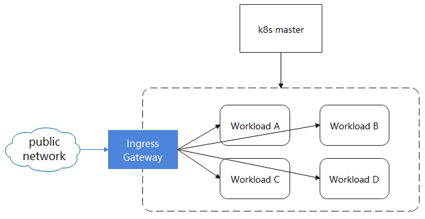

English | [简体中文](./README_zh.md)

# EdgeMesh

[](https://github.com/kubeedge/edgemesh/actions/workflows/main.yaml)
[](https://goreportcard.com/report/github.com/kubeedge/edgemesh)
[](https://github.com/kubeedge/edgemesh/blob/main/LICENSE)
[](https://github.com/kubeedge/edgemesh/releases)


## Introduction

EdgeMesh is a part of KubeEdge, and provides a simple network solution for the inter-communications between services at edge scenarios.


#### Background

KubeEdge is build based on Kubernetes, extending cloud-native containerized application orchestration capabilities to the edge. However, at the scenario of edge computer, the network topology is more complex. Edge nodes in different areas are often not interconnected, and the inter-communication of traffic between applications is the primary requirement of the business. For this scenairo, EdgeMesh offers a solution.


#### Motivation

As the component of data panel on a KubeEdge cluster, EdgeMesh offers sample capacities (e.g, service discovery, traffic proxy, etc.) for applications running on the KubeEdge cluster, thus shielding the complex network topology at the edge scenairo.


#### Advantage

EdgeMesh satisfies the new requirements in edge scenarios (e.g., limited edge resources, unstable edge cloud network, etc.), that is, high availability, high reliability, and extreme lightweight:

- **High availability**
  - Open up the network between edge nodes by using the edge cloud channel in KubeEdge
  - Divide the communication between edge nodes into intra-LAN and cross-LAN
    - Intra-LAN communication: direct access
    - Cross-LAN communication: forwarding through the cloud
- **High reliability (offline scenario)**
  - Both control plane and data plane traffic are delivered through the edge cloud channel
  - EdgeMesh internally implements a lightweight DNS server, thus no longer accessing the cloud DNS
- **Extreme lightweight**
  - Each node has one and only one EdgeMesh, which saves edge resources

##### User value

- For edge devices with limited resources, EdgeMesh provides a lightweight and highly integrated software with service discovery
- In the scene of Field Edge, compared to the mechanism of coredns + kube-proxy + cni service discovery , users only need to simply deploy an EdgeMesh to finish their goals


#### Key Features

<table align="center">
	<tr>
		<th align="center">Feature</th>
		<th align="center">Sub-Feature</th>
		<th align="center">Realization Degree</th>
	</tr >
	<tr >
		<td align="center">Service Discovery</td>
		<td align="center">/</td>
		<td align="center">✓</td>
	</tr>
	<tr>
		<td rowspan="4" align="center">Traffic Governance</td>
	 	<td align="center">HTTP</td>
		<td align="center">✓</td>
	</tr>
	<tr>
	 	<td align="center">TCP</td>
		<td align="center">✓</td>
	</tr>
	<tr>
	 	<td align="center">Websocket</td>
		<td align="center">✓</td>
	</tr>
	<tr>
	 	<td align="center">HTTPS</td>
		<td align="center">✓</td>
	</tr>
	<tr>
		<td rowspan="3" align="center">Load Balance</td>
	 	<td align="center">Random</td>
		<td align="center">✓</td>
	</tr>
	<tr>
	 	<td align="center">Round Robin</td>
		<td align="center">✓</td>
	</tr>
	<tr>
		<td align="center">Session Persistence</td>
		<td align="center">✓</td>
	</tr>
	<tr>
		<td align="center">External Access</td>
		<td align="center">/</td>
		<td align="center">✓</td>
	</tr>
	<tr>
		<td align="center">Multi-NIC Monitoring</td>
		<td align="center">/</td>
		<td align="center">✓</td>
	</tr>
  <tr>
		<td rowspan="2" align="center">Cross-Subnet Communication</td>
	 	<td align="center">Cross-Cloud Communication</td>
		<td align="center">✓</td>
	</tr>
	<tr>
	 	<td align="center">Cross-LAN E2E Communication</td>
		<td align="center">✓</td>
	</tr>
  <tr>
		<td align="center">Edge CNI</td>
	 	<td align="center">Cross-Subnet Pod Communication</td>
		<td align="center">+</td>
	</tr>
</table>


**Noting:**

- `✓` Features supported by the EdgeMesh version
- `+` Features not available in the EdgeMesh version, but will be supported in subsequent versions
- `-` Features not available in the EdgeMesh version, or deprecated features


#### Future Works


At present, the implementation of EdgeMesh relies on the connectivity of the host network. In the future, EdgeMesh will realize the capabilities of CNI plug-ins, and realize the Pod network connectivity between edge nodes and nodes on the cloud, or edge nodes across LANs in a  compatible manner with mainstream CNI plug-ins (e.g., flannel / calico, etc). Finally, EdgeMesh can even replace part of its own components with cloud-native components (e.g., replacing [kube-proxy](https://kubernetes.io/docs/reference/command-line-tools-reference/kube-proxy/) to achieve the capabilities of the Cluster IP, replacing [node local dns cache ](https://kubernetes.io/docs/tasks/administer-cluster/nodelocaldns/) to achieve node-level dns capabilities, and replace [envoy](https://www.envoyproxy.io/) to achieve mesh-layer capabilities).


## Architecture


To ensure the capability of service discovery in some edge devices with low-version kernels or low-version iptables, EdgeMesh adopts the userspace mode in its implementation of the traffic proxy. In addition, it also comes with a lightweight DNS resolver.
As shown in the figure above, EdgeMesh contains EdgeMesh-Server microservices and EdgeMesh-Agent components.
The core components of EdgeMesh-Server include:
- **Tunnel-Server**: Based on [libp2p](https://github.com/libp2p/go-libp2p), establish a connection with EdgeMesh-Agent to provide relay capability and hole punching capability

The core components of EdgeMesh-Agent include:
- **Proxier**: Responsible for configuring the kernel's iptables rules, and intercepting requests to the EdgeMesh process
- **DNS**: Built-in DNS resolver, which resolves the DNS request in the node into a service cluster IP
- **Traffic**: A traffic forwarding module based on the Go-chassis framework, which is responsible for forwarding traffic between applications
- **Controller**: Obtains metadata (e.g., Service, Endpoints, Pod, etc.) through the list-watch capability on the edge side of KubeEdge
- **Tunnel-Agent**: Based on [libp2p](https://github.com/libp2p/go-libp2p), using relay and hole punching to provide the ability of communicating across subnets


#### How It Works

- Through the capability of list-watch on the edge of KubeEdge, EdgeMesh monitors the addition, deletion and modification of metadata (e.g., Services and Endpoints),
  and then maintain the metadata required to access the services. At the same time configure iptables rules to intercept requests for the Cluster IP network segment.
- EdgeMesh uses the same ways (e.g., Cluster IP, domain name) as the K8s Service to access services
- Suppose we have two services, APP-A and APP2, and now the APP-A service tries to access APP-B based on the domain name, the domain name resolution
  request will be intercepted by the EdgeMesh-Agent of the node and EdgeMesh-Agent will return
  the Cluster IP. This request will be redirected by the iptables rules previously configured
  by EdgeMesh-Agent and forwarded to the port 40001 which is occupied by the EdgeMesh process (data packet from kernel mode -> user mode)
- After the request enters the EdgeMesh-Agent process, the EdgeMesh-Agent process completes the
  selection of the backend Pod (load balancing occurs here), and then the request will be sent
  to the EdgeMesh-Agent of the host where APP-B is located through the tunnel module (via relay
  forwarding or direct transmission through holes punch)
- The EdgeMesh-Agent of the node where APP-B is located is responsible for forwarding traffic to the service port of APP-B, and get
  the response back to the EdgeMesh-Agent where APP-A is located
- The EdgeMesh-Agent of the node where APP-A is located is responsible for feeding back the response data to the APP-A service


## Getting Started

#### Prerequisites
Before using EdgeMesh, you need to understand the following prerequisites at first:

- while using DestinationRule, the name of the DestinationRule must be equal to the name of the corresponding Service. Edgemesh will determine the DestinationRule in the same namespace according to the name of the Service
- Service ports must be named. The key/value pairs of port name must have the following syntax: name: \<protocol>[-\<suffix>]
- Now the Pod is **NOT** required a hostPort. You can refer to the files in the /examples/ directory.

#### Download EdgeMesh
```Shell
git clone https://github.com/kubeedge/edgemesh.git
cd edgemesh
```

#### Create CRDs
```shell
kubectl apply -f build/crds/istio/
```

#### Deployment

At the edge node, close edgeMesh module, open metaServer module, and restart edgecore

```shell
$ vim /etc/kubeedge/config/edgecore.yaml
modules:
  ..
  edgeMesh:
    enable: false
  ..
  metaManager:
    metaServer:
      enable: true
..
```

```shell
$ systemctl restart edgecore
```

On the cloud, open the dynamicController module, and restart cloudcore

```shell
$ vim /etc/kubeedge/config/cloudcore.yaml
modules:
  ..
  dynamicController:
    enable: true
..
```


```shell
$ pkill cloudcore
$ nohup /usr/local/bin/cloudcore > /var/log/kubeedge/cloudcore.log 2>&1 &
```

At the edge node, check if list-watch works

```shell
$ curl 127.0.0.1:10550/api/v1/services
{"apiVersion":"v1","items":[{"apiVersion":"v1","kind":"Service","metadata":{"creationTimestamp":"2021-04-14T06:30:05Z","labels":{"component":"apiserver","provider":"kubernetes"},"name":"kubernetes","namespace":"default","resourceVersion":"147","selfLink":"default/services/kubernetes","uid":"55eeebea-08cf-4d1a-8b04-e85f8ae112a9"},"spec":{"clusterIP":"10.96.0.1","ports":[{"name":"https","port":443,"protocol":"TCP","targetPort":6443}],"sessionAffinity":"None","type":"ClusterIP"},"status":{"loadBalancer":{}}},{"apiVersion":"v1","kind":"Service","metadata":{"annotations":{"prometheus.io/port":"9153","prometheus.io/scrape":"true"},"creationTimestamp":"2021-04-14T06:30:07Z","labels":{"k8s-app":"kube-dns","kubernetes.io/cluster-service":"true","kubernetes.io/name":"KubeDNS"},"name":"kube-dns","namespace":"kube-system","resourceVersion":"203","selfLink":"kube-system/services/kube-dns","uid":"c221ac20-cbfa-406b-812a-c44b9d82d6dc"},"spec":{"clusterIP":"10.96.0.10","ports":[{"name":"dns","port":53,"protocol":"UDP","targetPort":53},{"name":"dns-tcp","port":53,"protocol":"TCP","targetPort":53},{"name":"metrics","port":9153,"protocol":"TCP","targetPort":9153}],"selector":{"k8s-app":"kube-dns"},"sessionAffinity":"None","type":"ClusterIP"},"status":{"loadBalancer":{}}}],"kind":"ServiceList","metadata":{"resourceVersion":"377360","selfLink":"/api/v1/services"}}
```

Deploy edgemesh-server
```shell
$ kubectl apply -f build/server/edgemesh/02-serviceaccount.yaml
$ kubectl apply -f build/server/edgemesh/03-clusterrole.yaml
$ kubectl apply -f build/server/edgemesh/04-clusterrolebinding.yaml
# Please set the value of 05-configmap's publicIP to the node's public IP so that edge nodes can access it.
$ kubectl apply -f build/server/edgemesh/05-configmap.yaml
$ kubectl apply -f build/server/edgemesh/06-deployment.yaml
```

Deploy edgemesh-agent
```shell
$ kubectl apply -f build/agent/kubernetes/edgemesh-agent/
namespace/kubeedge configured
serviceaccount/edgemesh-agent created
clusterrole.rbac.authorization.k8s.io/edgemesh-agent created
clusterrolebinding.rbac.authorization.k8s.io/edgemesh-agent created
configmap/edgemesh-agent-cfg created
daemonset.apps/edgemesh-agent created
```

Check it out
```shell
$ kubectl get all -n kubeedge
NAME                                   READY   STATUS    RESTARTS   AGE
pod/edgemesh-agent-4rhz4               1/1     Running   0          76s
pod/edgemesh-agent-7wqgb               1/1     Running   0          76s
pod/edgemesh-agent-9c697               1/1     Running   0          76s
pod/edgemesh-server-5f6d5869ff-4568p   1/1     Running   0          5m8s

NAME                            DESIRED   CURRENT   READY   UP-TO-DATE   AVAILABLE   NODE SELECTOR   AGE
daemonset.apps/edgemesh-agent   3         3         3       3            3           <none>          76s

NAME                              READY   UP-TO-DATE   AVAILABLE   AGE
deployment.apps/edgemesh-server   1/1     1            1           5m8s

NAME                                         DESIRED   CURRENT   READY   AGE
replicaset.apps/edgemesh-server-5f6d5869ff   1         1         1       5m8s
```


#### Test Case

**HTTP**

At the edge node, deploy a HTTP container application, and relevant service

```shell
$ kubectl apply -f examples/hostname.yaml
```

Go to that edge node, use ‘curl’ to access the service, and print out the hostname of the container

```shell
$ curl hostname-lb-svc.edgemesh-test:12345
```


**TCP**

At the edge node 1, deploy a TCP container application, and relevant service

```shell
$ kubectl apply -f examples/tcp-echo-service.yaml
```

At the edge node 1, use ‘telnet’ to access the service

```shell
$ telnet tcp-echo-service.edgemesh-test 2701
```


**Websocket**

At the edge node 1, deploy a websocket container application, and relevant service

```shell
$ kubectl apply -f examples/websocket-pod-svc.yaml
```

Enter the container, and use ./client to access the service

```shell
$ docker exec -it 2a6ae1a490ae bash
$ ./client --addr ws-svc.edgemesh-test:12348
```


**Load Balance**

Use the 'loadBalancer' in 'DestinationRule' to select LB modes

```shell
$ vim examples/hostname-lb-random.yaml
spec
..
  trafficPolicy:
    loadBalancer:
      simple: RANDOM
..
```


**Cross-Edge-Cloud service discovery**

The busybox-edge in the edgezone can access the tcp-echo-cloud on the cloud, and the busybox-cloud in the cloudzone can access the tcp-echo-edge on the edge

```shell
$ kubectl apply -f examples/cloudzone.yaml
pod/tcp-echo-cloud created
service/tcp-echo-cloud-svc created
pod/busybox-sleep-cloud created

$ kubectl apply -f examples/edgezone.yaml
pod/tcp-echo-edge created
service/tcp-echo-edge-svc created
pod/busybox-sleep-edge created
```

Cloud access edge
```shell
$ kubectl -n cloudzone exec busybox-sleep-cloud -c busybox -i -t -- sh
/ # telnet tcp-echo-edge-svc.edgezone 2701
Welcome, you are connected to node ke-edge1.
Running on Pod tcp-echo-edge.
In namespace edgezone.
With IP address 172.17.0.2.
Service default.
I'm Cloud Buxybox
I'm Cloud Buxybox
```

Edge access cloud
```shell
$ docker exec -it 4c57a4ff8974 sh
/ # telnet tcp-echo-cloud-svc.cloudzone 2701
Welcome, you are connected to node k8s-master.
Running on Pod tcp-echo-cloud.
In namespace cloudzone.
With IP address 10.244.0.8.
Service default.
I'm Edge Busybox
I'm Edge Busybox
```


## EdgeMesh Ingress Gateway

EdgeMesh ingress gateway provides an ability to access services in external edge nodes.



#### HTTP Gateway

Deploy edgemesh-gateway

```shell
$ kubectl apply -f build/agent/kubernetes/edgemesh-gateway/02-configmap.yaml
configmap/edgemesh-gateway-cfg created
$ kubectl apply -f build/agent/kubernetes/edgemesh-gateway/03-deployment.yaml
deployment.apps/edgemesh-gateway created
```

Create 'Gateway' and 'VirtualService'

```shell
$ kubectl apply -f examples/hostname-lb-random-gateway.yaml
pod/hostname-lb-edge2 created
pod/hostname-lb-edge3 created
service/hostname-lb-svc created
gateway.networking.istio.io/edgemesh-gateway configured
destinationrule.networking.istio.io/hostname-lb-edge created
virtualservice.networking.istio.io/edgemesh-gateway-svc created
```

Check if the edgemesh-gateway is successfully created

```shell
$ kubectl get gw -n edgemesh-test
NAME               AGE
edgemesh-gateway   3m30s
```

Finally, use the IP and the port exposed by the Gateway to access

```shell
$ curl 192.168.0.211:12345
```


#### HTTPS GateWay

Create a test key file

```bash
$ openssl req -x509 -nodes -days 365 -newkey rsa:2048 -keyout tls.key -out tls.crt -subj "/CN=kubeedge.io"
Generating a RSA private key
............+++++
.......................................................................................+++++
writing new private key to 'tls.key'
-----
```

Create a 'Secret' according to the key file

```bash
$ kubectl create secret tls gw-secret --key tls.key --cert tls.crt -n edgemesh-test
secret/gw-secret created
```

Create a Secret-bound 'Gateway' and routing rules 'VirtualService'

```bash
$ kubectl apply -f examples/hostname-lb-random-gateway-tls.yaml
pod/hostname-lb-edge2 created
pod/hostname-lb-edge3 created
service/hostname-lb-svc created
gateway.networking.istio.io/edgemesh-gateway configured
destinationrule.networking.istio.io/hostname-lb-edge created
virtualservice.networking.istio.io/edgemesh-gateway-svc created
```

Finally, use the certificate for a HTTPS access

```bash
$ curl -k --cert ./tls.crt --key ./tls.key https://192.168.0.129:12345
```


## Contact

If you need support, start with the 'Operation Guidance', and then follow the process that we've outlined

If you have any question, please contact us through the recommended information on [KubeEdge](https://github.com/kubeedge/kubeedge#contact)


## Contributing
If you are interested in EdgeMesh and would like to contribute to EdgeMesh project, please refer to [CONTRIBUTING](./CONTRIBUTING.md) for detailed contribution process guide.