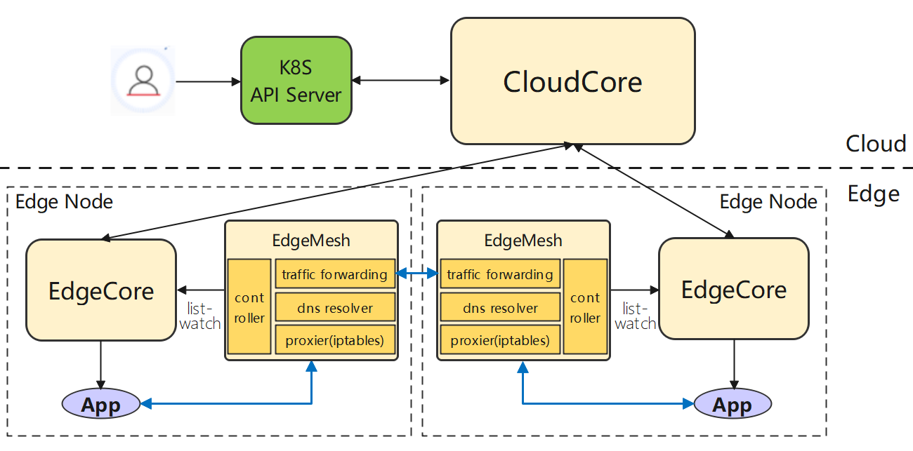

[English](./README.md) | 简体中文

# EdgeMesh

[](https://github.com/kubeedge/edgemesh/actions/workflows/main.yaml)
[](https://goreportcard.com/report/github.com/kubeedge/edgemesh)
[](https://github.com/kubeedge/edgemesh/blob/main/LICENSE)
[](https://github.com/kubeedge/edgemesh/releases)


## 介绍

EdgeMesh 作为 KubeEdge 的一部分，为边缘场景下的服务互访提供了简单的网络方案。


#### 背景

KubeEdge基于Kubernetes构建，将云原生容器化应用程序编排能力延伸到了边缘。但是，在边缘计算场景下，网络拓扑较为复杂，不同区域中的边缘节点往往网络不互通，并且应用之间流量的互通是业务的首要需求，而EdgeMesh正是对此提供了一套解决方案。


#### 动机

EdgeMesh作为KubeEdge集群的数据面组件，为KubeEdge集群中的应用程序提供了简单的服务发现与流量代理功能，从而屏蔽了边缘场景下复杂的网络结构。


#### 优势

EdgeMesh 满足边缘场景下的新需求（如边缘资源有限，边云网络不稳定等），即实现了高可用性，高可靠性和极致轻量化：

- **高可用性**
  - 利用 KubeEdge 中的边云通道，来打通边缘节点间的网络
  - 将边缘节点间的通信分为局域网内和跨局域网
    - 局域网内的通信：直接访问
    - 跨局域网的通信：通过云端转发
- **高可靠性 （离线场景）**
  - 控制面和数据面流量都通过边云通道下发
  - EdgeMesh 内部实现轻量级的 DNS 服务器，不再访问云端 DNS
- **极致轻量化**
  - 每个节点有且仅有一个 EdgeMesh，节省边缘资源

##### 用户价值

- 对于资源受限的边缘设备，EdgeMesh 提供了一个轻量化且具有高集成度的服务发现软件
- 在现场边缘的场景下，相对于 coredns + kube-proxy + cni 这一套服务发现机制，用户只需要简单地部署一个 EdgeMesh 就能完成目标


#### 关键功能

<table align="center">
	<tr>
		<th align="center">功能</th>
		<th align="center">子功能</th>
		<th align="center">实现度</th>  
	</tr >
	<tr >
		<td align="center">服务发现</td>
		<td align="center">/</td>
		<td align="center">✓</td>
	</tr>
	<tr>
		<td rowspan="4" align="center">流量治理</td>
	 	<td align="center">HTTP</td>
		<td align="center">✓</td>
	</tr>
	<tr>
	 	<td align="center">TCP</td>
		<td align="center">✓</td>
	</tr>
	<tr>
	 	<td align="center">Websocket</td>
		<td align="center">✓</td>
	</tr>
	<tr>
	 	<td align="center">HTTPS</td>
		<td align="center">✓</td>
	</tr>
	<tr>
		<td rowspan="3" align="center">负载均衡</td>
	 	<td align="center">随机</td>
		<td align="center">✓</td>
	</tr>
	<tr>
	 	<td align="center">轮询</td>
		<td align="center">✓</td>
	</tr>
	<tr>
		<td align="center">会话保持</td>
		<td align="center">✓</td>
	</tr>
	<tr>
		<td align="center">外部访问</td>
		<td align="center">/</td>
		<td align="center">✓</td>
	</tr>
	<tr>
		<td align="center">多网卡监听</td>
		<td align="center">/</td>
		<td align="center">✓</td>
	</tr>
  <tr>
		<td rowspan="2" align="center">跨子网通信</td>
	 	<td align="center">跨边云通信</td>
		<td align="center">+</td>
	</tr>
	<tr>
	 	<td align="center">跨局域网边边通信</td>
		<td align="center">+</td>
	</tr>
  <tr>
		<td align="center">边缘CNI</td>
	 	<td align="center">跨子网Pod通信</td>
		<td align="center">+</td>
	</tr>
</table>


**注：**

- `✓` EdgeMesh 版本所支持的功能
- `+` EdgeMesh 版本不具备的功能，但在后续版本中会支持
- `-` EdgeMesh 版本不具备的功能，或已弃用的功能


#### 未来工作


目前， EdgeMesh 的功能实现依赖于主机网络的连通性。未来， EdgeMesh 将会实现 CNI 插件的能力，以兼容主流 CNI 插件（例如 flannel / calico 等）的方式实现边缘节点和云上节点、跨局域网边缘节点之间的 Pod 网络连通。最终， EdgeMesh 甚至可以将部分自身组件替换成云原生组件（例如替换 [kube-proxy](https://kubernetes.io/docs/reference/command-line-tools-reference/kube-proxy/) 实现 Cluster IP 层的能力、替换 [node local dns cache](https://kubernetes.io/docs/tasks/administer-cluster/nodelocaldns/) 实现节点级 dns 的能力、替换 [envoy](https://www.envoyproxy.io/) 实现 mesh 层的能力）。


## 架构



为了保证一些低版本内核、低版本 iptables 边缘设备的服务发现能力，EdgeMesh 在流量代理的实现上采用了 userspace 模式，除此之外还自带了一个轻量级的DNS解析器。如图所示，EdgeMesh的核心组件包括：

- **Proxier**: 负责配置内核的iptables规则，将请求拦截到EdgeMesh进程内
- **DNS**: 内置的DNS解析器，将节点内的域名请求解析成一个服务的集群IP
- **Traffic**: 基于Go-chassis框架的流量转发模块，负责转发应用间的流量
- **Controller**: 通过KubeEdge的边缘侧list-watch能力获取Service、Endpoints、Pod等元数据


#### **工作原理**

- EdgeMesh 通过 KubeEdge 边缘侧 list-watch 的能力，监听Service、Endpoints等元数据的增删改，再根据 Service、Endpoints 的信息创建iptables规则
- EdgeMesh 使用与 K8s Service 相同的 Cluster IP 和域名的方式来访问服务
- 当 client 访问服务的请求到达带有EdgeMesh的节点后，它首先会进入内核的 iptables
- EdgeMesh 之前配置的 iptables 规则会将请求重定向，全部转发到 EdgeMesh 进程的40001端口里（数据包从内核态->用户态）
- 请求进入 EdgeMesh 进程后，由 EdgeMesh 进程完成后端 Pod 的选择（负载均衡在这里发生），然后将请求发到这个 Pod 所在的主机上


## 入门指南
#### 预备知识
在使用EdgeMesh之前，您需要先了解以下预备知识：

- 使用 EdgeMesh 能力时，必须要求 Pod 要开启一个 HostPort，例子可看 /examples/ 目录下面的文件
- 使用 DestinationRule 时，要求 DestinationRule 的名字与相应的 Service 的名字要一致，EdgeMesh 会根据 Service 的名字来确定同命名空间下面的DestinationRule
- Service 的端口必须命名。端口名键值对必须按以下格式：name: \<protocol>[-\<suffix>]


#### 部署

在边缘节点，关闭 edgeMesh模块，打开 metaServer模块，并重启 edgecore

```shell
$ vim /etc/kubeedge/config/edgecore.yaml
modules:
  ..
  edgeMesh:
    enable: false
  metaManager:
    metaServer:
      enable: true
..
```

```shell
$ systemctl restart edgecore
```

在云端，开启 dynamicController 模块，并重启 cloudcore

```shell
$ vim /etc/kubeedge/config/cloudcore.yaml
modules:
  ..
  dynamicController:
    enable: true
..
```


```shell
$ pkill cloudcore
$ nohup /usr/local/bin/cloudcore > /var/log/kubeedge/cloudcore.log 2>&1 &
```

在边缘节点，查看 list-watch 是否开启

```shell
$ curl 127.0.0.1:10550/api/v1/services
{"apiVersion":"v1","items":[{"apiVersion":"v1","kind":"Service","metadata":{"creationTimestamp":"2021-04-14T06:30:05Z","labels":{"component":"apiserver","provider":"kubernetes"},"name":"kubernetes","namespace":"default","resourceVersion":"147","selfLink":"default/services/kubernetes","uid":"55eeebea-08cf-4d1a-8b04-e85f8ae112a9"},"spec":{"clusterIP":"10.96.0.1","ports":[{"name":"https","port":443,"protocol":"TCP","targetPort":6443}],"sessionAffinity":"None","type":"ClusterIP"},"status":{"loadBalancer":{}}},{"apiVersion":"v1","kind":"Service","metadata":{"annotations":{"prometheus.io/port":"9153","prometheus.io/scrape":"true"},"creationTimestamp":"2021-04-14T06:30:07Z","labels":{"k8s-app":"kube-dns","kubernetes.io/cluster-service":"true","kubernetes.io/name":"KubeDNS"},"name":"kube-dns","namespace":"kube-system","resourceVersion":"203","selfLink":"kube-system/services/kube-dns","uid":"c221ac20-cbfa-406b-812a-c44b9d82d6dc"},"spec":{"clusterIP":"10.96.0.10","ports":[{"name":"dns","port":53,"protocol":"UDP","targetPort":53},{"name":"dns-tcp","port":53,"protocol":"TCP","targetPort":53},{"name":"metrics","port":9153,"protocol":"TCP","targetPort":9153}],"selector":{"k8s-app":"kube-dns"},"sessionAffinity":"None","type":"ClusterIP"},"status":{"loadBalancer":{}}}],"kind":"ServiceList","metadata":{"resourceVersion":"377360","selfLink":"/api/v1/services"}}
```

部署 edgemesh-agent 组件

```shell
# 请将03-configmap.yaml里面的subNet配置成kube-apiserver的service-cluster-ip-range的值
# 你可以在k8s master节点上的/etc/kubernetes/manifests/kube-apiserver.yaml文件中找到这个配置项的值
$ kubectl apply -f build/agent/kubernetes/edgemesh-agent/03-configmap.yaml
configmap/edgemesh-agent-cfg created
$ kubectl apply -f build/agent/kubernetes/edgemesh-agent/04-daemonset.yaml
daemonset.apps/edgemesh-agent created
```


#### 测试样例

**HTTP协议**

在边缘节点上，部署支持 http 协议的容器应用和相关服务

```shell
$ kubectl apply -f example/hostname.yaml
```

到边缘节点上，使用 curl 去访问相关服务，打印出容器的 hostname

```shell
$ curl hostname-lb-svc.edgemesh-test:12345
```


**TCP协议**

在边缘节点1，部署支持 tcp 协议的容器应用和相关服务

```shell
$ kubectl apply -f example/tcp-echo-service.yaml
```

在边缘节点2，使用 telnet 去访问相关服务

```shell
$ telnet tcp-echo-service.edgemesh-test 2701
```


**Websocket协议**

在边缘节点1，部署支持 websocket 协议的容器应用和相关服务

```shell
$ kubectl apply -f example/websocket-pod-svc.yaml
```

进入 websocket 的容器环境，并使用 client 去访问相关服务

```shell
$ docker exec -it 2a6ae1a490ae bash
$ ./client --addr ws-svc.edgemesh-test:12348
```


**负载均衡**

负载均衡功能需要添加 DestinationRule 用户自定义资源
```shell
$ kubectl apply -f build/crds/istio/destinationrule-crd.yaml
customresourcedefinition.apiextensions.k8s.io/destinationrules.networking.istio.io created
```

使用 DestinationRule 中的 loadBalancer 属性来选择不同的负载均衡模式

```shell
$ vim example/hostname-lb-random.yaml
spec
..
  trafficPolicy:
    loadBalancer:
      simple: RANDOM
..    
```


## EdgeMesh Ingress Gateway

EdgeMesh ingress gateway 提供了外部访问集群里服务的能力。


#### HTTP网关

创建 Gateway 和 VirtualService 用户自定义资源

```shell
$ kubectl apply -f build/crds/istio/gateway-crd.yaml
customresourcedefinition.apiextensions.k8s.io/gateways.networking.istio.io created
$ kubectl apply -f build/crds/istio/virtualservice-crd.yaml
customresourcedefinition.apiextensions.k8s.io/virtualservices.networking.istio.io created
```

部署 edgemesh-gateway

```shell
$ kubectl apply -f build/agent/kubernetes/edgemesh-gateway/03-configmap.yaml
configmap/edgemesh-gateway-cfg created
$ kubectl apply -f build/agent/kubernetes/edgemesh-gateway/04-deployment.yaml
deployment.apps/edgemesh-gateway created
```

创建 Gateway 资源对象和路由规则 VirtualService

```shell
$ kubectl apply -f example/hostname-lb-random-gateway.yaml
pod/hostname-lb-edge2 created
pod/hostname-lb-edge3 created
service/hostname-lb-svc created
gateway.networking.istio.io/edgemesh-gateway configured
destinationrule.networking.istio.io/hostname-lb-edge created
virtualservice.networking.istio.io/edgemesh-gateway-svc created
```

查看 edgemesh-gateway 是否创建成功

```shell
$ kubectl get gw -n edgemesh-test
NAME               AGE
edgemesh-gateway   3m30s
```

最后，使用 IP 和 Gateway 暴露的端口来进行访问

```shell
$ curl 192.168.0.211:12345
```


#### HTTPS网关

创建测试密钥文件
```bash
$ openssl req -x509 -nodes -days 365 -newkey rsa:2048 -keyout tls.key -out tls.crt -subj "/CN=kubeedge.io"
Generating a RSA private key
............+++++
.......................................................................................+++++
writing new private key to 'tls.key'
-----
```

根据密钥文件创建 Secret 资源对象
```bash
$ kubectl create secret tls gw-secret --key tls.key --cert tls.crt -n edgemesh-test
secret/gw-secret created
```

创建绑定了 Secret 的 Gateway 资源对象和路由规则 VirtualService
```bash
$ kubectl apply -f example/hostname-lb-random-gateway-tls.yaml
pod/hostname-lb-edge2 created
pod/hostname-lb-edge3 created
service/hostname-lb-svc created
gateway.networking.istio.io/edgemesh-gateway configured
destinationrule.networking.istio.io/hostname-lb-edge created
virtualservice.networking.istio.io/edgemesh-gateway-svc created
```

最后，使用证书进行 HTTPS 访问
```bash
$ curl -k --cert ./tls.crt --key ./tls.key https://192.168.0.129:12345
```


## 联系方式

如果您需要支持，请从 '操作指导' 开始，然后按照我们概述的流程进行操作。

如果您有任何疑问，请通过 [KubeEdge官网](https://github.com/kubeedge/kubeedge#contact) 推荐的联系方式与我们联系
