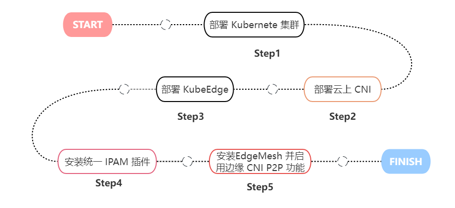

# EdgeMesh CNI Features Usage 


## Deployment and Usage

This feature mainly provides basic CNI functionality for edge containers. In the cloud, you can continue using the previously installed CNI architecture. However, for the edge, we recommend using our developed CNI component to integrate with IPAM to ensure that the IP addresses allocated to containers are unique within the cluster. If you still need to use your own CNI architecture for the edge, you will need to manage the allocation of container addresses by the IPAM to avoid duplication.

You can enable the Edge CNI feature by following these steps:



### 1. Install the Unified IPAM Plugin

This step involves deploying the unified address allocation plugin [SpiderPool](https://github.com/spidernet-io/spiderpool) in the cluster. It is designed to be compatible with both cloud and edge CNI systems and ensures unique PodIP addresses for containers within the entire cluster. We recommend using Helm for integrated deployment. The following installation process is adapted for version v0.8:

Add the SpiderPool repository to Helm:

``` shell
helm repo add spiderpool https://spidernet-io.github.io/spiderpool
```

Configure the parameters for PodIP address allocation in the cluster and deploy SpiderPool:

```shell
IPV4_SUBNET_YOU_EXPECT="10.244.0.0/24"
IPV4_IPRANGES_YOU_EXPECT="10.244.0.0-10.244.20.200"

helm install spiderpool spiderpool/spiderpool --wait --namespace kube-system \
  --set multus.multusCNI.install=false \
  --set multus.enableMultusConfig=false \
  --set coordinator.enabled=false \
  --set ipam.enableIPv4=true --set ipam.enableIPv6=false \
  --set clusterDefaultPool.installIPv4IPPool=true  \
  --set clusterDefaultPool.ipv4Subnet=${IPV4_SUBNET_YOU_EXPECT} \
  --set clusterDefaultPool.ipv4IPRanges={${IPV4_IPRANGES_YOU_EXPECT}}
```

In the above configuration parameters, the CNI-related parameters are:

* `IPV4_SUBNET_YOU_EXPECT` represents the PodIP addresses allocated for your cluster's containers, which is consistent with the `--cidr` parameter set during kubeadm startup.
* `IPV4_IPRANGES_YOU_EXPECT` represents the range of PodIP addresses allocated for your cluster's containers.

Remember the above address allocation situation and configure it in the subsequent process of enabling the Edge CNI feature.

### 2. Enable Edge CNI Feature

You can enable the EdgeMesh CNI edge P2P feature by configuring it when starting EdgeMesh. During the configuration process, you can divide the cloud-to-edge network segment resources according to your needs:

``` shell
# Enable Edge CNI feature
helm install edgemesh --namespace kubeedge \
--set agent.relayNodes[0].nodeName=k8s-master,agent.relayNodes[0].advertiseAddress="{1.1.1.1}" \
--set agent.cloudCIDR="{10.244.1.0/24,10.244.1.0/24}",agent.edgeCIDR="{10.244.5.0/24,10.244.6.0/24}"
https://raw.githubusercontent.com/kubeedge/edgemesh/main/build/helm/edgemesh.tgz
```

In the above configuration, the `cloudCIDR` parameter represents the addresses allocated for the containers in the cloud cluster, and the `edgeCIDR` parameter represents the addresses allocated for the containers in the edge cluster. EdgeMesh compares the container network segment CIDR assigned to the deployment nodes with the configured settings. Any addresses in different network segments will have corresponding `ip route` rules added to intercept them to the Tun device.

* The `cloudCIDR` parameter represents the container network segment allocated in the cloud. It is of type `[]string` and follows the format of container IP address and its subnet mask, representing a virtual network segment. Containers within this segment should have layer 2 network connectivity. If containers cannot communicate via layer 2 devices, they should be divided into different container network segments.
* The `edgeCIDR` parameter represents the container network segment allocated in the edge. It is of type `[]string` and follows the format of container IP address and its subnet mask, representing a virtual network segment. Containers within this segment should have layer 2 network connectivity. If containers cannot communicate via layer 2 devices, they should be divided into different container network segments.

| Name                           | Parameter Type | Usage Example                                                |
| ------------------------------ | -------------- | ------------------------------------------------------------ |
| agent.meshCIDRConfig.cloudCIDR | []string       | --set agent.meshCIDRConfig.cloudCIDR="{10.244.1.0/24,10.244.1.0/24}" |
| agent.meshCIDRConfig.edgeCIDR  | []string       | --set agent.meshCIDRConfig.edgeCIDR="{10.244.1.0/24,10.244.1.0/24}" |

Note that the addresses set must be in CIDR format, and you need to divide corresponding segments based on the cloud-to-edge network situation. On the other hand, this feature requires enabling the high availability feature to provide relay and penetration services for traffic across network segments.

For more installation and configuration information, please refer to:

Helm installation: [Helm Installation | EdgeMesh (opens new window)](https://edgemesh.netlify.app/guide/#helm-installation)

Manual installation: [Quick Start | EdgeMesh](https://edgemesh.netlify.app/guide/)

> It's worth noting that by default, EdgeMesh does not enable the CNI feature. If you do not specify the CIDR in the above parameters, the CNI feature will not be enabled within the cluster, and the edge nodes will rely on the existing CNI architecture (e.g., Docker) to provide container network connectivity.


## Functional Architecture Explanation

EdgeMesh aims to research and solve a series of issues related to network connectivity, service coordination, and traffic governance in edge computing scenarios. In a heterogeneous and complex edge network environment, containers in different physical regions may need to communicate across network segments using PodIP. However, mainstream CNI solutions do not support forwarding of traffic across subnets, which means that these containers, even within the same cluster, do not have access to a unified network communication service.

To address this issue, in the previous versions of the EdgeMesh high availability feature, EdgeMesh provided relay traffic based on Services and network penetration services to nodes in distributed network autonomy and other edge scenarios. However, it did not fully support forwarding and penetration services for traffic at the PodIP level. In other words, in a cloud-to-edge mixed scenario, EdgeMesh can provide penetration services for Service traffic across network segments but still relies on the original CNI architecture of the cluster for network resource management and Layer 3 connectivity. EdgeMesh does not interfere with this network traffic, which also means that EdgeMesh cannot fully cover the mixed cloud-to-edge scenario. For PodIP traffic that requires penetration and relay services, EdgeMesh does not affect them.

From a user's perspective, directly replacing the existing CNI architecture in the cloud would incur additional deployment costs and may not guarantee that the new architecture has enough value to fully cover the scenarios and functions of the old system. Moreover, it is difficult to directly achieve all the envisioned functional goals and design purposes within a short period of time, such as during the Summer of Open Source. Therefore, for the cloud environment, we tend to directly support the existing CNI architecture and use the services they provide, while complementing them with the P2P functionality they lack.

At the same time, the existing CNI architecture cannot provide a unified container networking service for the complex and heterogeneous edge environment. Therefore, compared to simple network functionalities provided by Docker or other Container Runtime Interfaces (CRI), we prefer to develop our own CNI to manage container network resources at the edge.

In addition to the aforementioned CNI requirements, the most important aspect is how to integrate it with EdgeMesh's P2P service. We have analyzed various existing P2P technologies and, considering the complex and heterogeneous nature of the edge environment that EdgeMesh deals with, we found that traditional configuration-based technologies, including IPSec, cannot meet the dynamic and increasingly complex edge environment. We need to use a more diverse set of penetration technologies. Therefore, this part directly inherits the original LibP2P architecture design. On top of that, we need to determine which PodIP traffic needs P2P and which traffic still uses the original CNI network service. Furthermore, we need to decouple these two functions to facilitate iterative optimization of functionality in future releases.

So, in this project, we have decided not to replace existing CNI implementations such as Flannel, Calico, but to work in coordination with them to achieve cloud-to-edge/edge-to-edge cross-network communication. The overall system architecture is depicted in the diagram below:

