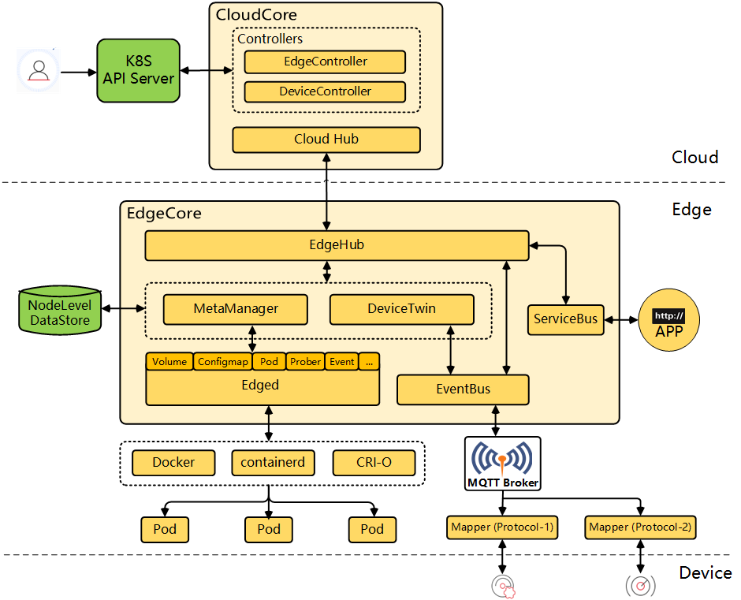
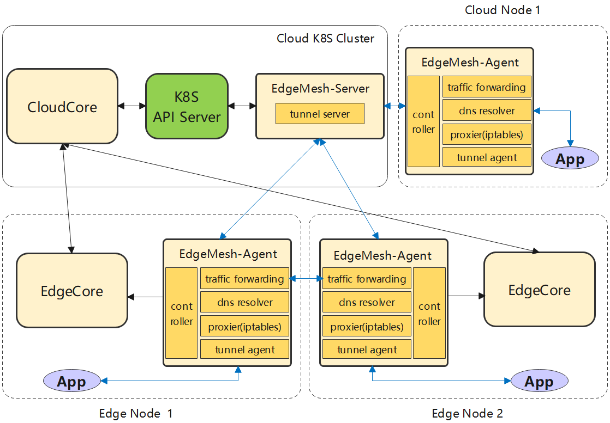
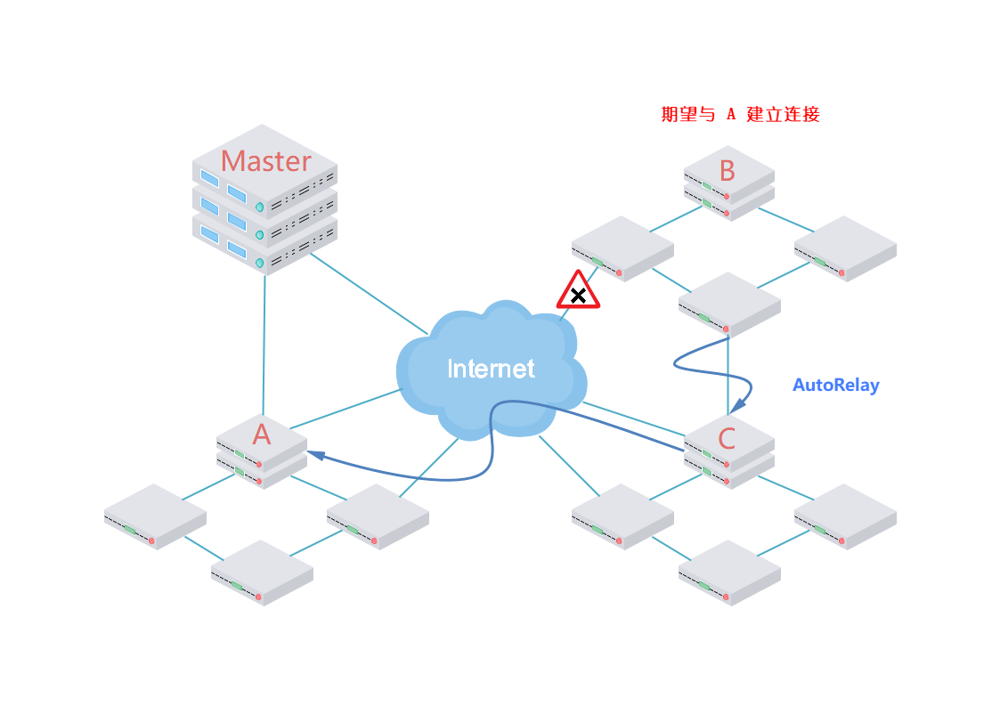
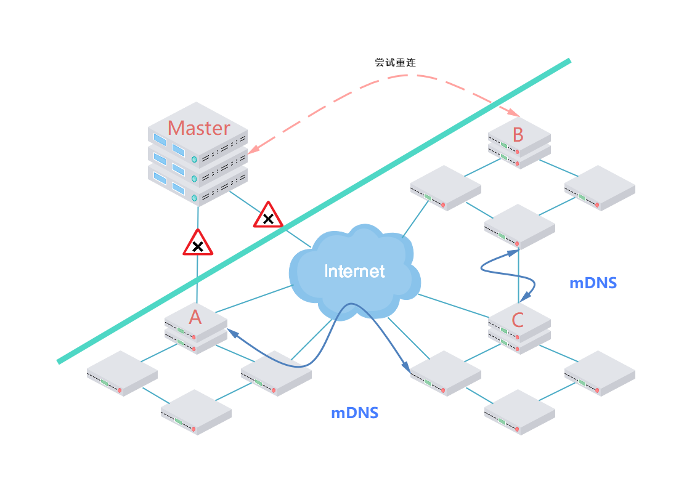

项目申请书

项目名称：KubeMesh 高可用架构设计 

项目导师：王杰章 

申请人： 达益鑫 

2022年7月218日 ; version2 

邮箱：2374087322@qq.com 

--------------------------------------------------------------------------------------

> 中文版申请书 核心想法及概念初版Version

# 一. 项目背景: 现状与痛点

## 1.  项目任务的基本需求

> ​	KubeEdge 基于 Kubernetes 构建，将云原生容器化应用程序编排能力延伸到了边缘。但是，在边缘计算	场景下，网络拓扑较为复杂，不同区域中的边缘节点往往网络不互通，并且应用之间流量的互通是业务的首要	需求，而 EdgeMesh 正是对此提供了一套解决方案。
>
>                                                                                     														——官网项目描述

    以下是Github Issue:  https://github.com/kubeedge/edgemesh/issues/353

​	当中所给的任务描述

> 1. 实现 EdgeMesh 的 aoturelay[自动中继转发] 和 autonat[自动地址转换] 机制
>
>    核心要求是：将EdgeMesh-Server 的功能合并到EdgeMesh-Agent当中，主要目的是能够尽可能地实现节点的分布式网络治理和通信，让Agent之间能够不通过中枢直接通信
>
> 2. 在EdgeMesh内实现多播dns的机制
>
>    确保即使外网无法连接，非协调节点也能正常工作；实现类似于节点容灾自治的功能。

## 2. EdgeMesh 及 KubeEdge

* 对于 KubeEdge 架构的理解和认识：

  KubeEdge 仓库位置： https://github.com/kubeedge/kubeedge

  * 在云端：CloudCoreService

    * CloudHub：一个web socket服务器，负责在云端观察变化，缓存并发送消息到EdgeHub。

    * EdgeController：一个扩展的 kubernetes 控制器，它管理边缘节点和 pod 元数据，以便可以将数据定位到特定的边缘节点。

    * DeviceController：一个扩展的 kubernetes 控制器，用于管理设备，以便设备元数据/状态数据可以在边缘和云之间同步。

  * 在边缘端：EdgeCoreService

    * EdgeHub：一个 Web 套接字客户端，负责与边缘计算的云服务交互（如 KubeEdge 架构中的边缘控制器）。 这包括将云端资源更新同步到边缘，以及向云端报告边缘端主机和设备状态的变化。

    * Edged：在边缘节点上运行并管理容器化应用程序的代理。

    * EventBus：一个 MQTT 客户端，用于与 MQTT 服务器（mosquitto）交互，为其他组件提供发布和订阅功能。

    * ServiceBus：与 HTTP 服务器 (REST) 交互的 HTTP 客户端，为云组件提供 HTTP 客户端功能，以访问在边缘运行的 HTTP 服务器。

    * DeviceTwin：负责存储设备状态并将设备状态同步到云端。 它还为应用程序提供查询接口。

    * MetaManager：edged 和 edgehub 之间的消息处理器。 它还负责在轻量级数据库 (SQLite) 中存储/检索元数据。

  在测试集群当中使用keadm部署，主要是对两个特应用进程做管理和启动，以下是架构图

  

* 对于EdgeMesh 架构的理解和认识：

  EdgeMesh 仓库位置：https://github.com/kubeedge/edgemesh

  * EdgeMesh Server

    * Tunnel-Server：与 EdgeMesh-Agent 建立连接，协助打洞以及为 EdgeMesh-Agent 提供中继能力

  * EdgeMesh Agent

    * Proxier：负责配置内核的iptables规则，拦截对EdgeMesh进程的请求

    * DNS Resolver ：内置DNS解析器，将节点内的DNS请求解析成服务集群IP

    * Traffic Forwarding：基于Go-Chassis框架的流量转发模块，负责应用之间的流量转发 

    * Controller：通过 KubeEdge 边缘端的 Local APIServer 能力获取元数据（如 Service、Endpoints、Pod 等）

    * Tunnel-Agent：基于LibP2P，使用中继和打孔提供跨子网通信的能力

  

# 二. 项目需求

## 1. aoturelay[自动中继转发] 和 autonat[自动地址转换] 机制移植边缘Agent

> **核心是能够让边缘节点可以在需要的时候充当其他节点连接的中继，或者帮助其他节点进行打洞直接传输应用数据**

### 			1.1  自动中继转发

* 当接收到某些节点想要与其他节点建立连接的请求时，依据自身的网络情况来提供中继转发服务。
* 如果多个节点都能够提供中继服务，能够找到性能最高的路径来完成中继。					

### 		1.2  自动地址转化	

* 多个节点建立连接的时候，可以打洞直接传输应用数据，针对场景可能是跨子网通信，跨子网Pod通信。

## 2. 在EdgeMesh内实现多播dns的机制

###  		2.1  多播地址发现

* 实现单个集群局域网内mDNS服务
* 连接多个子网mDNS服务，实现局域网络mDNS功能

### 		2.2  容灾缓存能力

* 当无法连接主控节点时候，使用边缘网络节点提供局域网内路由和服务转发，保证应用的稳定性

* 设立多路径重连主控的机制，尽可能快速恢复集群连接

  

# 三. 提案

## 1. 项目范围以及应用场景

​	对于上述的功能期望，我们的期望是能够在满足常见问题场景的基础上可以去适应更多的其他场景；就当前情况来说，EdgeMesh 已经能够做到：（1）对在线情况，同一网络直接建立连接，不同网络打洞直连或 Server 中继转发建立连接；（2）对离线场景，控制面数据通过 KubeEdge 边云通道下发，实现了轻量的 DNS 服务器，在一定范围内请求闭环；而且开发工具主要是 libp2p 的模块，这部分封装了相当的多的网络协议工具，结合 Linux 的一些编程技术能够做到一定程度上的网络可控。

​	在项目需求当中简洁扼要地给出了对于本次项目功能的期望描述，为了便于工程实现和理解，首先将这些功能缩小到特定的两个场景来讨论。

* 对在线场景，卸载Server能力到Agent

  将创建中间连接 Tunnel Server 能力卸载到几个边缘节点，做多层的扩散和下发，这样节点就能够借助其他边缘节点来做中继转发或者是帮助打洞直接建立连接。拿网络的算法来做类比，就是当前主机在小范围局域网内做了一次广播就获得了通讯的路由路径，而并不需要走多层结构去根服务器找对方的实际地址。

  这个做法的关键是寻找一个中继节点，中继节点其实简单来说就是代理的作用，在以下场景来理解：

  

  在这个集群架构当中，有一个Master节点、ABC三个工作节点，其中只有A直连Master。

  如果当 B 失去了直接连接互联网的通路，但是却寻求能够与 A 建立连接，那他需要通过AutoRelay机制找到合适的中继节点 C，此时 C 启动 Tunnel Server 的进程帮助 B 找到 A 的地址帮助打洞建立连接或者是作为BA 之间的中继传输数据。

  这个场景之下，主要的问题有三方面：（1）当B 需要建立连接的时候，需要能够**找到合适的中继节点C**，C需要在找到A或者建立与A的链接之后，也能够找到B并同时通知他链接的消息或者是中继数据 （2）**网络穿透**面临的防火墙和NAT问题 （3）保障B寻求**连接服务的应用性能稳定**。

  除此之外，面对集群比较复杂且更加追求分布式的部署和管理功能的话，还需要在上述的技术机制基础上，增加更多的分布式路由和管理机制。采用分布式哈希表DHT就是其中一个想法，Kademlia 是分布式散列表（DHT，Distributed Hash Table）的一种，类似的还有 Chord，Pastry 等。DHT 技术是去中心化 P2P 网络中最核心的一种路由寻址技术，可以在无中心服务器（trackerless）的情况下，在网络中快速找到目标节点。具体参考的文件是[maymounkov-kademlia-lncs](https://pdos.csail.mit.edu/~petar/papers/maymounkov-kademlia-lncs.pdf)

* 对离线场景

  增加Agent的本地缓存机制，或者是与周边其他 Online 节点连接的机制，这样对离线节点来说能够做到边缘局域网的自治和容灾，同时也能够使用分布式不同路径访问，将访问负载和网络断联的风险压力承载到网络结构上。

  这个方法主要是在集群或者节点失去了与主控节点的连接之后，通过对等网络来建立一个暂时的自组织网络或者服务，同时能够寻求其他连接建立与主控的连接来恢复原本集群状态，这之间也会涉及到各节点的数据缓存以及连接运用等等，使用以下例子来做讲解：

  

  图中当 ABC 集群脱离了能够与Master通信的已有连接之后，就需要与CB建立一个暂时的互通局域网络，启动mDNS（虽然这并不是mDNS的唯一场景）获取拥有各个节点的信息以及地址并维持服务。由于各个节点此时能够知道彼此的地址所以通信是可以在不出现其他情况下保持稳定的，同时还需要给每个节点建立自主的缓存和预取的机制，这样即便无法连接到云或者是数据中心，还依靠局域网内存储的数据和计算能力来维持一个自治的局域网，对用户来说就好像和云端断开连接这个问题不存在一样；不过如果长时间持续边缘的资源是无法支撑的，所以还需要不断地尝试与Master节点建立连接，这个部分可能会使用与其他集群的Autorelay或者是范围更广的mDNS来自实现。

  mDNS 技术能够解决的是当离开中心节点之后，能够在边缘局域网络当中发现其他节点的地址和信息：每个进入局域网内的主机，如果开启了 mDNS 服务的话，都会向局域网内的所有主机组播一个消息，例如，我是谁以及我的 IP 地址是多少等，然后其他节点开启 mDNS 服务的主机就会发出响应，例如，我是谁以及我的 IP 地址是多少等。比如，A主机进入了局域网，开启了 mDNS 服务，并向 mDNS 服务注册一下信息:我提供FTP服务，我的 IP 地址是192.168.1.101，端口号是21。当B主机进入局域网，并向B主机的 mDNS 服务请求，我要找局域网内 FTP 服务器，此时B主机的mDNS就会去局域网内向其他的 mDNS 询问，并且会告诉B主机，有一个 IP 地址为192.168.1.101，端口号是21的主机，也就是A主机提供 FTP 服务，所以B主机就知道了 A主机的 IP 地址和端口号了。

  在这个场景之下，主要的问题也是三方面：（1）实现 Mesh 的mDNS机制，能够在边缘局域网络当中发现其他节点的地址和信息 （2）需要在各个节点的Agent当中设置管理缓存预取的组件，利用mDNS的集群信息来维持对等网络的资源服务稳定 （3）不断尝试与主节点建立新的连接。

## 2. 实现细节

### 2.1 对 Agent 增加部分Server功能：	

* 移植 Tunnel Server 到 Agent当中，在保持原有的主控节点中继逻辑基础上能够通过性能选择启动边缘 Tunnel 进程
* 边缘 Tunnel 的节点选择和路由管理，这部分会参考去中心化 P2P 网络中的几项路由寻址技术
* 创建 NAT穿透组件，并实现中继和打洞功能；结合已有的穿透技术协议和KubeEdge 的系统架构来获取必要的信息，执行对应的操作

### 2.2 对 Agent 增加缓存和定时容灾机制:

* 增加mDNS功能模块，可以获取物理可连接局域网内其他节点的地址和信息，同时建立存储表来存储对应数据
* 增加mDNS控制模块，利用mDNS信息来做边缘服务请求的调配和负载均衡，实现边缘局域网络的自治能力
* 创建容灾重连模块，不断尝试与主节点恢复正常网络连接

# 四. 路标（Road Map） 

​	• 划分阶段（如每月为一个阶段）

​	• 总结阶段的核心任务

​	• 在每个阶段内，**分解及细化任务**

### 		6月15日 到 7月10日：项目及特性熟悉期[已完成]

        使用老师提供的服务器完成KubeEdge，EdgeMesh搭建，同时尝试多个测试样例形式的容器及服务生成，通过调试手段和查看日志的方式来实际学习系统的运作方式和执行逻辑。

        根据对于IFPS系统相关的一些研究，重点再libp2p上来做实验性质的Agent开发实验

### 		7月10日--8月20日：项目开发预热期

        深入学习和测试EdgeMesh的代码工程逻辑，熟悉EdgeMesh的代码细节

        学习和使用Libp2p工具包的使用

        对分布式架构和内网穿透技术的各项研究做调研，同时和导师保持至少每周一次组会式讨论 ，更新本周的实验内容和结果，探讨系统架构的开发实验结果，推进开发流程

### 		7月20日到9月30日： 项目开发期

#### 					一阶段： 基础功能开发研讨实验期

        	时间：7月20日到8月20日，大致半个月的时间

        	目标：依据Proposal及两次大组会Reviewers的建议，在已有的实验基础上讨论并测试多个开发的功能，尽可能完成项目初期的功能期望同时拓展其他的场景和问题。

#### 					二阶段：功能基础实现和改进期

        	时间：8月20日到9月10日，大致半个月的时间。

        	目标：开发完成课题设计的所有功能，能够在期望条件下正常运行并返回正确的结果，性能上不超过一定的容忍区间，同期完成相对应的技术文档和性能优化。

#### 					三阶段：中期功能检验和修改期

        	时间：9月10日到9月15后，大致花费不到一周的时间。

        	目标：交予老师和项目组代码，主要方式是自己的github代码仓库的形式，确认功能的实现和基础的鲁棒性，并总结和进一步交流评审修改意见。

#### 					四阶段：功能检验和查bug，系统调优期

        	时间：9月15日后到项目结束。

        	目标：依据修改意见对系统代码做修改，依据自己测试以及github的issue反馈修改bug，依据系统性能的调优标准优化程序运行逻辑，这段时间主要集中反馈性能优化和交流各项修改意见时间不再做具体划分。

# 五. 相关参考资料、个人Github仓库以及博客索引

* 个人[github](https://github.com/NKDYX/KubeEdgeMeshLearning.git): 将会详细记录本次课题从调研学习到具体功能实现的各项细节和问题，同步核心的Mesh Agent代码
* 个人博客： https://juejin.cn/user/2137896015897597 [正在考虑项目结束后做一个个人博客]
* 项目主要参考文件：
  * https://edgemesh.netlify.app/zh/advanced/architecture.html#%E6%A6%82%E8%A7%88
  * https://kubeedge.io/zh/docs/
  * https://blog.csdn.net/weixin_41033724/article/details/122954940