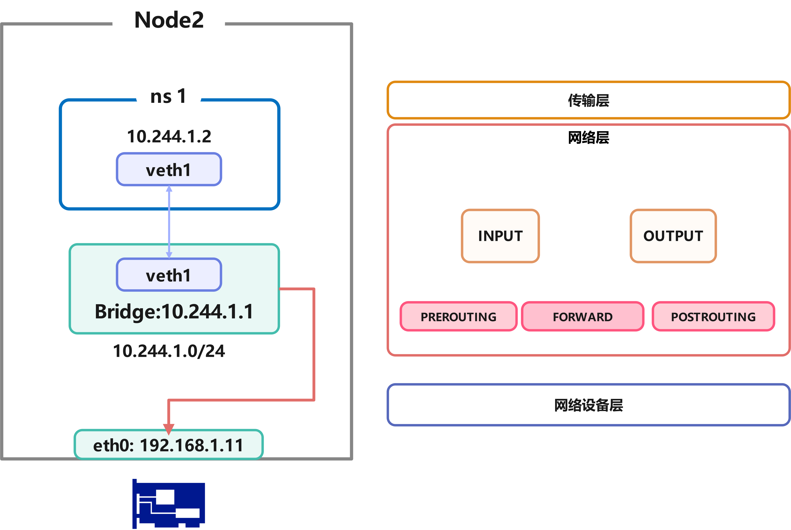
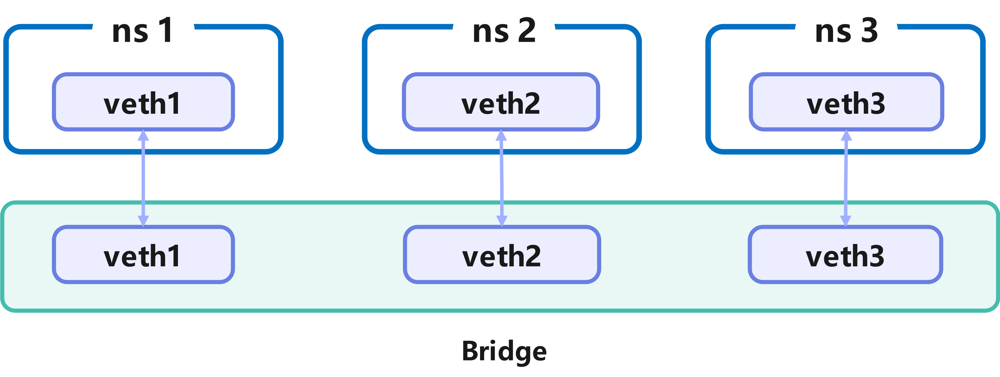
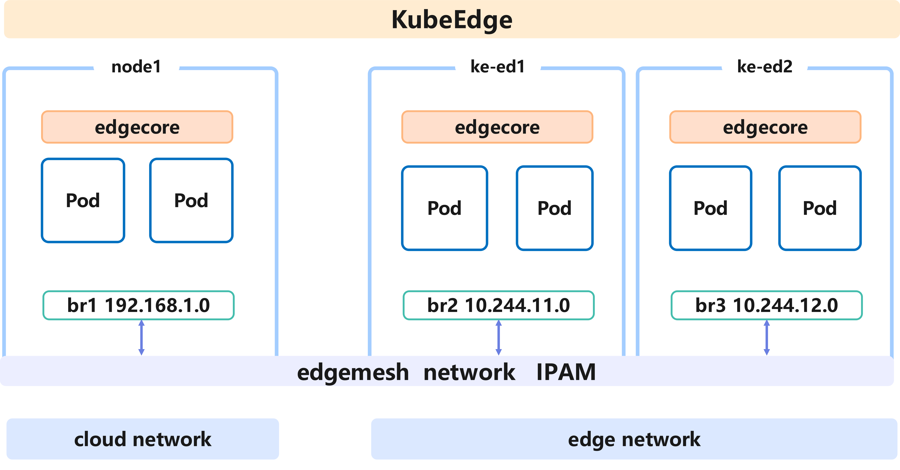
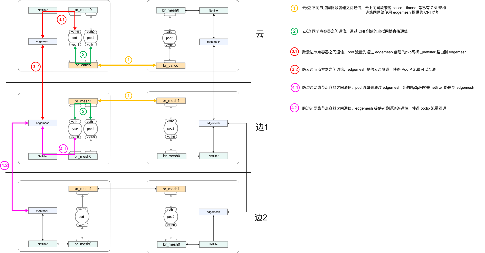

# [OSPP] Proposal for EdgeMesh supports CNI features

[TOC]

# <font size ='6'>Background and Challenges</font>

## 1.  KubeEdge and EdgeMesh

Understanding and Cognition of KubeEdge Architecture：

KubeEdge Repository ： https://github.com/kubeedge/kubeedge

* Cloud Side：CloudCoreService

  * CloudHub：A WebSocket server responsible for monitoring changes in the cloud, caching, and sending messages to the EdgeHub.。

  * EdgeController：An extended Kubernetes controller that manages edge node and pod metadata, enabling data to be directed to specific edge nodes.

  * DeviceController：An extended Kubernetes controller for managing devices, allowing device metadata and state data to be synchronized between the edge and the cloud.
* Edge Side：EdgeCoreService

  * EdgeHub：A WebSocket client responsible for interacting with cloud services for edge computing (such as the edge controller in the KubeEdge architecture). This includes synchronizing cloud resource updates to the edge and reporting changes in the edge host and device status to the cloud.
* Edged：An agent that runs on edge nodes and manages containerized applications
  * EventBus：An MQTT client for interacting with the MQTT server (mosquitto), providing publish and subscribe functionality for other components.
* ServiceBus：An HTTP client that interacts with an HTTP server (REST), providing HTTP client capabilities for cloud components to access HTTP servers running at the edge.
  * DeviceTwin：Responsible for storing device status and synchronizing it to the cloud. It also provides a query interface for applications.
* MetaManager：A message processor between edged and edgehub. It is also responsible for storing/retrieving metadata in a lightweight database (SQLite).

Deploying with keadm in a test cluster, mainly managing and launching two specific application processes. Below is the architecture diagram:


* Understanding and Cognition of EdgeMesh Architecture:

  EdgeMesh Repository Location: https://github.com/kubeedge/edgemesh

  - EdgeMesh Agent
  - Proxier: Responsible for configuring the kernel's iptables rules, intercepting requests to the EdgeMesh process
    - DNS Resolver: Built-in DNS resolver, resolving DNS requests within the node to service cluster IPs
  - LoadBalancer: Traffic forwarding module based on the Go-Chassis framework, responsible for traffic forwarding between applications
    - Controller: Obtains metadata (such as Service, Endpoints, Pod, etc.) through KubeEdge's edge-side Local APIServer capability
  - Tunnel-Agent: Based on LibP2P, provides cross-subnet communication capabilities using relay and NAT traversal


## 2. CNI and Network of Container

​	CNI, short for Container Network Interface, provides a **standardized, plugin-based network solution for containers**. In the past, the networking layer for containers was highly dependent on the underlying network environment, with different implementations by various network service providers. **CNI abstracts a set of standard interfaces from network services**, thereby shielding the differences between the upper-layer network and the underlying network provider's implementations. Through a plugin mechanism, it makes the specific implementation of the container's networking layer pluggable and highly flexible.

Firstly, CNI is a set of standard interfaces that belong to the [CNCF (Cloud Native Computing Foundation)](https://cncf.io/). The implementations according to this standard are CNI Plugins, which are independent of each other and can be combined for use. They consist of a set of specifications and libraries for configuring network interfaces for Linux containers, as well as some plugins. The core functionality of CNI is managing network allocation when containers are created and releasing network resources when containers are deleted.

​	According to the CNI [specification](https://github.com/containernetworking/cni/blob/master/SPEC.md), CNI has the following features:

- CNI must provide a **file format for network administrators to define network configurations**
- CNI must provide a **protocol/API** for Container Runtime (CRI) to invoke functionality.
- When CNI is called by CRI, it must execute network configuration functionality according to the configuration file
- CNI must reserve the capability to invoke other plugins
- CNI must standardize the data format returned to CRI

Based on these features and requirements, it is clear that implementing a CNI plugin needs to include the following parts:

- Executable files
  - CNI main process
  - IPAM, etc.
- Network configuration file

​	For each type of CNI, the following functions must be provided:

CNI plugins must first implement an executable file - cni plugins, which can be invoked by container management systems (CRI), such as rkt and Kubernetes. This plugin initially needs to provide **basic Linux network connectivity services**, such as creating veth or bridge and inserting one end of the veth pair into the container's network namespace and the other end into the bridge, allowing containers to communicate with each other. Then, **assign IP to the interface** and manage IP addresses by calling the **IPAM** plugin to ensure that container IP addresses within the cluster do not overlap, or to work with other plugins to implement more complex network routing management functions, etc.

The CNI team provided a more typical example as follows:

- Main plugins for creating network devices
  - bridge: create a bridge and add host and container to it
  - ipvlan: add ipvlan network card in the container
  - loopback: set the status of the loopback device (lo network card) and apply
  - macvlan: create a new MAC address
  - ptp: create Veth Pair (virtual Ethernet card pair)
  - vlan: allocate Vlan devices
  - host-device: move existing network card devices into the container
- IPAM for managing IP addresses
  - dhcp: run a daemon on the host machine, representing the container's request to the DHCP server
  - host-local: maintain allocated IP addresses in the local database
  - static: assign static IPv4/IPv6 addresses to containers (commonly used for debugging)
- Meta for other purposes
  - tuning: adjust the sysctl parameters of network devices
  - portmap: iptables-based port mapping, mapping ports from host address space to container
  - bandwidth: using TBF (Token Bucket Filter) to limit inbound/outbound bandwidth
  - firewall: managing rules for allowing traffic in and out of containers using iptables or firewalld


For more detailed research content, please refer to my blog summary and collation:

* [CNI 与 Pod 容器网络—— Linux 网络 | ideamesh (ideameshdyx.github.io)](https://ideameshdyx.github.io/2023/04/18/EdgeMesh/2023-ospp-fighting/CNI-LinuxNetwork/)

* [Kubernetes 容器网络 — CNI | ideamesh (ideameshdyx.github.io)](https://ideameshdyx.github.io/2023/04/18/EdgeMesh/2023-ospp-fighting/CNI-Basic/)

* [Kubernetes 容器网络 — 现有 CNI 方案的调研 | ideamesh (ideameshdyx.github.io)](https://ideameshdyx.github.io/2023/04/18/EdgeMesh/2023-ospp-fighting/CNI-ReaseachofCni/)

## 3. Core Issues 

​	Through the exploration of CNI functionality and experiments on EdgeMesh's related features, we can delve into the core issues of this research topic, which are also the main functions the project aims to achieve.

From the above experiments, it can be seen that the network access functionality provided by EdgeMesh is built on top of the existing container network management of the node cluster, mainly focusing on L4 and some L3 services. According to the future development requirements of EdgeMesh's network functionality, the management of cluster network addresses and service routing needs to be more in-depth in L3/L2 architecture management. Therefore, implementing CNI features for EdgeMesh is the key to this research topic, and the specific issues can be summarized into the following two points:

### <font size ='4'> Mainstream CNI does not support cross-subnet traffic forwarding </font>

> The detailed question is: Why can't this service be accessed through ClusterIP in the cloud LAN, while it can be accessed through ClusterIP in the edge LAN?
>
> **Answer: The current mainstream CNI plugins do not have the capability to forward traffic across subnets, and they rely on Layer 3 reachability. Therefore, if the underlying networks are not interconnected, the connection service provided by CNI at L3 is not sufficient to support cross-network segment connectivity. In other words, even in edge networks, non-interconnected network segments cannot be connected.**


​	The reason why the cloud LAN cannot access the services on the edge nodes through ClusterIP is that they are not in the same LAN, and the cloud nodes have not configured EdgeMesh. CNI itself only provides Layer 2 reachable network resource allocation and address management services. When the data packet reaches Netfilter, it cannot query the route to the node where the container providing the ClusterIP service is located, so the packet cannot be forwarded.

As shown in the figure above, during this process, the data packet is indeed encapsulated and directed to the node's IP address. However, if the nodes are not Layer 2 reachable, the encapsulated internal node IP is only visible to the Kubernetes cluster information, and it does not mean that there is a reachable route between the container-deployed node and this internal node. The data packet cannot find the corresponding node through the connected switch or other routing devices. To add, mainstream CNI does not check network connectivity on its own, which often results in container network resources created through Kubernetes address partitioning information being unreachable in edge environments.

### <font size ='4'> EdgeMesh does not have PodIP traffic forwarding capability</font>

> EdgeMesh does not have PodIP traffic forwarding capability Detailed question: Why can this service be accessed through ClusterIP in the cloud LAN (points will not be awarded for simply answering "because EdgeMesh is installed," the principle must be explained), while it cannot be accessed through PodIP?
>
> **Answer: Although EdgeMesh currently supports cross-subnet traffic forwarding at the ClusterIP level, it does not yet have the capability to forward PodIP traffic. When traffic is forwarded through Iptables, it will not be intercepted by EdgeMesh, so the NodeIP used is inaccessible to the underlying network devices.**



​	In the Kubernetes network model, a Service is set up by binding to the Pod IP of the EndPoint to provide services. This design means that requests only need to consider a fixed routing address, with the Kubernetes system assisting in network forwarding and load balancing.

EdgeMesh intercepts traffic to the Service by inserting Iptables rules on the node, at which point the traffic uses the P2P communication service provided by EdgeMesh. In other words, EdgeMesh cannot provide P2P service for PodIP traffic. As shown in the figure above, these cross-subnet traffic cannot find matching table entries in the routing rules and will be discarded or forwarded to the network card, allowing the underlying network devices to route. It is evident that the underlying devices do not have this routing table entry, which would result in such service requests being shown as unreachable.


# <font size ='6'>Project Proposal: Current Situation and Requirements </font>

## 1. situation of EdgeMesh 

### <font size ='4'> 1.1 EdgeMesh relies on existing CNI functionality</font>

​	If a node does not have a CNI plugin installed, KubeEdge will use the Docker0 bridge as an address allocation service provider. If a node has a CNI plugin installed, it will use the address and network resources allocated by the CNI plugin. In other words, the network routing work provided by EdgeMesh has always been at the L4/L3 layer, unable to forward and manage traffic accessing the PodIP, and depends on the network management capabilities of the CRI-accessed CNI.

Relying on existing CNI plugins to create network resources is feasible in cloud clusters, but the edge networks targeted by EdgeMesh have more complex network deployment scenarios, with containers and nodes often in different subnets. As previously analyzed in the experiments, the mainstream CNI relies on an environment with Layer 2 physical network connectivity. If cross-subnet situations are involved, IP unreachability issues often arise.

Moreover, due to the complex CNI plugin deployment in edge environments, deploying them sequentially or in a mixed manner can lead to address conflicts. If different subnet CNIs are started only to provide network resource creation, and the Kubernetes partitioned network segments are the same, it is possible that containers in different subnets may be assigned the same IP address, leading to service access address conflicts. In addition, when using CNI in a mixed manner, if the address partitioning rules are not carefully set in the configuration file, there will be confusion in IP address allocation between cloud-edge and edge-edge.

Considering these situations, I believe that EdgeMesh needs to complete its own CNI basic functionality and main invocation logic, and cannot be mixed with other CNIs or serve only as middleware between CNI plugins.

### <font size ='4'> 1.2 EdgeMesh targets Service-level traffic</font>

​	Currently, EdgeMesh supports cross-subnet traffic forwarding for accessing services through **Service**. The specific workflow is: By default, a port is exposed on `169.254.96.16`, and all Service traffic is hijacked through iptables configuration, forwarding this traffic to the application layer's EdgeMesh. In the following iptables NAT table, traffic is hijacked to `169.254.96.16:40505` through the `KUBE-SVC-PX4OGZX33ST3IKD4` table entry by rule matching.

```shell
[root@k8s-node1 ~]# iptables -t nat -nvL --line | grep  10.106.117.151
11       0     0 KUBE-MARK-MASQ  tcp  --  *      *      !10.244.0.0/16        10.106.117.151       /* testzone/hostname-svc:http-0 cluster IP */ tcp dpt:12345
12       0     0 KUBE-SVC-PX4OGZX33ST3IKD4  tcp  --  *      *       0.0.0.0/0            10.106.117.151       /* testzone/hostname-svc:http-0 cluster IP */ tcp dpt:12345
9       10   600 DNAT       tcp  --  *      *       0.0.0.0/0            10.106.117.151       /* testzone/hostname-svc:http-0 */ tcp dpt:12345 to:169.254.96.16:40505
9        0     0 DNAT       tcp  --  *      *       0.0.0.0/0            10.106.117.151       /* testzone/hostname-svc:http-0 */ tcp dpt:12345 to:169.254.96.16:40505
```

​	However, this approach is clearly aimed at SVC traffic and does not provide services for each PodIP traffic access. On the one hand, there is no need to forward every PodIP traffic, as this would cause a rapid increase in the rules injected into iptables, reducing the system's packet forwarding efficiency, and this part of the network connection can rely entirely on existing CNI plugins. On the other hand, for edge cross-subnet and cross-cloud-edge traffic, EdgeMesh needs to provide P2P network connection services for them, which is the most important feature that EdgeMesh needs to implement as a CNI network plugin.

## 2. EdgeMesh CNI Functionality Requirements

Based on the research of the existing CNI architecture and the understanding of the project requirements from the above experiments, I have compiled the following engineering objectives and functional tasks that need to be implemented for this project:

###  <font size ='4'> 2.1  Cluster-scale IP address partitioning and management </font>

> The purpose is to ensure the uniqueness of Pod IP within the cluster

####  <font size ='4'> A. Create and manage network resources within the node </font>

​	**EdgeMesh CNI needs to create network resources for containers in the same subnet and cross-subnet clusters, including basic functions such as IP address allocation, bridge creation and network segment partitioning, and maintaining network status.** After further in-depth research on the project, complex container network deployment structures at multiple levels will be implemented in conjunction with SRV6 or Netpolicy rules.

​	The issues to be addressed in this step include:

- Identifying the container network environment of the node. For example, whether the CNI plugins installed by the user or the already configured network environment will conflict with the network resources to be created later.

- Creating network resources and allocating addresses. This can be achieved by creating bridges or network cards, but the partitioning of network segments and synchronization with KubeEdge must be considered.

  > it's not means that  Edgemesh CNI completely overtake the position of formers like calico or flannel, costumers will use what they want in the cloud , but from experience , edge side would not have it's own CNI ,so that is where Edegmesh CNI would perform.

####  <font size ='4'> B. Ensure unique cluster internal addresses</font>

​	**Access Edgecore (standard Kubernetes specification) to synchronize the cluster's address allocation information. By using List/Watch on Pods and cluster network segment resources, the IP addresses assigned to containers on cloud edge nodes are unique within the cluster.**

The main issue in this step is to allocate a unique IP address to the container object under the IPAM form.

###  <font size ='4'> 2.2  Support Pod IP hierarchical traffic forwarding</font>

> Provide CNI basic functions for domain-internal Pods and Pod IP hierarchical P2P services for cross-domain Pods.

 ####  <font size ='4'> A. Implement basic CNI functions to provide Pod traffic forwarding within the same LAN</font>

​	**For containers in the same subnet, EdgeMesh needs to implement mainstream CNI plugin functions. By referring to other existing CNI plugin functions, EdgeMesh creates and manages the network resources allocated to containers, modifies the node's routing rules to provide address encapsulation functions, and enables normal transmission between nodes in the same subnet.**

####  <font size ='4'> B. Identify Pod IP in different LANs and provide P2P services</font>

​	**For containers in different subnets, EdgeMesh needs to intercept and forward the traffic to the target subnet to provide P2P services. This process needs to be combined with the high availability features currently implemented in EdgeMesh to distinguish these container traffic, whether it is accessed through Service or underlying PodIP.**

In this process, it is necessary to consider optimizing the method of relying on Iptables forwarding (such as IPVS relying on Netfilter forwarding technology). If a large number of rules are added to execute forwarding, it will lead to a decrease in network forwarding efficiency and waste of resources. This proposal will mainly use eBPF technology to optimize this aspect.


# <font size ='6'>Project Proposal: Design and Implementation Details </font>

## 1. Goal

​		Through research on the existing CNI plugin framework and combining with the requirements of complex network deployment in edge/cloud scenarios targeted by EdgeMesh, this proposal believes that the implementation goal of EdgeMesh should be an independent and complete CNI plugin function while also providing diverse services in combination with other CNI plugins. The alternative solution cannot meet the project requirements. For example, if it is implemented as middleware compatible with multiple CNIs, other CNI plugins need to be installed first, and then EdgeMesh acts as middleware to perform network information synchronization and translation, which will increase the pressure on users to configure various plugins. On the other hand, since the implementation of various CNI plugin functions is not pre-negotiated to divide their responsible sections, their functions overlap and are not orthogonal in many aspects, which may lead to conflicts in function compatibility.

Based on this analysis and in combination with the results of the previous research and testing, this project has determined the implementation scope and user orientation.

Implementation scope: Complete the first-stage requirements of CNI functions, design and implement basic CNI functions and mechanisms, and reserve scalability for future network traffic governance services and other features. This mainly includes the following two items:

- Implement network partitioning and container IP allocation functions, compatible with CNI standards, and ensure that the IP address of each container in the cluster is unique.
- Support cross-subnet Pod IP traffic proxy and forwarding functions, compatible with CNI standards.

User and scenario orientation: Enable containers within the cluster to access each other directly through IP addresses, regardless of whether they are on the edge or in the cloud.


## 2. Implementation Details

According to the planning of the project objectives mentioned above, the following details and objectives of each part of the implementation are described in detail.

### <font size ='4'>2.1  Design and implement basic CNI functions</font>	

Solution design: **Provide intra-node and intra-domain network routing capabilities by creating a unified bridge device to connect and manage related container network segments.**


​	As shown in the figure above, the goal of the solution implementation is for EdgeMesh CNI to create a Linux bridge to manage a network segment of containers and provide layer 2 network communication services for them on a single node.

The specific implementation process is:

- Receive the system parameters passed in by CRI or read the network segment divided by the Config file, create a bridge, and allocate an address to make the bridge the gateway of the network segment.
- Create a veth pair for each container managed by KubeEdge, and put one end of it into the above bridge, and then assign a unique IP address to the container.
- Provide address encapsulation for the traffic out of the bridge and write forwarding rules in the node's routing rules, so that nodes in the LAN can communicate with each other.
- 

Through studying the CNI standard, I have implemented a basic CNI that can create virtual network resources for single-node containers and complete IP communication.

The specific implementation and process code analysis can be found on my blog: [Creating a Simple CNI Plugin | ideamesh (ideameshdyx.github.io)](https://ideameshdyx.github.io/2023/05/25/EdgeMesh/2023-ospp-fighting/CNI-CreateCNI/). The experimental code and scripts are also available on my Github repository.

For EdgeMesh, this project requires the implementation of basic CNI functions, with the core being to provide IP segment division for cluster containers and traffic forwarding at the PodIP level.

Below is my simple logical design solution for this requirement.

#### <font size ='4'> A. Division of Container Network Segments</font>

Create a Linux bridge and allocate an IP segment. When the CRI calls the CNI program, a veth pair is created for each container (NetNS), with one end placed in the created bridge and the other end placed in the container, while assigning an IP address within the allocated network segment to the container.

In the complete function, it is also necessary to ensure the consistency of IP addresses within the cluster. The CNI needs to obtain the cluster content IP network segment stored in etcd through the List/Watch EdgeCore ApiServer, and can calculate a valid IP network segment through a local IPAM plugin and synchronize it to EdgeCore, which is then passed to the CNI as a parameter or written into the Config file.



The container network topology constructed in the experiment is shown above, and the most critical aspect of this process is the creation and management of local network resources, with IPAM data being obtained from the Config.

At the end of the experiment, a bridge was created and communication capabilities were provided between containers (NetNS). The testing script can be obtained from [knetwork/Makefile at main · IdeaMeshDyx/knetwork · GitHub](https://github.com/IdeaMeshDyx/knetwork/blob/main/testCni/scripts/Makefile).

```golang
[root@master knet]# ./run.sh 
Ready to call the cni to create ip for ns1
{test 192.0.2.15/24}
The CNI has been called, see the following results
The bridge and the veth has been attatch to
bridge name     bridge id               STP enabled     interfaces
test            8000.b6e6090625de       no              veth2a9d8a3d
The interface in the netns
eth10: flags=4163<UP,BROADCAST,RUNNING,MULTICAST>  mtu 1500
        inet 192.0.2.15  netmask 255.255.255.0  broadcast 192.0.2.255
        inet6 fe80::477:7aff:fee3:a9b8  prefixlen 64  scopeid 0x20<link>
        ether 06:77:7a:e3:a9:b8  txqueuelen 0  (Ethernet)
        RX packets 1  bytes 90 (90.0 B)
        RX errors 0  dropped 0  overruns 0  frame 0
        TX packets 1  bytes 90 (90.0 B)
        TX errors 0  dropped 0 overruns 0  carrier 0  collisions 0

lo: flags=8<LOOPBACK>  mtu 65536
        loop  txqueuelen 1000  (Local Loopback)
        RX packets 0  bytes 0 (0.0 B)
        RX errors 0  dropped 0  overruns 0  frame 0
        TX packets 0  bytes 0 (0.0 B)
        TX errors 0  dropped 0 overruns 0  carrier 0  collisions 0

[root@master knet]# sudo ifconfig test 192.0.2.1
[root@master knet]# sudo ip netns exec ns1 ping 192.0.2.1
PING 192.0.2.1 (192.0.2.1) 56(84) bytes of data.
64 bytes from 192.0.2.1: icmp_seq=1 ttl=64 time=0.077 ms
64 bytes from 192.0.2.1: icmp_seq=2 ttl=64 time=0.044 ms
64 bytes from 192.0.2.1: icmp_seq=3 ttl=64 time=0.053 ms
64 bytes from 192.0.2.1: icmp_seq=4 ttl=64 time=0.045 ms
```

The core logic of the code is implemented in `CmdAdd`, which reads the Config file and receives configuration parameters from the CRI to create the corresponding kernel device, bind the IP address, insert information, and finally provide network connectivity services to the container.


#### <font size ='4'> B. Traffic Forwarding at the PodIP Level*</font>

​	For containers connected to a single-node bridge, they are all Layer 2 accessible at the operating system level. Of course, to provide more diverse network services, the container network architecture built by CNI should also reflect more hierarchical features, especially when combined with label features such as SRV6. In this case, additional rules need to be injected into IPtables to achieve more functions.

For cross-node IP traffic, CNI mainly injects Iptables rules and modifies the kernel forwarding address to achieve this.

For containers connected to the same bridge in the cluster, they belong to the same network segment, so when the operating system transmits down to the bridge, it can be directly transmitted to the peer veth. Other network segments are forwarded to the local Layer 2 device by setting iptables rules when the packet reaches Netfilter. In more complex situations, when crossing nodes, CNI provides address encapsulation to forward packets outside the node.

In fact, the connectivity of this part needs to be implemented with the help of kube-proxy. Because the basic CNI only achieves resource creation and allocation. For cross-node PodIP traffic, CNI encapsulates the IP address of the data packet when it leaves the node, using the network segment and node address written in the configuration file (in KubeEdge, the cluster node information is obtained through EdgeCore).

If the nodes are in the same LAN, the corresponding route can be found in the node's routing rules and the data packet can be transmitted. However, if the nodes are in different LANs, the node's internal network address cannot communicate, in other words, the existing basic CNI or most CNIs cannot support the situation where Layer 2 addresses are not accessible.

### <font size ='4'>2.2  Coordinate cluster internal IP addresses for unified management</font>	

Solution design: **Access KubeEdge/Etcd to obtain the cluster's address allocation information and drive the IPAM CNI plugin**



​	As shown in the figure above, the goal of the solution implementation is to obtain the cluster-scale IP address allocation information by accessing KubeEdge and allocate a unique IP address within the cluster to each bridge and container through the edgemesh IPAM plugin.

The specific implementation process is:

- Design and implement the IPAM plugin, which is called first when CNI is called. By accessing EdgeCore (or Etcd), obtain the network information allocated by the cluster and obtain a segment of IP address information that can be allocated within the node. Calculate the network range divided by the node, write it to the Config file, or pass it as a parameter to the next called CNI plugin (bridge, etc.).
- Synchronize the divided network segment and container network information to EdgeCore/Etcd, and maintain an edge network resource object in the cluster database for resource management and uniformity with other nodes.

### <font size ='4'>2.3  Using tunneling technology to provide cross-node communication capabilities</font>	

> The core is L3/L4 network services, which can provide flat Layer 2 communication in design and can be extended to implement more diverse network control functions.

**Core idea: Use Iptables to forward traffic with fixed IP network segments (i.e., IP addresses across subnets) to EdgeMesh.**




The basic working principle of EdgeMesh is to intercept traffic to the Service into EdgeMesh by inserting Iptables rules on the node, and the traffic is then transmitted through the P2P communication service provided by EdgeMesh.

​	For the implementation of CNI's P2P function, different areas need to be divided. When PodIP is looking for an address within the LAN, the node's internal network IP address routing rule is reachable. If the traffic is across network segments, we only need to insert the rule that intercepts the traffic behind the above rule. When the linearly traversed rule does not find the corresponding routing rule, we intercept this traffic into EdgeMesh and rely on P2P forwarding.

​	From the previous experiment, it can be seen that the cloud and the edge are not in the same LAN. If EdgeMesh is not installed, the containers in each network segment cannot access each other. This is a typical scenario across subnets. We modify the node affinity of the previous EdgeMesh deployment document to deploy EdgeMesh on the cloud, as shown below:

```golang
[root@k8s-master dyx]# k get pods -n kubeedge -o wide
NAME                         READY   STATUS    RESTARTS   AGE   IP              NODE         NOMINATED NODE   READINESS GATES
cloudcore-5548d5db77-46dzw   1/1     Running   0          16m   192.168.0.243   k8s-node2    <none>           <none>
edgemesh-agent-72fwp         1/1     Running   0          28m   192.168.5.231   ke-edge1     <none>           <none>
edgemesh-agent-7n2s8         1/1     Running   0          29m   10.60.106.49    ke-edge3     <none>           <none>
edgemesh-agent-8mxb8         1/1     Running   0          29m   192.168.0.243   k8s-node2    <none>           <none>
edgemesh-agent-hjbr6         1/1     Running   0          29m   192.168.0.71    k8s-node1    <none>           <none>
edgemesh-agent-q29bx         1/1     Running   0          29m   192.168.0.229   k8s-master   <none>           <none>
edgemesh-agent-xp54c         1/1     Running   0          29m   192.168.5.121   ke-edge2     <none>           <none>
```

​	With the help of the previous EdgeMesh example, we know that after entering the test container, the container on the cloud can access the edge service through the Service, but cannot access it through PodIP, as shown below:

```
[root@k8s-master dyx]# k get all -n testzone -o wide
NAME                                 READY   STATUS    RESTARTS   AGE   IP             NODE        NOMINATED NODE   READINESS GATES
pod/alpine-test                      1/1     Running   0          16m   10.244.36.79   k8s-node1   <none>           <none>
pod/hostname-edge-84cb45ccf4-5srqw   1/1     Running   0          15m   10.244.13.2    ke-edge1    <none>           <none>
pod/hostname-edge-84cb45ccf4-cgpwg   1/1     Running   0          15m   10.244.11.3    ke-edge2    <none>           <none>
pod/hostname-edge-84cb45ccf4-n982k   1/1     Running   0          15m   10.244.12.2    ke-edge3    <none>           <none>
pod/websocket-test                   1/1     Running   0          16m   10.244.36.78   k8s-node1   <none>           <none>

NAME                   TYPE        CLUSTER-IP       EXTERNAL-IP   PORT(S)     AGE   SELECTOR
service/hostname-svc   ClusterIP   10.106.117.151   <none>        12345/TCP   15m   app=hostname-edge

NAME                            READY   UP-TO-DATE   AVAILABLE   AGE   CONTAINERS   IMAGES                           SELECTOR
deployment.apps/hostname-edge   3/3     3            3           15m   hostname     poorunga/serve_hostname:latest   app=hostname-edge

NAME                                       DESIRED   CURRENT   READY   AGE   CONTAINERS   IMAGES                           SELECTOR
replicaset.apps/hostname-edge-84cb45ccf4   3         3         3       15m   hostname     poorunga/serve_hostname:latest   app=hostname-edge,pod-template-hash=84cb45ccf4
[root@k8s-master dyx]# kubectl exec -n testzone  -it alpine-test -- sh
/ # curl hostname-svc:12345
hostname-edge-84cb45ccf4-5srqw
/ # ip a
1: lo: <LOOPBACK,UP,LOWER_UP> mtu 65536 qdisc noqueue state UNKNOWN qlen 1000
    link/loopback 00:00:00:00:00:00 brd 00:00:00:00:00:00
    inet 127.0.0.1/8 scope host lo
       valid_lft forever preferred_lft forever
2: tunl0@NONE: <NOARP> mtu 1480 qdisc noop state DOWN qlen 1000
    link/ipip 0.0.0.0 brd 0.0.0.0
4: eth0@if63: <BROADCAST,MULTICAST,UP,LOWER_UP,M-DOWN> mtu 1480 qdisc noqueue state UP 
    link/ether 72:e5:81:48:cd:38 brd ff:ff:ff:ff:ff:ff
    inet 10.244.36.79/32 scope global eth0
       valid_lft forever preferred_lft forever
/ # curl hostname-svc:12345
hostname-edge-84cb45ccf4-cgpwg
/ # curl 10.244.11.3:9376
curl: (28) Failed to connect to 10.244.11.3 port 9376 after 129306 ms: Operation timed out
```

​	However, in the corresponding edge node, because Layer 2 is accessible, the corresponding service can be accessed directly. That is to say, for traffic within the same subnet in the design plan, only the existing basic CNI function is needed to provide connectivity. The traffic that EdgeMesh needs to forward is traffic across subnets.

```
# in ed2
root@ke-edge2:~# curl 10.244.11.3:9376
hostname-edge-84cb45ccf4-cgpwg
# in ed1
[root@ke-edge1 ~]# curl 10.244.11.3:9376
hostname-edge-84cb45ccf4-cgpwg
```

​	According to the design plan I proposed, **for traffic across subnets, it is necessary to inject rules into the Iptables on the cloud node to forward traffic to EdgeMesh on the edge node, and EdgeMesh provides the connection**. 

```
[root@k8s-node1 ~]# ip route show
default via 192.168.0.1 dev eth0 proto dhcp metric 100 
blackhole 10.244.36.64/26 proto bird 
10.244.36.66 dev cali62cd1ccae9a scope link 
10.244.36.78 dev cali35731913c63 scope link 
10.244.36.79 dev calia64cd0fe4e2 scope link 
10.244.169.128/26 via 192.168.0.243 dev tunl0 proto bird onlink 
10.244.235.192/26 via 192.168.0.229 dev tunl0 proto bird onlink 
169.254.169.254 via 192.168.0.254 dev eth0 proto dhcp metric 100 
172.17.0.0/16 dev docker0 proto kernel scope link src 172.17.0.1 linkdown 
192.168.0.0/24 dev eth0 proto kernel scope link src 192.168.0.71 metric 100 
```

​	The following is an example of inserting rules into the container on the edge1 node to intercept traffic to the edge2 network segment into EdgeMesh. The same effect can be achieved by injecting rules to forward traffic to a server with a public IP address.

``` shell
# 查看 EdgeMesh 实现 svc 拦截的iptables 规则
[root@k8s-node1 ~]# iptables -t nat -nvL --line | grep  10.106.117.151
11       0     0 KUBE-MARK-MASQ  tcp  --  *      *      !10.244.0.0/16        10.106.117.151       /* testzone/hostname-svc:http-0 cluster I
12       0     0 KUBE-SVC-PX4OGZX33ST3IKD4  tcp  --  *      *       0.0.0.0/0            10.106.117.151       /* testzone/hostname-svc:http-
9       10   600 DNAT       tcp  --  *      *       0.0.0.0/0            10.106.117.151       /* testzone/hostname-svc:http-0 */ tcp dpt:123
9        0     0 DNAT       tcp  --  *      *       0.0.0.0/0            10.106.117.151       /* testzone/hostname-svc:http-0 */ tcp dpt:123
# Warning: iptables-legacy tables present, use iptables-legacy to see them
[root@k8s-node1 ~]# iptables -t nat -nvL --line | grep  10.106.117.151
11       0     0 KUBE-MARK-MASQ  tcp  --  *      *      !10.244.0.0/16        10.106.117.151       /* testzone/hostname-svc:http-0 cluster IP */ tcp dpt:12345
12       0     0 KUBE-SVC-PX4OGZX33ST3IKD4  tcp  --  *      *       0.0.0.0/0            10.106.117.151       /* testzone/hostname-svc:http-0 cluster IP */ tcp dpt:12345
9       10   600 DNAT       tcp  --  *      *       0.0.0.0/0            10.106.117.151       /* testzone/hostname-svc:http-0 */ tcp dpt:12345 to:169.254.96.16:40505
9        0     0 DNAT       tcp  --  *      *       0.0.0.0/0            10.106.117.151       /* testzone/hostname-svc:http-0 */ tcp dpt:12345 to:169.254.96.16:40505

```

Therefore, what we need is to forward traffic accessing `10.244.11.3:9376` to `169.254.96.16:40505`. This can be achieved using the following command. 

```shell
[root@k8s-node1 ~]# sudo iptables -t nat -A PREROUTING -p tcp -d 10.244.11.3 --dport 9376 -j DNAT --to-destination 169.254.96.16:40505
```

 Now, when entering the container again and accessing it through PodIP, EdgeMesh can forward the traffic to it.

```shell
[root@k8s-node1 ~]# docker exec -it 70743ce06969 /bin/sh
/ # curl 10.244.11.3:9376
hostname-edge-84cb45ccf4-n982k
/ # curl hostname-svc:12345
hostname-edge-84cb45ccf4-5srqw
```


## 3. Technical Feasibility of the Solution

The feasibility analysis of the above solution is as follows:：

###  3.1  Existing CNI Implementation Reference

​	The design of the above solution refers to and draws on the design of some existing CNI plugin architectures, combined with the requirements of edgemesh for complex network communication environments in edge/cloud scenarios.

The main system design logic is:

- The CNI plugin is accommodated as a module function of edgemesh in the main process of edgemesh.
- The CNI function of edgemesh is completely independent and needs to verify the node environment during installation. If the user has installed other CNIs, the user needs to uninstall or reset the environment. However, edgemesh will be compatible with some typical CNI implementations to provide diverse functions, such as Cilium, flannel, calico, kilo, etc.
- The CNI function of edgemesh will involve the creation and management of many kernel objects, and will be implemented by modifying the packet header or intercepting specific traffic through a custom protocol.

In summary, there are many open source solutions that can be referenced for the functional requirements of edgemesh. Combined with the application scenarios of edgemesh, this proposal designs a feasible system solution and architecture, which has been verified for feasibility by engineers and theoretical logic.


### 3.2 Technical Implementation Feasibility

​	The engineering technology and project implementation involved in this proposal mainly include the specifications provided by the official CNI and various typical CNI repositories. The basic function implementation will use more mature and stable open source repositories, and will be combined with kernel programmable technologies such as eBPF to achieve state management and information。

​	On the other hand, I have already implemented the first step of creating network resources as required above, and the specific code can be referred to: [knetwork/testCni/simpleCni at main · IdeaMeshDyx/knetwork · GitHub](https://github.com/IdeaMeshDyx/knetwork/tree/main/testCni/simpleCni)

​	main tools are in the follow：

* [eBPF-Cilium ](https://github.com/cilium/ebpf)

* [containernetworking/cni: Container Network Interface](https://github.com/containernetworking/cni)

* [Kilo is a multi-cloud network overlay ](https://github.com/squat/kilo/tree/main)
* [go-cni - Go Packages](https://pkg.go.dev/github.com/containerd/go-cni)

# <font size ='6'>Project Timeline </font>

>Plan according to the project release time and completion time.

## 1. Project Background Research and Related Unit Testing Phase (April 29 - June 26)

> This phase mainly completes the confirmation and clarification of project requirements and difficulties, explores feasible design solutions through the implementation of some feature functions, accumulates relevant knowledge, applies for the project.

* Set up and test edgemesh to clarify the problem requirements proposed by the project (completed)
* Implement a custom simple CNI and provide basic services (completed)
* Experiment with custom routing solutions to achieve traffic forwarding (completed)

## 2. Related Feature and Environment Function Testing and Experiment Phase (June 26 - July 15)

> Sort out the previous basic knowledge and testing units, implement the CNI function testing module, actively communicate with the community to implement the solution, and modify and iterate according to the community's opinions.

* Design experimental processes for related functional modules
  - Test and design basic CNI function modules to provide unified IP address management and routing services for cluster containers.
  - Test various solutions for accessing P2P tunnels to implement different network schemes for different subnets.
  - Test kernel network plugin functions and implement target kernel network control logic through eBPF or other CNI network programmable open source repositories.
  - Test CNI startup logic and experiment with CRI invocation process.

* Actively communicate with the mentor community to modify technical solutions based on testing results.

##  3. Project Development Phase (July 16 - September 25)

* Implementation process of functional modules:
  - Design and implement basic CNI function modules, create and manage container network objects, and provide unique IP address representation for containers.
  - Design and implement CNI function modules for subnet routing, divide different network areas, and encapsulate data streams to provide unified network access services.
  - Design and implement CNI-compatible P2P tunnel tunneling service solutions, allowing cross-subnet traffic to use P2P tunnels and same-subnet traffic to use common CNI network services.
  - Design and plan the deployment and installation process of CNI and the startup execution logic, set up access to CRI specifications, and configure P2P relay services.
  - Implement and test the performance of edgemesh CNI in actual clusters, and modify and optimize the solution based on test data.

* Actively communicate with mentors and the community to optimize the solution design.

## 4. Project Improvement Phase (September 26 - October 30)

* Project optimization part:

  - Test the various functions of edgemesh CNI, correct any bugs and issues, and actively communicate with the community and mentors about any issues.

    The open source repositories used for testing are:

    - [zvfvrv/k8s-bench-suite: Simple scripts to benchmark kubernetes cluster features (github.com)](https://github.com/zvfvrv/k8s-bench-suite)
    - [kinvolk/egress-filtering-benchmark (github.com)](https://github.com/kinvolk/egress-filtering-benchmark)
    - [InfraBuilder/k8s-bench-suite: Simple scripts to benchmark kubernetes cluster features (github.com)](https://github.com/InfraBuilder/k8s-bench-suite)

  - Collect and organize relevant data, communicate with the community and mentors, and optimize performance based on feedback.

* Documentation and PR part:

  - Organize data and test results, as well as relevant written materials, and write documents.
  - According to the output results required by Github Issue, organize and standardize the relevant content of the results.
  - Submit PR, and improve it .

# <font size ='6'>Related Reference Materials, Personal Github Repositories, and Blog Index</font>

All the above processes and tests will be recorded and open-sourced on my personal blog and Github repository.

### <font size ='4'>Personal blog article index</font> 

[ideamesh - learn and code (ideameshdyx.github.io)](https://ideameshdyx.github.io/)

[Kubernetes 容器网络 CNI — 现有 CNI 方案的调研 | ideamesh (ideameshdyx.github.io)](https://ideameshdyx.github.io/2023/04/18/EdgeMesh/2023-ospp-fighting/CNI-ReaseachofCni/)

[CNI 与 Pod 容器网络—— Linux 网络 | ideamesh (ideameshdyx.github.io)](https://ideameshdyx.github.io/2023/04/18/EdgeMesh/2023-ospp-fighting/CNI-LinuxNetwork/)

[Kubernetes 容器网络 — CNI | ideamesh (ideameshdyx.github.io)](https://ideameshdyx.github.io/2023/04/18/EdgeMesh/2023-ospp-fighting/CNI-Basic/)

[创建简单的 CNI 插件 | ideamesh (ideameshdyx.github.io)](https://ideameshdyx.github.io/2023/05/25/EdgeMesh/2023-ospp-fighting/CNI-CreateCNI/)

### <font size ='4'>Github test module address</font>

[IdeaMeshDyx/knetwork: a tour to network of Kubernetes (github.com)](https://github.com/IdeaMeshDyx/knetwork)

### <font size ='4'>List of references</font>

[1] [[containernetworking/cni: Container Network Interface - networking for Linux containers (github.com)](https://github.com/containernetworking/cni)](https://github.com/IdeaMeshDyx/knetwork)

[2] [Deep Dive: CNI - Bryan Boreham, Weaveworks & Dan Williams, Red Hat](https://www.youtube.com/watch?v=zChkx-AB5Xc&feature=youtu.be)

[3] [containernetworking/plugins: Some reference and example networking plugins, maintained by the CNI team. (github.com)](https://github.com/containernetworking/plugins)

[4] [ip-link(8) - Linux manual page (man7.org)](https://www.man7.org/linux/man-pages/man8/ip-link.8.html)

