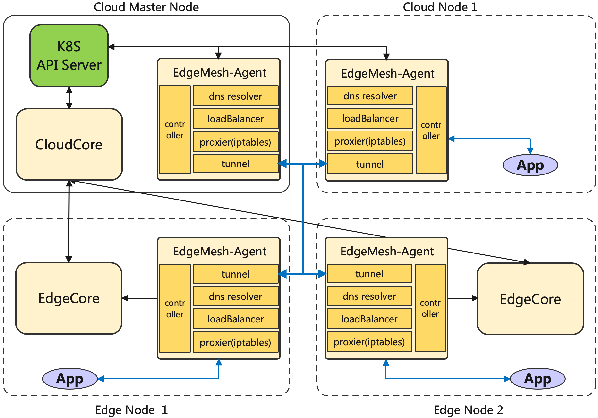
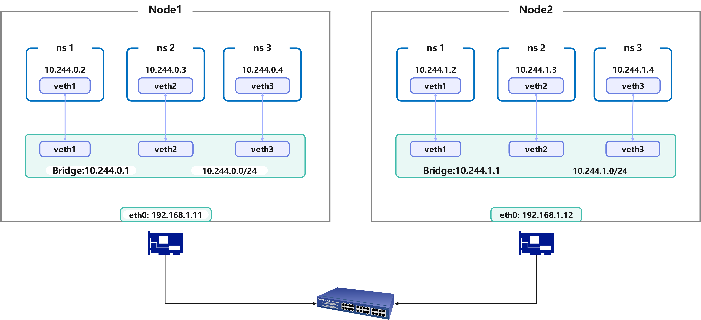
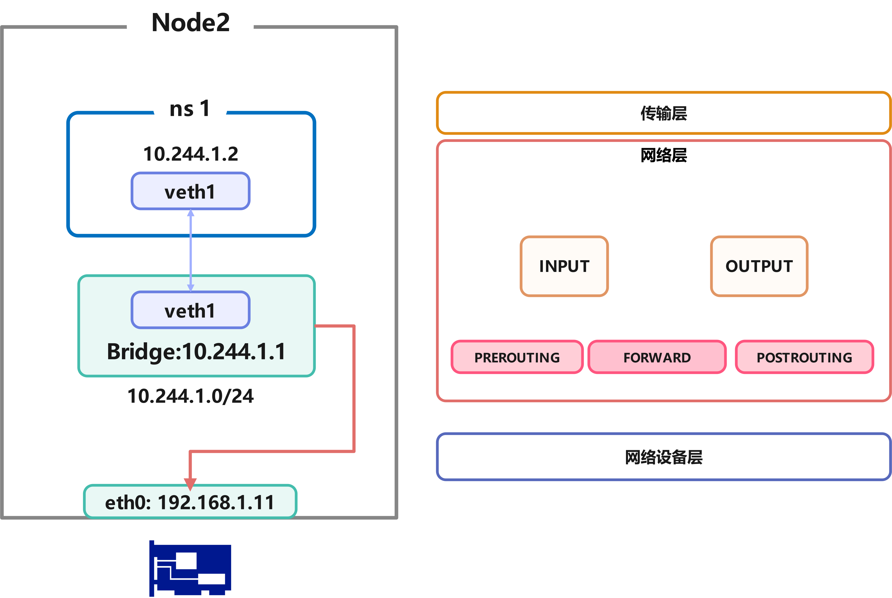
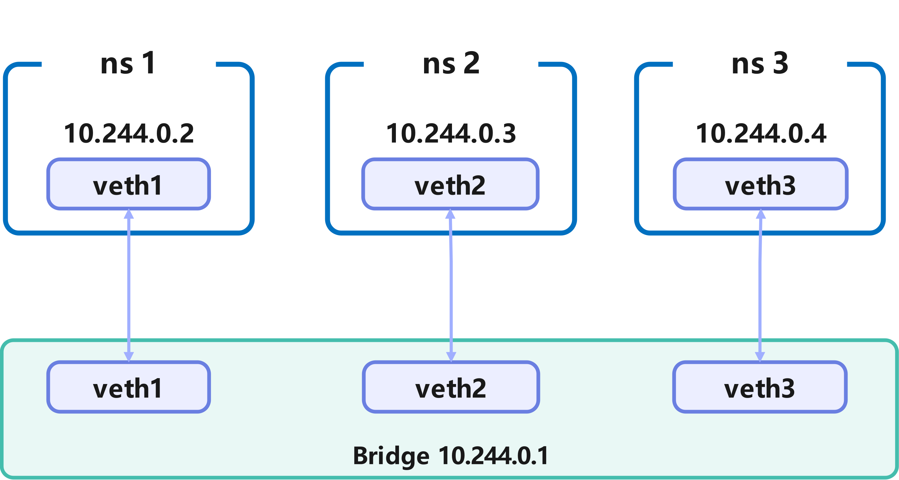
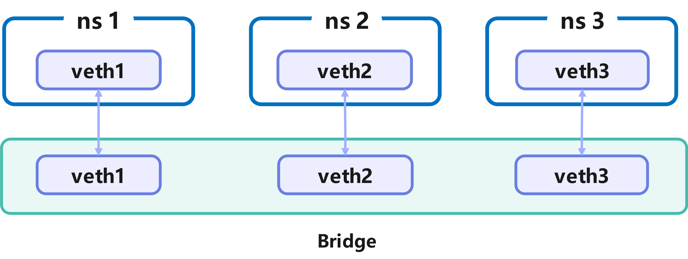
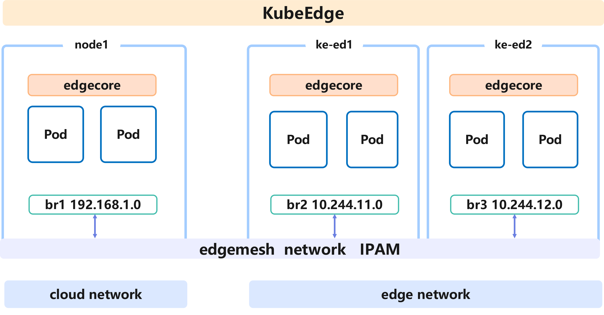
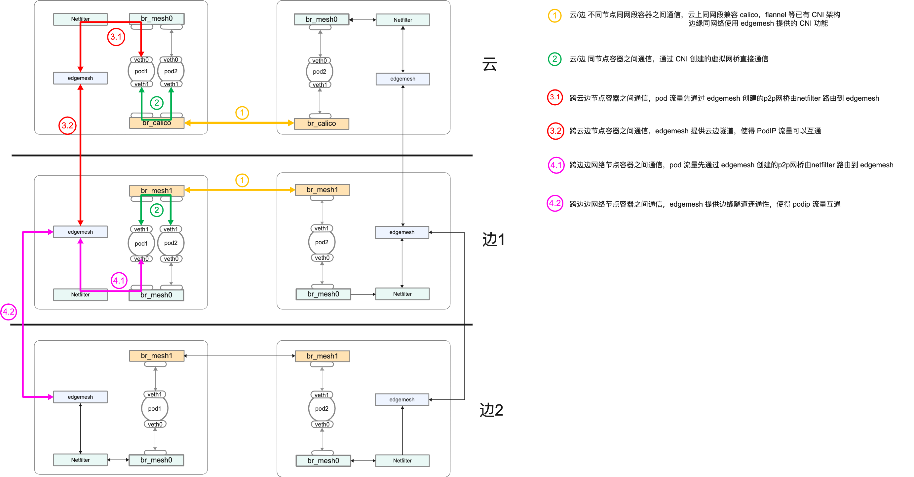

<center><font size ='5'>Project：Container Network supports CNI features</font></center>

<center><font size='4'>Mentor：王杰章</font> </center>

<center><font size='4'>Applicant： 达益鑫</font> </center>

<center><font size='4'>2023-5-18</font> </center>

<center><font size='4'>Email：2374087322@qq.com</font> </center>

---


[TOC]

# <font size ='6'>Background and Challenges</font>

## 1.  KubeEdge and EdgeMesh

Understanding and Cognition of KubeEdge Architecture：

KubeEdge Repository ： https://github.com/kubeedge/kubeedge

* Cloud Side：CloudCoreService

  * CloudHub：A WebSocket server responsible for monitoring changes in the cloud, caching, and sending messages to the EdgeHub.。

  * EdgeController：An extended Kubernetes controller that manages edge node and pod metadata, enabling data to be directed to specific edge nodes.

  * DeviceController：An extended Kubernetes controller for managing devices, allowing device metadata and state data to be synchronized between the edge and the cloud.
* Edge Side：EdgeCoreService

  * EdgeHub：A WebSocket client responsible for interacting with cloud services for edge computing (such as the edge controller in the KubeEdge architecture). This includes synchronizing cloud resource updates to the edge and reporting changes in the edge host and device status to the cloud.
* Edged：An agent that runs on edge nodes and manages containerized applications
  * EventBus：An MQTT client for interacting with the MQTT server (mosquitto), providing publish and subscribe functionality for other components.
* ServiceBus：An HTTP client that interacts with an HTTP server (REST), providing HTTP client capabilities for cloud components to access HTTP servers running at the edge.
  * DeviceTwin：Responsible for storing device status and synchronizing it to the cloud. It also provides a query interface for applications.
* MetaManager：A message processor between edged and edgehub. It is also responsible for storing/retrieving metadata in a lightweight database (SQLite).

Deploying with keadm in a test cluster, mainly managing and launching two specific application processes. Below is the architecture diagram:


* Understanding and Cognition of EdgeMesh Architecture:

  EdgeMesh Repository Location: https://github.com/kubeedge/edgemesh

  - EdgeMesh Agent
  - Proxier: Responsible for configuring the kernel's iptables rules, intercepting requests to the EdgeMesh process
    - DNS Resolver: Built-in DNS resolver, resolving DNS requests within the node to service cluster IPs
  - LoadBalancer: Traffic forwarding module based on the Go-Chassis framework, responsible for traffic forwarding between applications
    - Controller: Obtains metadata (such as Service, Endpoints, Pod, etc.) through KubeEdge's edge-side Local APIServer capability
  - Tunnel-Agent: Based on LibP2P, provides cross-subnet communication capabilities using relay and NAT traversal



## 2. CNI and Network of Container

​	CNI, short for Container Network Interface, provides a **standardized, plugin-based network solution for containers**. In the past, the networking layer for containers was highly dependent on the underlying network environment, with different implementations by various network service providers. **CNI abstracts a set of standard interfaces from network services**, thereby shielding the differences between the upper-layer network and the underlying network provider's implementations. Through a plugin mechanism, it makes the specific implementation of the container's networking layer pluggable and highly flexible.

Firstly, CNI is a set of standard interfaces that belong to the [CNCF (Cloud Native Computing Foundation)](https://cncf.io/). The implementations according to this standard are CNI Plugins, which are independent of each other and can be combined for use. They consist of a set of specifications and libraries for configuring network interfaces for Linux containers, as well as some plugins. The core functionality of CNI is managing network allocation when containers are created and releasing network resources when containers are deleted.

​	According to the CNI [specification](https://github.com/containernetworking/cni/blob/master/SPEC.md), CNI has the following features:

- CNI must provide a **file format for network administrators to define network configurations**
- CNI must provide a **protocol/API** for Container Runtime (CRI) to invoke functionality.
- When CNI is called by CRI, it must execute network configuration functionality according to the configuration file
- CNI must reserve the capability to invoke other plugins
- CNI must standardize the data format returned to CRI

Based on these features and requirements, it is clear that implementing a CNI plugin needs to include the following parts:

- Executable files
  - CNI main process
  - IPAM, etc.
- Network configuration file

​	For each type of CNI, the following functions must be provided:

CNI plugins must first implement an executable file - cni plugins, which can be invoked by container management systems (CRI), such as rkt and Kubernetes. This plugin initially needs to provide **basic Linux network connectivity services**, such as creating veth or bridge and inserting one end of the veth pair into the container's network namespace and the other end into the bridge, allowing containers to communicate with each other. Then, **assign IP to the interface** and manage IP addresses by calling the **IPAM** plugin to ensure that container IP addresses within the cluster do not overlap, or to work with other plugins to implement more complex network routing management functions, etc.

The CNI team provided a more typical example as follows:

- Main plugins for creating network devices
  - bridge: create a bridge and add host and container to it
  - ipvlan: add ipvlan network card in the container
  - loopback: set the status of the loopback device (lo network card) and apply
  - macvlan: create a new MAC address
  - ptp: create Veth Pair (virtual Ethernet card pair)
  - vlan: allocate Vlan devices
  - host-device: move existing network card devices into the container
- IPAM for managing IP addresses
  - dhcp: run a daemon on the host machine, representing the container's request to the DHCP server
  - host-local: maintain allocated IP addresses in the local database
  - static: assign static IPv4/IPv6 addresses to containers (commonly used for debugging)
- Meta for other purposes
  - tuning: adjust the sysctl parameters of network devices
  - portmap: iptables-based port mapping, mapping ports from host address space to container
  - bandwidth: using TBF (Token Bucket Filter) to limit inbound/outbound bandwidth
  - firewall: managing rules for allowing traffic in and out of containers using iptables or firewalld


For more detailed research content, please refer to my blog summary and collation:

* [CNI 与 Pod 容器网络—— Linux 网络 | ideamesh (ideameshdyx.github.io)](https://ideameshdyx.github.io/2023/04/18/EdgeMesh/2023-ospp-fighting/CNI-LinuxNetwork/)

* [Kubernetes 容器网络 — CNI | ideamesh (ideameshdyx.github.io)](https://ideameshdyx.github.io/2023/04/18/EdgeMesh/2023-ospp-fighting/CNI-Basic/)

* [Kubernetes 容器网络 — 现有 CNI 方案的调研 | ideamesh (ideameshdyx.github.io)](https://ideameshdyx.github.io/2023/04/18/EdgeMesh/2023-ospp-fighting/CNI-ReaseachofCni/)

## 3. Core Issues 

​	Through the exploration of CNI functionality and experiments on EdgeMesh's related features, we can delve into the core issues of this research topic, which are also the main functions the project aims to achieve.

From the above experiments, it can be seen that the network access functionality provided by EdgeMesh is built on top of the existing container network management of the node cluster, mainly focusing on L4 and some L3 services. According to the future development requirements of EdgeMesh's network functionality, the management of cluster network addresses and service routing needs to be more in-depth in L3/L2 architecture management. Therefore, implementing CNI features for EdgeMesh is the key to this research topic, and the specific issues can be summarized into the following two points:

### <font size ='4'> Mainstream CNI does not support cross-subnet traffic forwarding </font>

> The detailed question is: Why can't this service be accessed through ClusterIP in the cloud LAN, while it can be accessed through ClusterIP in the edge LAN?
>
> **Answer: The current mainstream CNI plugins do not have the capability to forward traffic across subnets, and they rely on Layer 3 reachability. Therefore, if the underlying networks are not interconnected, the connection service provided by CNI at L3 is not sufficient to support cross-network segment connectivity. In other words, even in edge networks, non-interconnected network segments cannot be connected.**



​	The reason why the cloud LAN cannot access the services on the edge nodes through ClusterIP is that they are not in the same LAN, and the cloud nodes have not configured EdgeMesh. CNI itself only provides Layer 2 reachable network resource allocation and address management services. When the data packet reaches Netfilter, it cannot query the route to the node where the container providing the ClusterIP service is located, so the packet cannot be forwarded.

As shown in the figure above, during this process, the data packet is indeed encapsulated and directed to the node's IP address. However, if the nodes are not Layer 2 reachable, the encapsulated internal node IP is only visible to the Kubernetes cluster information, and it does not mean that there is a reachable route between the container-deployed node and this internal node. The data packet cannot find the corresponding node through the connected switch or other routing devices. To add, mainstream CNI does not check network connectivity on its own, which often results in container network resources created through Kubernetes address partitioning information being unreachable in edge environments.

### <font size ='4'> EdgeMesh does not have PodIP traffic forwarding capability</font>

> EdgeMesh does not have PodIP traffic forwarding capability Detailed question: Why can this service be accessed through ClusterIP in the cloud LAN (points will not be awarded for simply answering "because EdgeMesh is installed," the principle must be explained), while it cannot be accessed through PodIP?
>
> **Answer: Although EdgeMesh currently supports cross-subnet traffic forwarding at the ClusterIP level, it does not yet have the capability to forward PodIP traffic. When traffic is forwarded through Iptables, it will not be intercepted by EdgeMesh, so the NodeIP used is inaccessible to the underlying network devices.**



​	In the Kubernetes network model, a Service is set up by binding to the Pod IP of the EndPoint to provide services. This design means that requests only need to consider a fixed routing address, with the Kubernetes system assisting in network forwarding and load balancing.

EdgeMesh intercepts traffic to the Service by inserting Iptables rules on the node, at which point the traffic uses the P2P communication service provided by EdgeMesh. In other words, EdgeMesh cannot provide P2P service for PodIP traffic. As shown in the figure above, these cross-subnet traffic cannot find matching table entries in the routing rules and will be discarded or forwarded to the network card, allowing the underlying network devices to route. It is evident that the underlying devices do not have this routing table entry, which would result in such service requests being shown as unreachable.


# <font size ='6'>Project Proposal: Current Situation and Requirements </font>

## 1. situation of EdgeMesh 

### <font size ='4'> 1.1 EdgeMesh relies on existing CNI functionality</font>

​	If a node does not have a CNI plugin installed, KubeEdge will use the Docker0 bridge as an address allocation service provider. If a node has a CNI plugin installed, it will use the address and network resources allocated by the CNI plugin. In other words, the network routing work provided by EdgeMesh has always been at the L4/L3 layer, unable to forward and manage traffic accessing the PodIP, and depends on the network management capabilities of the CRI-accessed CNI.

Relying on existing CNI plugins to create network resources is feasible in cloud clusters, but the edge networks targeted by EdgeMesh have more complex network deployment scenarios, with containers and nodes often in different subnets. As previously analyzed in the experiments, the mainstream CNI relies on an environment with Layer 2 physical network connectivity. If cross-subnet situations are involved, IP unreachability issues often arise.

Moreover, due to the complex CNI plugin deployment in edge environments, deploying them sequentially or in a mixed manner can lead to address conflicts. If different subnet CNIs are started only to provide network resource creation, and the Kubernetes partitioned network segments are the same, it is possible that containers in different subnets may be assigned the same IP address, leading to service access address conflicts. In addition, when using CNI in a mixed manner, if the address partitioning rules are not carefully set in the configuration file, there will be confusion in IP address allocation between cloud-edge and edge-edge.

Considering these situations, I believe that EdgeMesh needs to complete its own CNI basic functionality and main invocation logic, and cannot be mixed with other CNIs or serve only as middleware between CNI plugins.

### <font size ='4'> 1.2 EdgeMesh targets Service-level traffic</font>

​	Currently, EdgeMesh supports cross-subnet traffic forwarding for accessing services through **Service**. The specific workflow is: By default, a port is exposed on `169.254.96.16`, and all Service traffic is hijacked through iptables configuration, forwarding this traffic to the application layer's EdgeMesh. In the following iptables NAT table, traffic is hijacked to `169.254.96.16:40505` through the `KUBE-SVC-PX4OGZX33ST3IKD4` table entry by rule matching.

```shell
[root@k8s-node1 ~]# iptables -t nat -nvL --line | grep  10.106.117.151
11       0     0 KUBE-MARK-MASQ  tcp  --  *      *      !10.244.0.0/16        10.106.117.151       /* testzone/hostname-svc:http-0 cluster IP */ tcp dpt:12345
12       0     0 KUBE-SVC-PX4OGZX33ST3IKD4  tcp  --  *      *       0.0.0.0/0            10.106.117.151       /* testzone/hostname-svc:http-0 cluster IP */ tcp dpt:12345
9       10   600 DNAT       tcp  --  *      *       0.0.0.0/0            10.106.117.151       /* testzone/hostname-svc:http-0 */ tcp dpt:12345 to:169.254.96.16:40505
9        0     0 DNAT       tcp  --  *      *       0.0.0.0/0            10.106.117.151       /* testzone/hostname-svc:http-0 */ tcp dpt:12345 to:169.254.96.16:40505
```

​	However, this approach is clearly aimed at SVC traffic and does not provide services for each PodIP traffic access. On the one hand, there is no need to forward every PodIP traffic, as this would cause a rapid increase in the rules injected into iptables, reducing the system's packet forwarding efficiency, and this part of the network connection can rely entirely on existing CNI plugins. On the other hand, for edge cross-subnet and cross-cloud-edge traffic, EdgeMesh needs to provide P2P network connection services for them, which is the most important feature that EdgeMesh needs to implement as a CNI network plugin.

## 2. EdgeMesh CNI Functionality Requirements

Based on the research of the existing CNI architecture and the understanding of the project requirements from the above experiments, I have compiled the following engineering objectives and functional tasks that need to be implemented for this project:

###  <font size ='4'> 2.1  Cluster-scale IP address partitioning and management </font>

> The purpose is to ensure the uniqueness of Pod IP within the cluster

####  <font size ='4'> A. Create and manage network resources within the node </font>

​	**EdgeMesh CNI needs to create network resources for containers in the same subnet and cross-subnet clusters, including basic functions such as IP address allocation, bridge creation and network segment partitioning, and maintaining network status.** After further in-depth research on the project, complex container network deployment structures at multiple levels will be implemented in conjunction with SRV6 or Netpolicy rules.

​	The issues to be addressed in this step include:

- Identifying the container network environment of the node. For example, whether the CNI plugins installed by the user or the already configured network environment will conflict with the network resources to be created later.

- Creating network resources and allocating addresses. This can be achieved by creating bridges or network cards, but the partitioning of network segments and synchronization with KubeEdge must be considered.

  > it's not means that  Edgemesh CNI completely overtake the position of formers like calico or flannel, costumers will use what they want in the cloud , but from experience , edge side would not have it's own CNI ,so that is where Edegmesh CNI would perform.

####  <font size ='4'> B. Ensure unique cluster internal addresses</font>

​	**Access Edgecore (standard Kubernetes specification) to synchronize the cluster's address allocation information. By using List/Watch on Pods and cluster network segment resources, the IP addresses assigned to containers on cloud edge nodes are unique within the cluster.**

The main issue in this step is to allocate a unique IP address to the container object under the IPAM form.

###  <font size ='4'> 2.2  Support Pod IP hierarchical traffic forwarding</font>

> Provide CNI basic functions for domain-internal Pods and Pod IP hierarchical P2P services for cross-domain Pods.

 ####  <font size ='4'> A. Implement basic CNI functions to provide Pod traffic forwarding within the same LAN</font>

​	**For containers in the same subnet, EdgeMesh needs to implement mainstream CNI plugin functions. By referring to other existing CNI plugin functions, EdgeMesh creates and manages the network resources allocated to containers, modifies the node's routing rules to provide address encapsulation functions, and enables normal transmission between nodes in the same subnet.**

####  <font size ='4'> B. Identify Pod IP in different LANs and provide P2P services</font>

​	**For containers in different subnets, EdgeMesh needs to intercept and forward the traffic to the target subnet to provide P2P services. This process needs to be combined with the high availability features currently implemented in EdgeMesh to distinguish these container traffic, whether it is accessed through Service or underlying PodIP.**

In this process, it is necessary to consider optimizing the method of relying on Iptables forwarding (such as IPVS relying on Netfilter forwarding technology). If a large number of rules are added to execute forwarding, it will lead to a decrease in network forwarding efficiency and waste of resources. This proposal will mainly use eBPF technology to optimize this aspect.


# <font size ='6'>Project Proposal: Design and Implementation Details </font>

## 1. Goal

​		Through research on the existing CNI plugin framework and combining with the requirements of complex network deployment in edge/cloud scenarios targeted by EdgeMesh, this proposal believes that the implementation goal of EdgeMesh should be an independent and complete CNI plugin function while also providing diverse services in combination with other CNI plugins. The alternative solution cannot meet the project requirements. For example, if it is implemented as middleware compatible with multiple CNIs, other CNI plugins need to be installed first, and then EdgeMesh acts as middleware to perform network information synchronization and translation, which will increase the pressure on users to configure various plugins. On the other hand, since the implementation of various CNI plugin functions is not pre-negotiated to divide their responsible sections, their functions overlap and are not orthogonal in many aspects, which may lead to conflicts in function compatibility.

Based on this analysis and in combination with the results of the previous research and testing, this project has determined the implementation scope and user orientation.

Implementation scope: Complete the first-stage requirements of CNI functions, design and implement basic CNI functions and mechanisms, and reserve scalability for future network traffic governance services and other features. This mainly includes the following two items:

- Implement network partitioning and container IP allocation functions, compatible with CNI standards, and ensure that the IP address of each container in the cluster is unique.
- Support cross-subnet Pod IP traffic proxy and forwarding functions, compatible with CNI standards.

User and scenario orientation: Enable containers within the cluster to access each other directly through IP addresses, regardless of whether they are on the edge or in the cloud.


## 2. Implementation Details

According to the planning of the project objectives mentioned above, the following details and objectives of each part of the implementation are described in detail.

### <font size ='4'>2.1  Design and implement basic CNI functions</font>	

Solution design: **Provide intra-node and intra-domain network routing capabilities by creating a unified bridge device to connect and manage related container network segments.**



​	As shown in the figure above, the goal of the solution implementation is for EdgeMesh CNI to create a Linux bridge to manage a network segment of containers and provide layer 2 network communication services for them on a single node.

The specific implementation process is:

- Receive the system parameters passed in by CRI or read the network segment divided by the Config file, create a bridge, and allocate an address to make the bridge the gateway of the network segment.
- Create a veth pair for each container managed by KubeEdge, and put one end of it into the above bridge, and then assign a unique IP address to the container.
- Provide address encapsulation for the traffic out of the bridge and write forwarding rules in the node's routing rules, so that nodes in the LAN can communicate with each other.
- 

Through studying the CNI standard, I have implemented a basic CNI that can create virtual network resources for single-node containers and complete IP communication.

The specific implementation and process code analysis can be found on my blog: [Creating a Simple CNI Plugin | ideamesh (ideameshdyx.github.io)](https://ideameshdyx.github.io/2023/05/25/EdgeMesh/2023-ospp-fighting/CNI-CreateCNI/). The experimental code and scripts are also available on my Github repository.

For EdgeMesh, this project requires the implementation of basic CNI functions, with the core being to provide IP segment division for cluster containers and traffic forwarding at the PodIP level.

Below is my simple logical design solution for this requirement.

#### <font size ='4'> A. Division of Container Network Segments</font>

Create a Linux bridge and allocate an IP segment. When the CRI calls the CNI program, a veth pair is created for each container (NetNS), with one end placed in the created bridge and the other end placed in the container, while assigning an IP address within the allocated network segment to the container.

In the complete function, it is also necessary to ensure the consistency of IP addresses within the cluster. The CNI needs to obtain the cluster content IP network segment stored in etcd through the List/Watch EdgeCore ApiServer, and can calculate a valid IP network segment through a local IPAM plugin and synchronize it to EdgeCore, which is then passed to the CNI as a parameter or written into the Config file.



The container network topology constructed in the experiment is shown above, and the most critical aspect of this process is the creation and management of local network resources, with IPAM data being obtained from the Config.

At the end of the experiment, a bridge was created and communication capabilities were provided between containers (NetNS). The testing script can be obtained from [knetwork/Makefile at main · IdeaMeshDyx/knetwork · GitHub](https://github.com/IdeaMeshDyx/knetwork/blob/main/testCni/scripts/Makefile).

```golang
[root@master knet]# ./run.sh 
Ready to call the cni to create ip for ns1
{test 192.0.2.15/24}
The CNI has been called, see the following results
The bridge and the veth has been attatch to
bridge name     bridge id               STP enabled     interfaces
test            8000.b6e6090625de       no              veth2a9d8a3d
The interface in the netns
eth10: flags=4163<UP,BROADCAST,RUNNING,MULTICAST>  mtu 1500
        inet 192.0.2.15  netmask 255.255.255.0  broadcast 192.0.2.255
        inet6 fe80::477:7aff:fee3:a9b8  prefixlen 64  scopeid 0x20<link>
        ether 06:77:7a:e3:a9:b8  txqueuelen 0  (Ethernet)
        RX packets 1  bytes 90 (90.0 B)
        RX errors 0  dropped 0  overruns 0  frame 0
        TX packets 1  bytes 90 (90.0 B)
        TX errors 0  dropped 0 overruns 0  carrier 0  collisions 0

lo: flags=8<LOOPBACK>  mtu 65536
        loop  txqueuelen 1000  (Local Loopback)
        RX packets 0  bytes 0 (0.0 B)
        RX errors 0  dropped 0  overruns 0  frame 0
        TX packets 0  bytes 0 (0.0 B)
        TX errors 0  dropped 0 overruns 0  carrier 0  collisions 0

[root@master knet]# sudo ifconfig test 192.0.2.1
[root@master knet]# sudo ip netns exec ns1 ping 192.0.2.1
PING 192.0.2.1 (192.0.2.1) 56(84) bytes of data.
64 bytes from 192.0.2.1: icmp_seq=1 ttl=64 time=0.077 ms
64 bytes from 192.0.2.1: icmp_seq=2 ttl=64 time=0.044 ms
64 bytes from 192.0.2.1: icmp_seq=3 ttl=64 time=0.053 ms
64 bytes from 192.0.2.1: icmp_seq=4 ttl=64 time=0.045 ms
```

The core logic of the code is implemented in `CmdAdd`, which reads the Config file and receives configuration parameters from the CRI to create the corresponding kernel device, bind the IP address, insert information, and finally provide network connectivity services to the container.


#### <font size ='4'> B. Traffic Forwarding at the PodIP Level*</font>

​	For containers connected to a single-node bridge, they are all Layer 2 accessible at the operating system level. Of course, to provide more diverse network services, the container network architecture built by CNI should also reflect more hierarchical features, especially when combined with label features such as SRV6. In this case, additional rules need to be injected into IPtables to achieve more functions.

For cross-node IP traffic, CNI mainly injects Iptables rules and modifies the kernel forwarding address to achieve this.

For containers connected to the same bridge in the cluster, they belong to the same network segment, so when the operating system transmits down to the bridge, it can be directly transmitted to the peer veth. Other network segments are forwarded to the local Layer 2 device by setting iptables rules when the packet reaches Netfilter. In more complex situations, when crossing nodes, CNI provides address encapsulation to forward packets outside the node.

In fact, the connectivity of this part needs to be implemented with the help of kube-proxy. Because the basic CNI only achieves resource creation and allocation. For cross-node PodIP traffic, CNI encapsulates the IP address of the data packet when it leaves the node, using the network segment and node address written in the configuration file (in KubeEdge, the cluster node information is obtained through EdgeCore).

If the nodes are in the same LAN, the corresponding route can be found in the node's routing rules and the data packet can be transmitted. However, if the nodes are in different LANs, the node's internal network address cannot communicate, in other words, the existing basic CNI or most CNIs cannot support the situation where Layer 2 addresses are not accessible.

### <font size ='4'>2.2  Coordinate cluster internal IP addresses for unified management</font>	

Solution design: **Access KubeEdge/Etcd to obtain the cluster's address allocation information and drive the IPAM CNI plugin**



​	As shown in the figure above, the goal of the solution implementation is to obtain the cluster-scale IP address allocation information by accessing KubeEdge and allocate a unique IP address within the cluster to each bridge and container through the edgemesh IPAM plugin.

The specific implementation process is:

- Design and implement the IPAM plugin, which is called first when CNI is called. By accessing EdgeCore (or Etcd), obtain the network information allocated by the cluster and obtain a segment of IP address information that can be allocated within the node. Calculate the network range divided by the node, write it to the Config file, or pass it as a parameter to the next called CNI plugin (bridge, etc.).
- Synchronize the divided network segment and container network information to EdgeCore/Etcd, and maintain an edge network resource object in the cluster database for resource management and uniformity with other nodes.

### <font size ='4'>2.3  Using tunneling technology to provide cross-node communication capabilities</font>	

> The core is L3/L4 network services, which can provide flat Layer 2 communication in design and can be extended to implement more diverse network control functions.

**Core idea: Use Iptables to forward traffic with fixed IP network segments (i.e., IP addresses across subnets) to EdgeMesh.**




The basic working principle of EdgeMesh is to intercept traffic to the Service into EdgeMesh by inserting Iptables rules on the node, and the traffic is then transmitted through the P2P communication service provided by EdgeMesh.

​	For the implementation of CNI's P2P function, different areas need to be divided. When PodIP is looking for an address within the LAN, the node's internal network IP address routing rule is reachable. If the traffic is across network segments, we only need to insert the rule that intercepts the traffic behind the above rule. When the linearly traversed rule does not find the corresponding routing rule, we intercept this traffic into EdgeMesh and rely on P2P forwarding.

​	From the previous experiment, it can be seen that the cloud and the edge are not in the same LAN. If EdgeMesh is not installed, the containers in each network segment cannot access each other. This is a typical scenario across subnets. We modify the node affinity of the previous EdgeMesh deployment document to deploy EdgeMesh on the cloud, as shown below:

```golang
[root@k8s-master dyx]# k get pods -n kubeedge -o wide
NAME                         READY   STATUS    RESTARTS   AGE   IP              NODE         NOMINATED NODE   READINESS GATES
cloudcore-5548d5db77-46dzw   1/1     Running   0          16m   192.168.0.243   k8s-node2    <none>           <none>
edgemesh-agent-72fwp         1/1     Running   0          28m   192.168.5.231   ke-edge1     <none>           <none>
edgemesh-agent-7n2s8         1/1     Running   0          29m   10.60.106.49    ke-edge3     <none>           <none>
edgemesh-agent-8mxb8         1/1     Running   0          29m   192.168.0.243   k8s-node2    <none>           <none>
edgemesh-agent-hjbr6         1/1     Running   0          29m   192.168.0.71    k8s-node1    <none>           <none>
edgemesh-agent-q29bx         1/1     Running   0          29m   192.168.0.229   k8s-master   <none>           <none>
edgemesh-agent-xp54c         1/1     Running   0          29m   192.168.5.121   ke-edge2     <none>           <none>
```

​	With the help of the previous EdgeMesh example, we know that after entering the test container, the container on the cloud can access the edge service through the Service, but cannot access it through PodIP, as shown below:

```
[root@k8s-master dyx]# k get all -n testzone -o wide
NAME                                 READY   STATUS    RESTARTS   AGE   IP             NODE        NOMINATED NODE   READINESS GATES
pod/alpine-test                      1/1     Running   0          16m   10.244.36.79   k8s-node1   <none>           <none>
pod/hostname-edge-84cb45ccf4-5srqw   1/1     Running   0          15m   10.244.13.2    ke-edge1    <none>           <none>
pod/hostname-edge-84cb45ccf4-cgpwg   1/1     Running   0          15m   10.244.11.3    ke-edge2    <none>           <none>
pod/hostname-edge-84cb45ccf4-n982k   1/1     Running   0          15m   10.244.12.2    ke-edge3    <none>           <none>
pod/websocket-test                   1/1     Running   0          16m   10.244.36.78   k8s-node1   <none>           <none>

NAME                   TYPE        CLUSTER-IP       EXTERNAL-IP   PORT(S)     AGE   SELECTOR
service/hostname-svc   ClusterIP   10.106.117.151   <none>        12345/TCP   15m   app=hostname-edge

NAME                            READY   UP-TO-DATE   AVAILABLE   AGE   CONTAINERS   IMAGES                           SELECTOR
deployment.apps/hostname-edge   3/3     3            3           15m   hostname     poorunga/serve_hostname:latest   app=hostname-edge

NAME                                       DESIRED   CURRENT   READY   AGE   CONTAINERS   IMAGES                           SELECTOR
replicaset.apps/hostname-edge-84cb45ccf4   3         3         3       15m   hostname     poorunga/serve_hostname:latest   app=hostname-edge,pod-template-hash=84cb45ccf4
[root@k8s-master dyx]# kubectl exec -n testzone  -it alpine-test -- sh
/ # curl hostname-svc:12345
hostname-edge-84cb45ccf4-5srqw
/ # ip a
1: lo: <LOOPBACK,UP,LOWER_UP> mtu 65536 qdisc noqueue state UNKNOWN qlen 1000
    link/loopback 00:00:00:00:00:00 brd 00:00:00:00:00:00
    inet 127.0.0.1/8 scope host lo
       valid_lft forever preferred_lft forever
2: tunl0@NONE: <NOARP> mtu 1480 qdisc noop state DOWN qlen 1000
    link/ipip 0.0.0.0 brd 0.0.0.0
4: eth0@if63: <BROADCAST,MULTICAST,UP,LOWER_UP,M-DOWN> mtu 1480 qdisc noqueue state UP 
    link/ether 72:e5:81:48:cd:38 brd ff:ff:ff:ff:ff:ff
    inet 10.244.36.79/32 scope global eth0
       valid_lft forever preferred_lft forever
/ # curl hostname-svc:12345
hostname-edge-84cb45ccf4-cgpwg
/ # curl 10.244.11.3:9376
curl: (28) Failed to connect to 10.244.11.3 port 9376 after 129306 ms: Operation timed out
```

​	However, in the corresponding edge node, because Layer 2 is accessible, the corresponding service can be accessed directly. That is to say, for traffic within the same subnet in the design plan, only the existing basic CNI function is needed to provide connectivity. The traffic that EdgeMesh needs to forward is traffic across subnets.

```
# in ed2
root@ke-edge2:~# curl 10.244.11.3:9376
hostname-edge-84cb45ccf4-cgpwg
# in ed1
[root@ke-edge1 ~]# curl 10.244.11.3:9376
hostname-edge-84cb45ccf4-cgpwg
```

​	According to the design plan I proposed, **for traffic across subnets, it is necessary to inject rules into the Iptables on the cloud node to forward traffic to EdgeMesh on the edge node, and EdgeMesh provides the connection**. 

```
[root@k8s-node1 ~]# ip route show
default via 192.168.0.1 dev eth0 proto dhcp metric 100 
blackhole 10.244.36.64/26 proto bird 
10.244.36.66 dev cali62cd1ccae9a scope link 
10.244.36.78 dev cali35731913c63 scope link 
10.244.36.79 dev calia64cd0fe4e2 scope link 
10.244.169.128/26 via 192.168.0.243 dev tunl0 proto bird onlink 
10.244.235.192/26 via 192.168.0.229 dev tunl0 proto bird onlink 
169.254.169.254 via 192.168.0.254 dev eth0 proto dhcp metric 100 
172.17.0.0/16 dev docker0 proto kernel scope link src 172.17.0.1 linkdown 
192.168.0.0/24 dev eth0 proto kernel scope link src 192.168.0.71 metric 100 
```

​	The following is an example of inserting rules into the container on the edge1 node to intercept traffic to the edge2 network segment into EdgeMesh. The same effect can be achieved by injecting rules to forward traffic to a server with a public IP address.

``` shell
# 查看 EdgeMesh 实现 svc 拦截的iptables 规则
[root@k8s-node1 ~]# iptables -t nat -nvL --line | grep  10.106.117.151
11       0     0 KUBE-MARK-MASQ  tcp  --  *      *      !10.244.0.0/16        10.106.117.151       /* testzone/hostname-svc:http-0 cluster I
12       0     0 KUBE-SVC-PX4OGZX33ST3IKD4  tcp  --  *      *       0.0.0.0/0            10.106.117.151       /* testzone/hostname-svc:http-
9       10   600 DNAT       tcp  --  *      *       0.0.0.0/0            10.106.117.151       /* testzone/hostname-svc:http-0 */ tcp dpt:123
9        0     0 DNAT       tcp  --  *      *       0.0.0.0/0            10.106.117.151       /* testzone/hostname-svc:http-0 */ tcp dpt:123
# Warning: iptables-legacy tables present, use iptables-legacy to see them
[root@k8s-node1 ~]# iptables -t nat -nvL --line | grep  10.106.117.151
11       0     0 KUBE-MARK-MASQ  tcp  --  *      *      !10.244.0.0/16        10.106.117.151       /* testzone/hostname-svc:http-0 cluster IP */ tcp dpt:12345
12       0     0 KUBE-SVC-PX4OGZX33ST3IKD4  tcp  --  *      *       0.0.0.0/0            10.106.117.151       /* testzone/hostname-svc:http-0 cluster IP */ tcp dpt:12345
9       10   600 DNAT       tcp  --  *      *       0.0.0.0/0            10.106.117.151       /* testzone/hostname-svc:http-0 */ tcp dpt:12345 to:169.254.96.16:40505
9        0     0 DNAT       tcp  --  *      *       0.0.0.0/0            10.106.117.151       /* testzone/hostname-svc:http-0 */ tcp dpt:12345 to:169.254.96.16:40505

```

Therefore, what we need is to forward traffic accessing `10.244.11.3:9376` to `169.254.96.16:40505`. This can be achieved using the following command. 

```shell
[root@k8s-node1 ~]# sudo iptables -t nat -A PREROUTING -p tcp -d 10.244.11.3 --dport 9376 -j DNAT --to-destination 169.254.96.16:40505
```

 Now, when entering the container again and accessing it through PodIP, EdgeMesh can forward the traffic to it.

```shell
[root@k8s-node1 ~]# docker exec -it 70743ce06969 /bin/sh
/ # curl 10.244.11.3:9376
hostname-edge-84cb45ccf4-n982k
/ # curl hostname-svc:12345
hostname-edge-84cb45ccf4-5srqw
```


## 3. Technical Feasibility of the Solution

The feasibility analysis of the above solution is as follows:：

###  3.1  Existing CNI Implementation Reference

​	The design of the above solution refers to and draws on the design of some existing CNI plugin architectures, combined with the requirements of edgemesh for complex network communication environments in edge/cloud scenarios.

The main system design logic is:

- The CNI plugin is accommodated as a module function of edgemesh in the main process of edgemesh.
- The CNI function of edgemesh is completely independent and needs to verify the node environment during installation. If the user has installed other CNIs, the user needs to uninstall or reset the environment. However, edgemesh will be compatible with some typical CNI implementations to provide diverse functions, such as Cilium, flannel, calico, kilo, etc.
- The CNI function of edgemesh will involve the creation and management of many kernel objects, and will be implemented by modifying the packet header or intercepting specific traffic through a custom protocol.

In summary, there are many open source solutions that can be referenced for the functional requirements of edgemesh. Combined with the application scenarios of edgemesh, this proposal designs a feasible system solution and architecture, which has been verified for feasibility by engineers and theoretical logic.


### 3.2 Technical Implementation Feasibility

​	The engineering technology and project implementation involved in this proposal mainly include the specifications provided by the official CNI and various typical CNI repositories. The basic function implementation will use more mature and stable open source repositories, and will be combined with kernel programmable technologies such as eBPF to achieve state management and information。

​	On the other hand, I have already implemented the first step of creating network resources as required above, and the specific code can be referred to: [knetwork/testCni/simpleCni at main · IdeaMeshDyx/knetwork · GitHub](https://github.com/IdeaMeshDyx/knetwork/tree/main/testCni/simpleCni)

​	main tools are in the follow：

* [eBPF-Cilium ](https://github.com/cilium/ebpf)

* [containernetworking/cni: Container Network Interface](https://github.com/containernetworking/cni)

* [Kilo is a multi-cloud network overlay ](https://github.com/squat/kilo/tree/main)
* [go-cni - Go Packages](https://pkg.go.dev/github.com/containerd/go-cni)

# <font size ='6'>Project Timeline </font>

>Plan according to the project release time and completion time.

## 1. Project Background Research and Related Unit Testing Phase (April 29 - June 26)

> This phase mainly completes the confirmation and clarification of project requirements and difficulties, explores feasible design solutions through the implementation of some feature functions, accumulates relevant knowledge, applies for the project.

* Set up and test edgemesh to clarify the problem requirements proposed by the project (completed)
* Implement a custom simple CNI and provide basic services (completed)
* Experiment with custom routing solutions to achieve traffic forwarding (completed)

## 2. Related Feature and Environment Function Testing and Experiment Phase (June 26 - July 15)

> Sort out the previous basic knowledge and testing units, implement the CNI function testing module, actively communicate with the community to implement the solution, and modify and iterate according to the community's opinions.

* Design experimental processes for related functional modules
  - Test and design basic CNI function modules to provide unified IP address management and routing services for cluster containers.
  - Test various solutions for accessing P2P tunnels to implement different network schemes for different subnets.
  - Test kernel network plugin functions and implement target kernel network control logic through eBPF or other CNI network programmable open source repositories.
  - Test CNI startup logic and experiment with CRI invocation process.

* Actively communicate with the mentor community to modify technical solutions based on testing results.

##  3. Project Development Phase (July 16 - September 25)

* Implementation process of functional modules:
  - Design and implement basic CNI function modules, create and manage container network objects, and provide unique IP address representation for containers.
  - Design and implement CNI function modules for subnet routing, divide different network areas, and encapsulate data streams to provide unified network access services.
  - Design and implement CNI-compatible P2P tunnel tunneling service solutions, allowing cross-subnet traffic to use P2P tunnels and same-subnet traffic to use common CNI network services.
  - Design and plan the deployment and installation process of CNI and the startup execution logic, set up access to CRI specifications, and configure P2P relay services.
  - Implement and test the performance of edgemesh CNI in actual clusters, and modify and optimize the solution based on test data.

* Actively communicate with mentors and the community to optimize the solution design.

## 4. Project Improvement Phase (September 26 - October 30)

* Project optimization part:

  - Test the various functions of edgemesh CNI, correct any bugs and issues, and actively communicate with the community and mentors about any issues.

    The open source repositories used for testing are:

    - [zvfvrv/k8s-bench-suite: Simple scripts to benchmark kubernetes cluster features (github.com)](https://github.com/zvfvrv/k8s-bench-suite)
    - [kinvolk/egress-filtering-benchmark (github.com)](https://github.com/kinvolk/egress-filtering-benchmark)
    - [InfraBuilder/k8s-bench-suite: Simple scripts to benchmark kubernetes cluster features (github.com)](https://github.com/InfraBuilder/k8s-bench-suite)

  - Collect and organize relevant data, communicate with the community and mentors, and optimize performance based on feedback.

* Documentation and PR part:

  - Organize data and test results, as well as relevant written materials, and write documents.
  - According to the output results required by Github Issue, organize and standardize the relevant content of the results.
  - Submit PR, and improve it .

# <font size ='6'>Related Reference Materials, Personal Github Repositories, and Blog Index</font>

All the above processes and tests will be recorded and open-sourced on my personal blog and Github repository.

### <font size ='4'>Personal blog article index</font> 

[ideamesh - learn and code (ideameshdyx.github.io)](https://ideameshdyx.github.io/)

[Kubernetes 容器网络 CNI — 现有 CNI 方案的调研 | ideamesh (ideameshdyx.github.io)](https://ideameshdyx.github.io/2023/04/18/EdgeMesh/2023-ospp-fighting/CNI-ReaseachofCni/)

[CNI 与 Pod 容器网络—— Linux 网络 | ideamesh (ideameshdyx.github.io)](https://ideameshdyx.github.io/2023/04/18/EdgeMesh/2023-ospp-fighting/CNI-LinuxNetwork/)

[Kubernetes 容器网络 — CNI | ideamesh (ideameshdyx.github.io)](https://ideameshdyx.github.io/2023/04/18/EdgeMesh/2023-ospp-fighting/CNI-Basic/)

[创建简单的 CNI 插件 | ideamesh (ideameshdyx.github.io)](https://ideameshdyx.github.io/2023/05/25/EdgeMesh/2023-ospp-fighting/CNI-CreateCNI/)

### <font size ='4'>Github test module address</font>

[IdeaMeshDyx/knetwork: a tour to network of Kubernetes (github.com)](https://github.com/IdeaMeshDyx/knetwork)

### <font size ='4'>List of references</font>

[1] [[containernetworking/cni: Container Network Interface - networking for Linux containers (github.com)](https://github.com/containernetworking/cni)](https://github.com/IdeaMeshDyx/knetwork)

[2] [Deep Dive: CNI - Bryan Boreham, Weaveworks & Dan Williams, Red Hat](https://www.youtube.com/watch?v=zChkx-AB5Xc&feature=youtu.be)

[3] [containernetworking/plugins: Some reference and example networking plugins, maintained by the CNI team. (github.com)](https://github.com/containernetworking/plugins)

[4] [ip-link(8) - Linux manual page (man7.org)](https://www.man7.org/linux/man-pages/man8/ip-link.8.html)

----


> 中文版申请书

# <font size ='6'>一. 项目背景: 背景和痛点</font>

## 1.  KubeEdge 以及 EdgeMesh相关

对于 KubeEdge 架构的理解和认识：

KubeEdge 仓库位置： https://github.com/kubeedge/kubeedge

* 在云端：CloudCoreService

  * CloudHub：一个web Socket服务器，负责在云端观察变化，缓存并发送消息到EdgeHub。

  * EdgeController：一个扩展的 kubernetes 控制器，它管理边缘节点和 pod 元数据，以便可以将数据定位到特定的边缘节点。

  * DeviceController：一个扩展的 kubernetes 控制器，用于管理设备，以便设备元数据/状态数据可以在边缘和云之间同步。

* 在边缘端：EdgeCoreService

  * EdgeHub：一个 Web Socket客户端，负责与边缘计算的云服务交互（如 KubeEdge 架构中的边缘控制器）。 这包括将云端资源更新同步到边缘，以及向云端报告边缘端主机和设备状态的变化。

  * Edged：在边缘节点上运行并管理容器化应用程序的代理。

  * EventBus：一个 MQTT 客户端，用于与 MQTT 服务器（mosquitto）交互，为其他组件提供发布和订阅功能。

  * ServiceBus：与 HTTP 服务器 (REST) 交互的 HTTP 客户端，为云组件提供 HTTP 客户端功能，以访问在边缘运行的 HTTP 服务器。

  * DeviceTwin：负责存储设备状态并将设备状态同步到云端。 它还为应用程序提供查询接口。

  * MetaManager：edged 和 edgehub 之间的消息处理器。 它还负责在轻量级数据库 (SQLite) 中存储/检索元数据。

在测试集群当中使用keadm部署，主要是对两个特定应用进程做管理和启动，以下是架构图:


对于EdgeMesh 架构的理解和认识：

EdgeMesh 仓库位置：https://github.com/kubeedge/edgemesh

* EdgeMesh Agent

  * Proxier：负责配置内核的iptables规则，拦截对EdgeMesh进程的请求

  * DNS Resolver ：内置DNS解析器，将节点内的DNS请求解析成服务集群IP

  * LoadBalancer：基于Go-Chassis框架的流量转发模块，负责应用之间的流量转发 

  * Controller：通过 KubeEdge 边缘端的 Local APIServer 能力获取元数据（如 Service、Endpoints、Pod 等）

  * Tunnel-Agent：基于LibP2P，使用中继和内网穿透提供跨子网通信的能力


## 2. CNI 以及 Pod 容器网络

​	CNI的全称是 Container Network Interface，它为**容器提供了一种基于插件结构的标准化网络解决方案**。以往，容器的网络层是和底层网络环境高度相关的，不同的网络服务提供商有不同的实现。**CNI从网络服务里抽象出了一套标准接口**，从而屏蔽了上层网络和底层网络提供商的网络实现之间的差异，并且通过插件方式，它让容器在网络层的具体实现变得可插拔了，所以非常灵活。

​	首先 CNI 是一套标准接口，它隶属于[CNCF(Cloud Native Computing Foundation)](https://cncf.io/)，依照这个标准所实现的为 CNI Plugins, 他们彼此独立，也可以组合起来一起使用，由一组用于配置 Linux 容器的网络接口的规范和库组成，同时还包含了一些插件。CNI 核心功能是管理容器创建时的网络分配，和当容器被删除时释放网络资源。

​	依据 CNI 的[规范](https://github.com/containernetworking/cni/blob/master/SPEC.md)，CNI 具有以下几点特征：

- CNI 需提供网络管理员**定义网络配置的文件格式**
- CNI 需提供 Container Runtime（CRI） 调用功能的**协议/API**。
- 当 CNI 被 CRI 调用时，需依据配置文件执行网络配置功能
- CNI 需预留可调用其他插件的能力
- CNI 需规范统一返回给CRI 的数据格式

依据这样的特征和要求，可以明确实现一个CNI插件需要包含以下部分：

* 可执行文件
  * CNI 主进程
  * IPAM 等
* 网络配置文件

​	对于每一类 CNI 而言都必须具有的功能包括：

​	CNI 插件首先得实现一个可以被容器管理系统（CRI），比如rkt、Kubernetes 所调用的可执行文件——cni plugins，这个插件首先需要提供**基础的 Linux 网络联通服务**，比如创建 veth 或者 bridge 并将 veth 对的一端插入容器的 network namespace，一端插入 bridge，使得容器之间可以相互通信。然后**将IP 分配给接口**，并通过调用 **IPAM **插件来设置和管理IP地址，使得集群内的容器IP地址相互不重复，或者是结合其他的插件来实现更加复杂的网络路由管理功能等等。

  CNI 团队提供了一个较为典型的例子如下：

  * Main 插件用于创建网络设备
    * bridge 创建网桥并向其添加宿主机与容器
    * ipvlan 在容器中添加 ipvlan 网卡
    * loopback 设置回环设备（lo 网卡）的状态并应用
    * macvlan 创建新的 MAC 地址
    * ptp 创建 Veth Pair（虚拟以太网卡对）
    * vlan 分配 Vlan 设备
    * host-device 将已存在的网卡设备移动至容器内
  * IPAM 查看用于管理 IP 地址
    * dhcp 在宿主机上运行守护进程，代表容器请求 DHCP 服务器
    * host-local 在本地数据库维护已分配的 IP 地址
    * static 给容器分配静态的 IPv4/IPv6 地址（常用于调试）
  * Meta 其他用途
    * tuning 调整网络设备的 sysctl 参数
    * portmap 基于 iptables 的端口映射，将端口从宿主机地址空间映射至容器
    * bandwith 利用 TBF（Token Bucket Filter） 限制入向/出向带宽
    * firewall 利用 iptables 或 firewalld 管理允许进出容器流量的规则


更加详细的调研内容见本人的博客整理归纳：

* [CNI 与 Pod 容器网络—— Linux 网络 | ideamesh (ideameshdyx.github.io)](https://ideameshdyx.github.io/2023/04/18/EdgeMesh/2023-ospp-fighting/CNI-LinuxNetwork/)

* [Kubernetes 容器网络 — CNI | ideamesh (ideameshdyx.github.io)](https://ideameshdyx.github.io/2023/04/18/EdgeMesh/2023-ospp-fighting/CNI-Basic/)

* [Kubernetes 容器网络 — 现有 CNI 方案的调研 | ideamesh (ideameshdyx.github.io)](https://ideameshdyx.github.io/2023/04/18/EdgeMesh/2023-ospp-fighting/CNI-ReaseachofCni/)


## 3. 课题核心问题

​	可以通过上述对 CNI 功能的探究和对 EdgeMesh 相关特性的实验，深入探讨本课题关注的核心问题，也是项目期望实现的主要功能。

​	从上述实验来看，EdgeMesh 目前提供的网络访问功能是建立在节点集群已有的容器网络管理之上的，主要集中在 L4 以及部分 L3 的服务。依据 EdgeMesh 后期的网络功能发展需求来看，对于集群网络地址的管理和服务路由需要更加深入到 L3/L2 的架构管理，所以为 EdgeMesh 实现 CNI 特性功能就是本课题的关键所在，具体面对的问题归纳为如下两点：

### <font size ='4'> 主流 CNI 不支持跨子网流量转发 </font>

> 详细问题是：为什么在云上局域网通过ClusterIP访问此服务无法访问通，然而在边缘局域网通过ClusterIP访问此服务可以访问通？
>
> **答：当前主流的 CNI 插件并不具备跨子网流量转发的能力，本身依赖网络三层可达；所以底层网络不互通，CNI 仅在L3提供的连接服务就不够支持跨网段连通，换句话说即便是边缘网络，不相通的网段也无法联通。 **


​	云上局域网不能够通过ClusterIP访问边缘节点的服务是因为他们并不在一个局域网，且云上的节点也没有配置 EdgeMesh ，而 CNI 本身仅提供二层可通的网络资源分配和地址管理服务；当数据包到达 Netfilter 时候并不能够查询到 ClusterIP 对端提供服务容器所在节点的路由，那么这个包就无法转发。

​	如上图所示，这个过程中数据包的确是被封装指向了节点的 IP 地址，但如果节点之间二层不可通的话，这个被封装的内网节点 IP 仅只是 Kubenetes 看到集群信息，并不意味着容器所部署的节点就能够与这个内网节点之间存在相通的路由设置，数据包并不能够通过所连接的交换机或者其他路由设备找到对应的节点。 补充来说，主流的 CNI 并不会自己去检验网络的连通性，所以往往使得通过 Kubernetes 获取地址划分信息所创建的容器网络资源在边缘环境下不可通。

### <font size ='4'> EdgeMesh 不具备 PodIP 流量转发能力</font>

> 详细问题： 为什么在云上局域网通过ClusterIP访问此服务可以通（如果仅回答因为装了edgemesh不得分，需要回答清楚原理），然而通过PodIP访问此应用不能通
>
> **答：edgemesh目前虽然支持ClusterIP层面的跨子网流量转发能力，但是还不具备PodIP的流量转发能力；当流量经由 Iptables 转发时候不会被拦截到 EdgeMesh 中，那么所使用的 NodeIP 是底层网络设备无法访问到**


​	Kubernetes 的网络模型中设置 Service , 通过绑定 EndPoint 的 Pod IP 来提供服务。这个设计使得请求只需要考虑一个固定的路由地址，由 Kubernetes 系统帮助他完成网络的转发和负载均衡。 

​	EdgeMesh 通过在节点上插入 Iptables 规则，将对Service 的流量拦截到 EdgeMesh 当中，此时流量走的是 EdgeMesh 提供的 P2P 通信服务。也就是说 EdgeMesh 并不能够为 PodIP 的流量提供P2P服务，正如上图所示，这些跨子网的流量在路由规则中找不到匹配的表项就会被丢弃或者转发到网卡，让底层的网络设备路由，显而易见的是底层设备当然不具备这个路由表项，会导致这样的服务请求显示不可达。

# <font size ='6'>二. 项目提案 ：现状与需求 </font>

## 1. EdgeMesh 的现状

### <font size ='4'> 1.1 EdgeMesh 依赖已有 CNI 功能</font>

​	如果节点上没有安装 CNI 插件的话，KubeEdge 也会使用 Docker0 网桥作为地址分配提供服务；而如果节点安装了 CNI 插件则使用  CNI 插件分配的地址和网络资源。也就是说 EdgeMesh 所提供的网络路由工作一直是在 L4 /L3层，无法对访问 PodIP 的流量进行转发和管理，依赖的是 CRI 接入的 CNI 网络管理能力。

​	依赖已有的 CNI 插件来创建网络资源在云集群情况下是可行的，但 EdgeMesh 所要服务针对的边缘网络存在着较为复杂的网络部署情况，容器以及节点之间往往在不同的子网当中。正如先前实验分析所得，目前主流的 CNI 依赖于二层物理网络可通的环境，如果涉及到跨子网的情况，往往会出现 IP 不可达的问题。

​	不止如此，由于边缘部署的 CNI 插件情况复杂，先后部署或者是混合部署的时候就会产生地址冲突的问题。如果不同子网的 CNI 启动仅只是提供网络资源创建，而 Kubernetes 划分的网段是相同的话，那么就有可能会出现不同子网的容器可能被分配到相同的一个 IP 地址，进而导致服务访问地址冲突的问题。加之混合使用 CNI 的时候，如果不能够在配置文件中细心地设置好地址划分规则的话，云边/边边就会出现 IP 地址分配的混乱。

​	考虑到这些情况，我认为 EdgeMesh 需要完成自己的 CNI 基础功能和主要的调用逻辑，不能够与其他的 CNI 混用或者说仅作为 CNI 插件之间的中间件。

### <font size ='4'> 1.2 EdgeMesh 针对 Service 层级流量</font>

​	目前 EdgeMesh  支持通过 **Service** 访问服务的流量跨子网转发。具体工作流程是：默认暴露在`169.254.96.16`上一个端口，并且通过 iptables 配置劫持所有的 Service 流量访问,将这些流量转发到应用层的 EdgeMesh。在如下的 iptables 的NAT表可以看到，通过规则匹配，流量通过表项 `KUBE-SVC-PX4OGZX33ST3IKD4` 被劫持到了 `169.254.96.16:40505`

```shell
[root@k8s-node1 ~]# iptables -t nat -nvL --line | grep  10.106.117.151
11       0     0 KUBE-MARK-MASQ  tcp  --  *      *      !10.244.0.0/16        10.106.117.151       /* testzone/hostname-svc:http-0 cluster IP */ tcp dpt:12345
12       0     0 KUBE-SVC-PX4OGZX33ST3IKD4  tcp  --  *      *       0.0.0.0/0            10.106.117.151       /* testzone/hostname-svc:http-0 cluster IP */ tcp dpt:12345
9       10   600 DNAT       tcp  --  *      *       0.0.0.0/0            10.106.117.151       /* testzone/hostname-svc:http-0 */ tcp dpt:12345 to:169.254.96.16:40505
9        0     0 DNAT       tcp  --  *      *       0.0.0.0/0            10.106.117.151       /* testzone/hostname-svc:http-0 */ tcp dpt:12345 to:169.254.96.16:40505
```

​	但是显然，这样的方式是针对于 SVC 流量来做的，并没有为每一个 PodIP 的流量访问提供服务。一方面也没有必要转发每一个 PodIP 的流量，因为这将会导致注入到 Iptables 中的规则急速增长，降低系统数据包的转发效率 ,而这部分的网络连接完全可以依靠现有的 CNI 插件；另一方面，对于边缘跨子网、跨云边的流量，就需要 EdgeMesh 为他们提供 P2P 网络连接服务，也是 EdgeMesh 需要实现 CNI 网络插件功能最关注的特性。


## 2. EdgeMesh 的 CNI 功能需求

依据对现有的 CNI 架构调研，结合上述实验对课题需求的了解，我对本课题需要实现的工程目标和功能任务整理如下：

###  <font size ='4'> 2.1  集群规模的IP地址划分和管理</font>

> 目的是保障集群内 Pod IP 唯一 

####  <font size ='4'> A. 节点内创建并管理网络资源 </font>

​	**EdgeMesh CNI 需要为同子网以及跨子网集群内容器创建网络资源，包括分配 IP 地址、创建网桥划分网段、维护网络状态等基础功能。**在进一步深入项目研究之后，结合 SRV6 或者是 Netpolicy规则实现多层次复杂结构的容器网络部署形式。

​	这一步需要解决的问题包括：

* 识别节点的容器网络环境。比如用户已经安装的 CNI 插件，或者是已经配置的网络环境，是否会与接下来创建的网络资源冲突。
* 创建网络资源并分配地址。通过创建网桥或者网卡实现，但要考虑网段划分和 KubeEdge 同步的问题

####  <font size ='4'> B. 协调集群内地址唯一</font>

​	**接入 Edgecore (标准Kubernetes 规范)同步集群的地址分配信息,通过对Pods以及集群网段资源的 List/Watch，使得云边节点上的容器分配到的 IP 地址在集群中是唯一的**

​	这一步的问题主要是集中在 IPAM 形式下，对容器对象分配一个唯一的IP地址


###  <font size ='4'> 2.2  支持Pod IP 层级流量互通转发</font>

> 为域内 Pod 提供 CNI 基础功能，为跨域 Pod 提供 Pod IP 层级 P2P 服务

 ####  <font size ='4'> A. 实现基础 CNI 功能提供同一个局域网内 Pod 流量转发</font>

​	**对于在同一个子网的容器， EdgeMesh 需要实现主流的 CNI 插件功能**，参考现有的其他 CNI 插件功能，创建并管理容器分配到的网络资源，修改节点的路由规则提供地址封装的功能，可以让节点正常在同一个子网的节点之间相互传输。


####  <font size ='4'> B. 识别不同局域网间 Pod IP 为其提供 P2P 服务</font>

​	**对于在不同子网的容器， EdgeMesh 需要拦截这些流量并将其转发到目标子网中，提供P2P服务**。要结合目前 EdgeMesh 实现的高可用特性，将这些容器流量区分出来，不论是通过 Service 访问还是底层的 PodIP 访问流量。

​	在这个过程中需要考虑对依赖 Iptables 转发的方式进行优化（IPVS等依靠 Netfilter的转发技术），如果单纯通过加入大量的规则来执行转发那么将会导致节点的网络转发效率下降和资源的浪费，本提案将主要通过 eBPF技术实现这方面的优化。


# <font size ='6'>三. 项目提案 ：设计与实现细节 </font>

## 1. 项目实现总体目标

​		通过对现有 CNI 插件框架的调研，结合 EdgeMesh 所针对的边云/边边复杂网络部署情况需求。本提案认为，EdgeMesh 的实现目标应该是独立完整的 CNI 插件功能但同时结合其他 CNI 插件来提供多样服务。与之相对的方案并不能够满足项目需求，比如如果实现为兼容多个 CNI 的中间件，就需要首先安装其他的 CNI 插件，然后由 EdgeMesh 来做中间件，执行网络信息同步翻译工作，这个方案会加重用户配置各类插件的压力；另一方面，由于各类 CNI 插件的功能实现并非事先商量好划分自己负责的区段，这也导致他们的功能在很多方面是重合并非正交的，这也导致了在功能兼容上可能会导致的矛盾。
  通过这个分析判断，然后结合上述预研的结果和测试内容，本课题确定了项目的实现范围和面向用户。
  实现范围： 完成 CNI 功能的一阶段需求，设计并实现基础的 CNI 功能和机制，并为之后的网络流量治理服务等特性预留扩展性。主要包括以下两项内容：
​    * 实现网络划分与容器IP分配功能，兼容CNI标准，保证集群内每个容器的IP地址唯一
​    * 支持跨子网的 Pod IP 流量代理与转发功能，兼容CNI标准
  面向用户和场景： 使得集群内的容器不论在边或者云，都可以通过 IP 地址直接访问彼此


## 2. 实现细节

按照 上述工程目标的规划，接下来详述各个部分具体实现的工程细节和目标。

### <font size ='4'>2.1  设计实现基础 CNI 功能</font>	

方案设计： **通过创建统一网桥设备连接并管理相关容器网段，提供节点内及域内网络路由能力**


​	如上图所示，方案实现的目标是 EdgeMesh CNI 通过创建 Linux 网桥纳管一个网段的容器， 并为他们提供单节点上的二层网络通信服务。

​	具体实现的流程是：

* 接收 CRI 传入的系统参数或者是读取 Config 文件划分的网段，创建网桥并分配地址，使得网桥成为该网段的网关
* 为每一个 KubeEdge 辖管的容器创建 veth 对，并将其中的一端放入到上述网桥内，接着为该容器分配一个唯一的 IP 地址
* 为出网桥的流量提供地址封装的功能并在节点路由规则中写入转发的规则，使得局域网内的节点之间可以相互通信。

通过对 CNI 标准的学习，我自己实现了一个基础的 CNI 能够为单节点的容器创建虚拟网络资源，并能够完成 IP 通信

具体的实现和过程代码分析讲解见我的博客：[创建简单的 CNI 插件 | ideamesh (ideameshdyx.github.io)](https://ideameshdyx.github.io/2023/05/25/EdgeMesh/2023-ospp-fighting/CNI-CreateCNI/) 实验的代码和脚本也都全部在github仓库中可以访问。

对于 EdgeMesh 而言，本课题需要实现基础的 CNI 功能，核心在于解决为集群的容器提供 IP 网段的划分和 PodIP 层级的流量转发。

以下是我对于这个需求的简单逻辑设计方案。

#### <font size ='4'> **A. 容器网段的划分**</font>

**创建 Linux 网桥并分配 IP 网段**，然后当 CRI 调用 CNI 程序时，会为每一个容器（NetNS）创建 veth 对并把其中一端放入到所创建的网桥当中，另一端放入到容器中，同时给容器分配一个网段内的 IP 地址。

完整的功能中还需要保障集群内的 IP 地址一致性， CNI 需要通过 List/Watch 边缘 EdgeCore ApiServer 获取 etcd 中存储管理的集群内容器IP网段，可以通过本地 IPAM 插件来计算合法的 IP网段 并同步给 EdgeCore，之后以参数形式传给 CNI 或者是写入到 Config 文件当中。


实验构造的容器网络拓扑如上，这个过程中最关键的就是本地的网络资源创建和管理，IPAM 的数据读取从 Config 中获取。

实验最后得到创建的网桥以及提供了容器(NetNS)之间的通信能力，测试的脚本可以从 [knetwork/Makefile at main · IdeaMeshDyx/knetwork · GitHub](https://github.com/IdeaMeshDyx/knetwork/blob/main/testCni/scripts/Makefile) 中获取

```golang
[root@master knet]# ./run.sh 
Ready to call the cni to create ip for ns1
{test 192.0.2.15/24}
The CNI has been called, see the following results
The bridge and the veth has been attatch to
bridge name     bridge id               STP enabled     interfaces
test            8000.b6e6090625de       no              veth2a9d8a3d
The interface in the netns
eth10: flags=4163<UP,BROADCAST,RUNNING,MULTICAST>  mtu 1500
        inet 192.0.2.15  netmask 255.255.255.0  broadcast 192.0.2.255
        inet6 fe80::477:7aff:fee3:a9b8  prefixlen 64  scopeid 0x20<link>
        ether 06:77:7a:e3:a9:b8  txqueuelen 0  (Ethernet)
        RX packets 1  bytes 90 (90.0 B)
        RX errors 0  dropped 0  overruns 0  frame 0
        TX packets 1  bytes 90 (90.0 B)
        TX errors 0  dropped 0 overruns 0  carrier 0  collisions 0

lo: flags=8<LOOPBACK>  mtu 65536
        loop  txqueuelen 1000  (Local Loopback)
        RX packets 0  bytes 0 (0.0 B)
        RX errors 0  dropped 0  overruns 0  frame 0
        TX packets 0  bytes 0 (0.0 B)
        TX errors 0  dropped 0 overruns 0  carrier 0  collisions 0

[root@master knet]# sudo ifconfig test 192.0.2.1
[root@master knet]# sudo ip netns exec ns1 ping 192.0.2.1
PING 192.0.2.1 (192.0.2.1) 56(84) bytes of data.
64 bytes from 192.0.2.1: icmp_seq=1 ttl=64 time=0.077 ms
64 bytes from 192.0.2.1: icmp_seq=2 ttl=64 time=0.044 ms
64 bytes from 192.0.2.1: icmp_seq=3 ttl=64 time=0.053 ms
64 bytes from 192.0.2.1: icmp_seq=4 ttl=64 time=0.045 ms
```

代码的核心逻辑在 `CmdAdd` 中实现，通过读取 Config 文件以及从 CRI 当中接收到配置参数，创建出对应的内核设备，然后绑定IP地址以及插入信息，最后能够给容器提供网络连通服务。

#### <font size ='4'> **B. PodIP 层级的流量转发**</font>

​	对于单节点网桥连接的容器，在操作系统层面，他们都二层可通。当然为能够提供更加多样的网络服务, CNI 所构建的容器网络架构也应该体现出更多层次的特征，尤其是结合 SRV6等标签特性之后，这样的话需要在 IPtables 中注入其他的规则来实现更多的功能。

​	**跨节点IP流量， CNI 主要通过注入 Iptables 规则，通过修改内核转发的地址实现**。

​	在集群中连接到同一个网桥的容器之间同属于一个网段，那么在操作系统向下传输到网桥时候就可以直接传输到对端 veth ；而其他网段则通过设置 iptables 规则，当数据包到达 Netfilter 时候设置对应规则将数据包转发到本机的二层设备，更复杂的情况是跨节点时候， CNI 提供地址封装功能，将数据包转发到节点外。

​	实际上这部分的连通性需要借助 kube-proxy 实现。因为基础的 CNI 只是做到了资源的创建和分配。对于跨节点的 PodIP 流量，CNI 为数据包出节点做IP地址封装(IP encapsulated)，会使用配置文件中写入的网段和节点地址(在KubeEdge中会通过 EdgeCore 获取到集群的节点信息)。

​	如果节点是在同一个局域网，那么在节点的路由规则中就能够找到对应路由并把数据包传输过去；但如果节点在不同的局域网当中，那么使用的节点内网地址是没办法通信的，换句话说目前现有的基础 CNI 或者说大部分的 CNI 并不能够支持二层地址不可通的情况。


### <font size ='4'>2.2  协调集群内 IP 地址，实现统一管理</font>	

方案设计： **接入 KubeEdge/Etcd 获取集群内地址分配情况，驱动 IPAM CNI 插件 ？**


​	如上图所示，方案实现的目标是通过接入 KubeEdge 获取集群尺度的 IP地址分配信息，并通过edgemesh IPAM 插件划分并给每一个网桥和容器分配集群内唯一的 IP 地址。

​	具体实现的流程是：

* 设计实现 IPAM 插件，在 CNI 被调用时候，优先驱动；通过接入 EdgeCore(或者是Etcd)获取集群分配的网络信息，获得一段本节点内可以分配的IP地址信息。计算出本节点划分的网络范围，写入 Config 文件或者是作为参数传给接下来调用的 CNI 插件（bridge等等）
* 将划分的网段和容器网络信息同步给 EdgeCore/Etcd ，同时在集群数据库中维护一个边缘网络的资源对象对象，用于资源管理和其他节点统一。


### <font size ='4'>2.3  使用隧道技术提供跨节点通信能力</font>	

> 核心是 L3/L4 的网络服务，能够提供设计上的平面二层通信；能扩展实现更多样的网络控制功能。

设计方案：通过在适当的网络区域内使用隧道技术来保证跨节点的通信能力，按照物理位置的不同，具体分类为以下三种：


​	**核心思路：使用 Iptables 将请求固定 IP 网段(也就是跨子网的IP地址)的流量转发到EdgeMesh **。

​	EdgeMesh 的基础工作原理是通过在节点上插入 Iptables 规则，将对Service 的流量拦截到 EdgeMesh 当中，此时流量走的是 EdgeMesh 提供的 P2P 通信服务。

​	对于 CNI 的P2P功能实现，需要划分不同的区域。当 PodIP 寻找的是局域网内的地址，那么节点内网 IP 地址路由规则可达；如果是跨网段的流量，我们只需要将拦截流量的规则插入到以上规则的后面，当线性便利规则并没有找到对应的路由规则，我们就将这个流量拦截到 EdgeMesh 当中，依靠 P2P 转发。

​	通过先前的实验，可以知道云端与边缘并不在一个局域网，如果没有安装 EdgeMesh 的话各自网内容器是无法访问到彼此的。这就是一个典型的跨子网场景，我们修改之前的 EdgeMesh 部署文档节点亲和性，使得云上也部署 EdgeMesh，如下所示：

```golang
[root@k8s-master dyx]# k get pods -n kubeedge -o wide
NAME                         READY   STATUS    RESTARTS   AGE   IP              NODE         NOMINATED NODE   READINESS GATES
cloudcore-5548d5db77-46dzw   1/1     Running   0          16m   192.168.0.243   k8s-node2    <none>           <none>
edgemesh-agent-72fwp         1/1     Running   0          28m   192.168.5.231   ke-edge1     <none>           <none>
edgemesh-agent-7n2s8         1/1     Running   0          29m   10.60.106.49    ke-edge3     <none>           <none>
edgemesh-agent-8mxb8         1/1     Running   0          29m   192.168.0.243   k8s-node2    <none>           <none>
edgemesh-agent-hjbr6         1/1     Running   0          29m   192.168.0.71    k8s-node1    <none>           <none>
edgemesh-agent-q29bx         1/1     Running   0          29m   192.168.0.229   k8s-master   <none>           <none>
edgemesh-agent-xp54c         1/1     Running   0          29m   192.168.5.121   ke-edge2     <none>           <none>
```

​	借助此前的 EdgeMesh 样例，我们知道进入测试容器之后，云上的容器内是可以通过 Service 访问边缘的服务，但是却不能够通过 PodIP 访问,也就是如下所示：

```
[root@k8s-master dyx]# k get all -n testzone -o wide
NAME                                 READY   STATUS    RESTARTS   AGE   IP             NODE        NOMINATED NODE   READINESS GATES
pod/alpine-test                      1/1     Running   0          16m   10.244.36.79   k8s-node1   <none>           <none>
pod/hostname-edge-84cb45ccf4-5srqw   1/1     Running   0          15m   10.244.13.2    ke-edge1    <none>           <none>
pod/hostname-edge-84cb45ccf4-cgpwg   1/1     Running   0          15m   10.244.11.3    ke-edge2    <none>           <none>
pod/hostname-edge-84cb45ccf4-n982k   1/1     Running   0          15m   10.244.12.2    ke-edge3    <none>           <none>
pod/websocket-test                   1/1     Running   0          16m   10.244.36.78   k8s-node1   <none>           <none>

NAME                   TYPE        CLUSTER-IP       EXTERNAL-IP   PORT(S)     AGE   SELECTOR
service/hostname-svc   ClusterIP   10.106.117.151   <none>        12345/TCP   15m   app=hostname-edge

NAME                            READY   UP-TO-DATE   AVAILABLE   AGE   CONTAINERS   IMAGES                           SELECTOR
deployment.apps/hostname-edge   3/3     3            3           15m   hostname     poorunga/serve_hostname:latest   app=hostname-edge

NAME                                       DESIRED   CURRENT   READY   AGE   CONTAINERS   IMAGES                           SELECTOR
replicaset.apps/hostname-edge-84cb45ccf4   3         3         3       15m   hostname     poorunga/serve_hostname:latest   app=hostname-edge,pod-template-hash=84cb45ccf4
[root@k8s-master dyx]# kubectl exec -n testzone  -it alpine-test -- sh
/ # curl hostname-svc:12345
hostname-edge-84cb45ccf4-5srqw
/ # ip a
1: lo: <LOOPBACK,UP,LOWER_UP> mtu 65536 qdisc noqueue state UNKNOWN qlen 1000
    link/loopback 00:00:00:00:00:00 brd 00:00:00:00:00:00
    inet 127.0.0.1/8 scope host lo
       valid_lft forever preferred_lft forever
2: tunl0@NONE: <NOARP> mtu 1480 qdisc noop state DOWN qlen 1000
    link/ipip 0.0.0.0 brd 0.0.0.0
4: eth0@if63: <BROADCAST,MULTICAST,UP,LOWER_UP,M-DOWN> mtu 1480 qdisc noqueue state UP 
    link/ether 72:e5:81:48:cd:38 brd ff:ff:ff:ff:ff:ff
    inet 10.244.36.79/32 scope global eth0
       valid_lft forever preferred_lft forever
/ # curl hostname-svc:12345
hostname-edge-84cb45ccf4-cgpwg
/ # curl 10.244.11.3:9376
curl: (28) Failed to connect to 10.244.11.3 port 9376 after 129306 ms: Operation timed out
```

​	而在对应的边缘节点当中由于二层可通，所可以直接访问对应服务,也就是说在方案设计中对于同子网的流量，只需要依赖原有的 CNI 基础功能就可以提供连通性，我们需要 EdgeMesh 转发的流量是跨子网的流量。

```
# in ed2
root@ke-edge2:~# curl 10.244.11.3:9376
hostname-edge-84cb45ccf4-cgpwg
# in ed1
[root@ke-edge1 ~]# curl 10.244.11.3:9376
hostname-edge-84cb45ccf4-cgpwg
```

​	依据我设计的方案，**对于跨子网的流量需要通过在云上节点的 Iptable 中注入规则，将到边缘节点的流量转发到 EdgeMesh 当中，由 EdgeMesh 来提供连接**。

```
# 到 pod 所在云上节点，观察ip route
[root@k8s-node1 ~]# ip route show
default via 192.168.0.1 dev eth0 proto dhcp metric 100 
blackhole 10.244.36.64/26 proto bird 
10.244.36.66 dev cali62cd1ccae9a scope link 
10.244.36.78 dev cali35731913c63 scope link 
10.244.36.79 dev calia64cd0fe4e2 scope link 
10.244.169.128/26 via 192.168.0.243 dev tunl0 proto bird onlink 
10.244.235.192/26 via 192.168.0.229 dev tunl0 proto bird onlink 
169.254.169.254 via 192.168.0.254 dev eth0 proto dhcp metric 100 
172.17.0.0/16 dev docker0 proto kernel scope link src 172.17.0.1 linkdown 
192.168.0.0/24 dev eth0 proto kernel scope link src 192.168.0.71 metric 100 
```

​	以下是在边缘 edge1 节点 ke-edge2 上的容器插入规则，将通往 edge2 网段的流量都拦截到 EdgeMesh 当中，同样的效果是注入规则将其转发到具有公网地址的服务器上来做转发。

``` shell
# 查看 EdgeMesh 实现 svc 拦截的iptables 规则
[root@k8s-node1 ~]# iptables -t nat -nvL --line | grep  10.106.117.151
11       0     0 KUBE-MARK-MASQ  tcp  --  *      *      !10.244.0.0/16        10.106.117.151       /* testzone/hostname-svc:http-0 cluster I
12       0     0 KUBE-SVC-PX4OGZX33ST3IKD4  tcp  --  *      *       0.0.0.0/0            10.106.117.151       /* testzone/hostname-svc:http-
9       10   600 DNAT       tcp  --  *      *       0.0.0.0/0            10.106.117.151       /* testzone/hostname-svc:http-0 */ tcp dpt:123
9        0     0 DNAT       tcp  --  *      *       0.0.0.0/0            10.106.117.151       /* testzone/hostname-svc:http-0 */ tcp dpt:123
# Warning: iptables-legacy tables present, use iptables-legacy to see them
[root@k8s-node1 ~]# iptables -t nat -nvL --line | grep  10.106.117.151
11       0     0 KUBE-MARK-MASQ  tcp  --  *      *      !10.244.0.0/16        10.106.117.151       /* testzone/hostname-svc:http-0 cluster IP */ tcp dpt:12345
12       0     0 KUBE-SVC-PX4OGZX33ST3IKD4  tcp  --  *      *       0.0.0.0/0            10.106.117.151       /* testzone/hostname-svc:http-0 cluster IP */ tcp dpt:12345
9       10   600 DNAT       tcp  --  *      *       0.0.0.0/0            10.106.117.151       /* testzone/hostname-svc:http-0 */ tcp dpt:12345 to:169.254.96.16:40505
9        0     0 DNAT       tcp  --  *      *       0.0.0.0/0            10.106.117.151       /* testzone/hostname-svc:http-0 */ tcp dpt:12345 to:169.254.96.16:40505

```

所以我们需要的是将访问 `10.244.11.3:9376` 的流量转发到 `169.254.96.16:40505`,使用以下指令即可完成

```shell
[root@k8s-node1 ~]# sudo iptables -t nat -A PREROUTING -p tcp -d 10.244.11.3 --dport 9376 -j DNAT --to-destination 169.254.96.16:40505
```

此时再次进入到容器当中，并使用 PodIP 进行访问，就能够实现让 EdgeMesh 来转发这个对 PodIP 的流量

```shell
[root@k8s-node1 ~]# docker exec -it 70743ce06969 /bin/sh
/ # curl 10.244.11.3:9376
hostname-edge-84cb45ccf4-n982k
/ # curl hostname-svc:12345
hostname-edge-84cb45ccf4-5srqw
```

---


## 3. 技术方案可行性

对于上述方案可行性的分析如下：

###  3.1  已有 CNI 的实现参考

​	上述方案的设计参考借鉴了部分现有 CNI 插件架构的设计，同时结合了 edgemesh 对于云边/边边复杂网络通信环境情况的需求。

​	主要的系统设计逻辑是：

* CNI 插件是作为 edgemesh 的一个模块功能容纳到 edgemesh 主进程当中。
* edgemesh 的  CNI 功能是完整独立的，需要在安装时候检验节点环境，如果用户安装了其他的 CNI ，需要求用户卸载或者是重置环境；但 edgemesh 会兼容参考一些典型 CNI 的实现提供多样的功能，比如 Cilium、flannel、calico、kilo等等。
* edgemesh 的 CNI 功能会较多涉及到内核对象的创建和管理，通过走自定义协议修改数据包头或者是特定流量拦截实现。

​	总之，目前对于edgemesh 的功能需求实现有较多可以参考的开源方案，同时结合 edgemesh 的应用场景，本提案设计了可行的系统方案和架构，有工程师先和理论逻辑上完整的可行性验证。


### 3.2 技术实现可行性

​	本提案涉及的工程技术以及项目实现主要包括 CNI 官方提供的规范以及各类典型 CNI 的常用仓库，基础功能实现上会使用较为成熟稳定的开源仓库，同时结合 eBPF 等内核可编程技术，通过接入KubeEdge 架构实现状态管理和信息同步；P2P 功能上会依赖已实现的高可用功能，创建和管理特定的隧道通信。

​	另一方面，我已经实现了上述要求的第一步基础创建网络资源的功能，具体代码可以参考 [knetwork/testCni/simpleCni at main · IdeaMeshDyx/knetwork · GitHub](https://github.com/IdeaMeshDyx/knetwork/tree/main/testCni/simpleCni)

​	主要使用的仓库工具列举如下：

* [eBPF-Cilium ](https://github.com/cilium/ebpf)

* [containernetworking/cni: Container Network Interface](https://github.com/containernetworking/cni)

* [Kilo is a multi-cloud network overlay ](https://github.com/squat/kilo/tree/main)
* [go-cni - Go Packages](https://pkg.go.dev/github.com/containerd/go-cni)

# <font size ='6'>四.  项目时间规划 </font>

>依照项目的发布时间和完成时间来进行规划

##  1.项目背景调研和相关单元测试阶段（04月29日-06月26日）

> 本阶段主要完成对于项目需求和难点的确认明晰，通过对一些特性功能的实现探索可行方案的设计，积累相关的知识，申请项目，希望中选。

* 搭建并测试 edgemesh ，明确课题所提出的问题需求（已完成）
* 实现自定义的简易 CNI 并提供基础服务（已完成）
* 实验自定义路由方案，实现流量的转发（已完成）

##  2.相关特性功能及环境功能测试实验阶段 （6月26日-7月15日）

> 整理先前的基础知识和测试单元，实现 CNI 功能测试模块，并积极与社区交流实现方案并依据社区意见修改迭代。

* 相关功能模块设计实验流程

  * 测试并设计基础 CNI 功能模块，为集群容器提供统一的IP地址管理及路由服务。

  * 测试接入P2P隧道的各类方案，实现划分不同子网执行不同的网络方案。
  * 测试内核网络插件功能，通过 eBPF或者是其他 CNI 网络可编程开源仓库，实现目标内核网络控制逻辑

  * 测试 CNI 启动逻辑并实验 CRI 调用过程

* 积极与导师社区沟通方案和测试流程结果，不断修改技术方案。

##  3 项目研发阶段（7月16日-9月25日）

* 功能模块实现流程：

  * 设计并实现基础 CNI 功能模块，创建并管理容器网络对象，为容器提供唯一的 IP 地址表示。

  * 设计并实现划分子网路由的 CNI 功能模块，划分不同网络区域并封装数据流以提供统一的网络访问服务。

  * 设计并实现CNI兼容 P2P Tunnel 隧道的服务方案，让跨子网流量走P2P隧道而同一子网流量走常用 CNI 网络服务。

  * 设计并规划 CNI 部署安装的流程和启动执行逻辑，设置接入 CRI 规范同时配置P2P中继服务。
  * 实现并测试 edgemesh CNI 在实际集群中的功能表现，依据测试数据来做方案修改和优化

* 积极与导师和社区沟通方案研发和测试进展，不断优化方案设计。

##  4 项目完善阶段（9月26日-10月30日）

* 项目优化部分：

  * 测试 edgemesh CNI 各项功能，并修正出现的各项bug和问题,并积极与社区和导师沟通各项问题

    测试使用的开源仓库是：

    * [zvfvrv/k8s-bench-suite: Simple scripts to benchmark kubernetes cluster features (github.com)](https://github.com/zvfvrv/k8s-bench-suite)
    * [kinvolk/egress-filtering-benchmark (github.com)](https://github.com/kinvolk/egress-filtering-benchmark)
    * [InfraBuilder/k8s-bench-suite: Simple scripts to benchmark kubernetes cluster features (github.com)](https://github.com/InfraBuilder/k8s-bench-suite)

  * 收集并整理相关数据，与社区和导师交流后做性能优化

* 文档以及PR部分：

  * 整理数据和测试结果，以及相关文字资料，撰写文档。
  * 依据 Github Issue 要求的输出成果，整理并规范成果相关内容。
  * 提交 PR ，并根据社区成员反馈和PR意见进行修改和完善。

# <font size ='6'>五. 相关参考资料、个人Github仓库以及博客索引</font>

以上流程和测试都会记录并开源在本人的博客和Github仓库

### <font size ='4'>个人博客相关文章索引</font> 

[ideamesh - learn and code (ideameshdyx.github.io)](https://ideameshdyx.github.io/)

[Kubernetes 容器网络 CNI — 现有 CNI 方案的调研 | ideamesh (ideameshdyx.github.io)](https://ideameshdyx.github.io/2023/04/18/EdgeMesh/2023-ospp-fighting/CNI-ReaseachofCni/)

[CNI 与 Pod 容器网络—— Linux 网络 | ideamesh (ideameshdyx.github.io)](https://ideameshdyx.github.io/2023/04/18/EdgeMesh/2023-ospp-fighting/CNI-LinuxNetwork/)

[Kubernetes 容器网络 — CNI | ideamesh (ideameshdyx.github.io)](https://ideameshdyx.github.io/2023/04/18/EdgeMesh/2023-ospp-fighting/CNI-Basic/)

[创建简单的 CNI 插件 | ideamesh (ideameshdyx.github.io)](https://ideameshdyx.github.io/2023/05/25/EdgeMesh/2023-ospp-fighting/CNI-CreateCNI/)

### <font size ='4'>Github 测试模块地址</font>

[IdeaMeshDyx/knetwork: a tour to network of Kubernetes (github.com)](https://github.com/IdeaMeshDyx/knetwork)

### <font size ='4'>参考文献列表</font>

[1] [[containernetworking/cni: Container Network Interface - networking for Linux containers (github.com)](https://github.com/containernetworking/cni)](https://github.com/IdeaMeshDyx/knetwork)

[2] [Deep Dive: CNI - Bryan Boreham, Weaveworks & Dan Williams, Red Hat](https://www.youtube.com/watch?v=zChkx-AB5Xc&feature=youtu.be)

[3] [containernetworking/plugins: Some reference and example networking plugins, maintained by the CNI team. (github.com)](https://github.com/containernetworking/plugins)

[4] [ip-link(8) - Linux manual page (man7.org)](https://www.man7.org/linux/man-pages/man8/ip-link.8.html)

