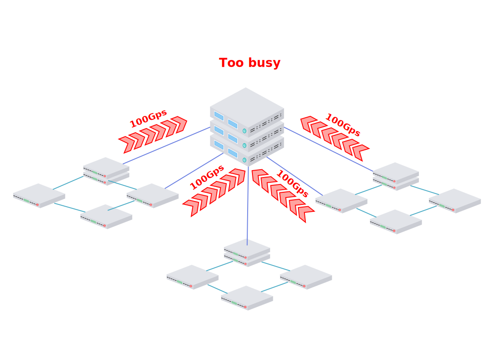
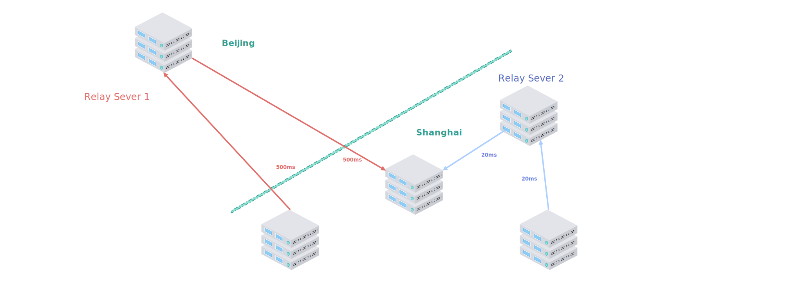
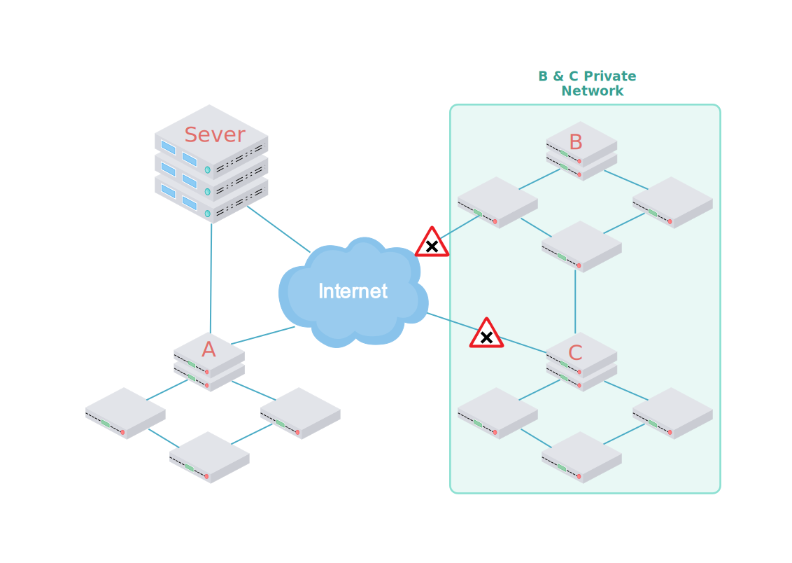
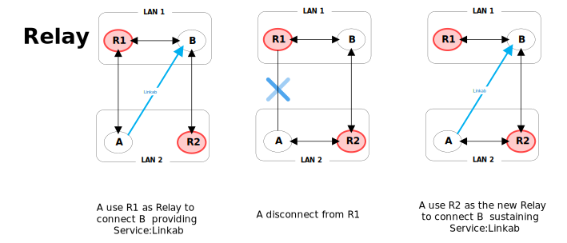
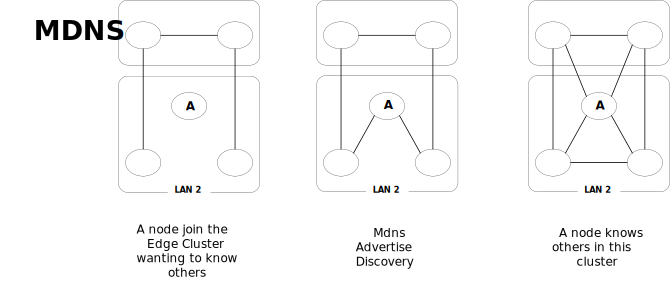
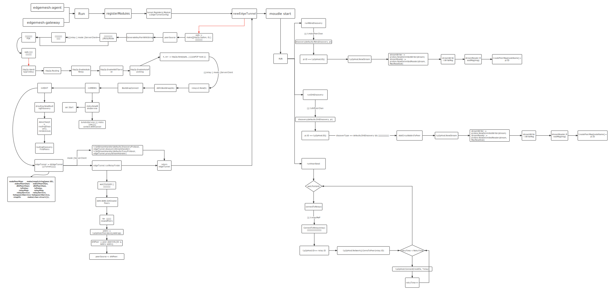

# [OSPP] Proposal for EdgeMesh supports high availability architecture Design and Implementation

[TOC]

## Motivation

Currently, the architecture of EdgeMesh is divided into two parts: **edgemesh server** and **edgemesh agent**. The structure adopts a centralized management and relay method. Functionally, when nodes need to be relayed and connected, they will pass through the edgemesh server. To achieve that need, here comes the following two features:

- Assist two edgemesh agents to exchange peer information, then try to hole punch.
- When hole punching fails, it also needs to act as a relay server to ensure normal network connection.

However, currently, edgemesh server does not support multi-point deployment. The centralized structure and communication method will not fulfill the following problems:

- Case 1:

  When the number of connections going through edgemesh server comes too large or the communication traffic becomes too heavy, it will cause the single-point failure problem of edgemesh server.



To secure the robustness of connection service, the server node always being such a high-load node in a cluster, and thus constraints the implementation scenarios of edgemesh. In that case, edgemesh needs to think about how to share these high-load accesses into the whole cluster, in other words, to allow each edge node to act as an access relay of other nodes, just as the same functions with Server.

- Case 2:

  The location of edgemesh server will affect the delay with traffic forwarding. If the location of the relay server is too far away, it will significantly increase the delay.



Ideal edgemesh cluster would cover from large to small and distance is a core factor in that goal. How about choosing a neighbor as a relay server? As the same motion of Kubernetes in 5G situation, it is essential to put the service close to where they are. Nevertheless, nodes are separated from each other, so it is a must to let everybody know the address of all in this area.

- Case 3:

  In the case of some private networks, edgemesh agent cannot connect to edgemesh server in the external network, thus causing edgemesh agent not to work properly.



Once apart from the center, the normal service of a cluster would no long exist, but if allowing the nodes in this local area to be able to manage themselves, it will be easy to sustain the connection of service.

To sum up, edgemesh wants to cover these scenarios which means that the demand for decentralization has surged in such situations. We should transplant the capabilities of the Server into the edge nodes and enable the nodes to detect the surrounding node topology.

## Goals

Based on the analysis of the above problem scenarios and the explanation of the difficulties, this proposal points out two solutions that can meet these requirements. The core lies in the merger of the Server-Agent module and the realization of the mDNS function.

Actions:

#### 1. The implementation of porting "autorelay" and "autonat" functions into edgemesh agent

> **The main idea is to enable edge nodes to act as relays for other nodes to connect when needed, or to help other nodes punch holes and directly transmit application data**



In this cluster architecture, there are two LANs and each LAN has two nodes. Also, there is a service called Linkab that is the virtual connection between node A and node B.

If A loses the direct connection to R1, but seeks to establish a new connection with B to sustain Linkab, then he needs to find a suitable relay node R2 through the AutoRelay mechanism. At this time, R2 starts the process of Tunnel Server to help A find the address of B and help to establish a connection or transmit data as a relay between B & A.

In this scenario, there are three main problems: (1) When A needs to establish a new connection with B, it needs to be able to find a suitable relay node R2. After R2 finds B or establishes a link with B, it also needs to be able to find A and notify him of linked messages or relay data at the same time (2) firewall and NAT problems faced by network penetration (3) to ensure stable application performance of B seeking connection services.

#### 2. The implementation code of mDNS discovery in edgemesh



In this scenario, node A joins the Cluster and craves to know others in this Lan. As mentioned above, this needs mDNS which is the first step to autorelay and hole punching, etc.

## Proposal

Based on the investigation and research on the current edge network distributed connection technology, it is best to use LibP2P as the main basic open-source tool for development.

Here comes the specific idea about this project:

#### 1. The scope of Tunnel-Architecture includes：

> - new EdgeTunnel Structure
>
> Since the server and agent are changed into everynode-agent, it is needed to make a new Tunnel structure to carry information and hold new services.

> - Boostrap-Connection prepare
>
>   preparing for the relay service, that is the initial relay node provided by LibP2P or set by edgemesh user.

> - mDNS-Discovery Function
>
> The goal of mDNS is to advertise the information so that everybody in the LAN would know where others are and what they are.

> - DHT-Discovery Function
>
>   This mechanism helps to find the nearest relay in the whole cluster, which gets the routing discovery process.

> - Relay-HeartBeat Function
>
> Never resting watcher, who is always waiting for the relay request and automatically helps to start relay-finding process.

#### 2. New ideas implementations

> - mDNS :
>
>   mDNS is used in the initialization or node joining process in which the node obtains the address information of others in the LAN in the form of multiple addresses

> - PeerInfo consistency :
>
> By using NodeName as the encryption key information, the Identify information generated by each node can be logically unified, relying on the better support of the underlying LibP2P for distributed networks, and complete communication at the container virtual layer.

> - AutoRelay:
>
>   edgemesh will help to find relays when needed and this service is completely transparent to users. It feels like the cluster connection had never changed in the whole time.

## Design Details

#### 1. New EdgeTunnel Structure

> Main target of the new structure of Tunnel

EdgeTunnel is the new structure, which provides edgemesh service in every node, used for solving cross-subset communication. As explained above, this new Tunnel will handle all the abilities combined with the agent and server, especially the relay function and dht routing discovery process to carry information and hold new services.

```go
// EdgeTunnel is used for solving cross-subset communication
type EdgeTunnel struct {
        Config           *v1alpha1.EdgeTunnelConfig
        p2pHost          p2phost.Host
        hostCtx          context.Context
        nodePeerMap      map[string]peer.ID
        mdnsPeerChan     chan peer.AddrInfo
        dhtPeerChan      <-chan peer.AddrInfo
        isRelay          bool
        relayMap         RelayMap
        relayService     *relayv2.Relay
        holepunchService *holepunch.Service
        stopCh           chan struct{}
}
```

here are explanations for the essential components:

- **p2pHost-p2phost.Host** is libp2p host, which is responsible for executing all the functions.
- **hostCtx-context.Context** governs the lifetime of the libp2p host
- **nodePeerMap-map[string]peer.ID** is the map of the Kubernetes node name and peer ID
- **mdnsPeerChan-chan peer.AddrInfo** stores the result of Mdns discovery in the LAN.
- **htPeerChan-chan peer.AddrInfo** stores the result DHT routing discovery process.
- **isRelay** comes from config and shows if this node is a relay or not.
- **relayMap-RelayMap** stores the information of relay nodes
- **relayService-\*relayv2.Relay** is a service host responsible for executing functions.

EdgeTunnelConfig is the opts used when Tunnel is initialized. Users can set the parameter list to activate the function they want in edgemesh or provide some former information for edgemesh.

```go
type EdgeTunnelConfig struct {

        Enable bool `json:"enable,omitempty"`

        Mode defaults.TunnelMode

        NodeName string

        ListenPort int `json:"listenPort,omitempty"`

        Transport string `json:"transport,omitempty"`

        Rendezvous string `json:"rendezvous,omitempty"`

        RelayNodes []*RelayNode `json:"relayNodes,omitempty"`

        EnableIpfsLog bool `json:"enableIpfsLog,omitempty"`

        MaxCandidates int `json:"maxCandidates,omitempty"`

        HeartbeatPeriod int `json:"heartbeatPeriod,omitempty"`

        FinderPeriod int `json:"finderPeriod,omitempty"`

        PSK *PSK `json:"psk,omitempty"`
}
```

- **Mode-defaults.TunnelMode** is set for the role of node, if it is ServerAndClient, this node will have the same function as server&agent.

- **NodeName-string** is important afterward, the name of the node will be used to generate the privateKey.

- **rendezvous-string** Rendezvous unique string to identify group of libp2p nodes, default being EDGEMESH_PLAYGOUND

- **RelayNodes-[] \*RelayNode** RelayNodes is a map structure to store relay nodes.

#### 2. The implementation of code



        Above is all the code in this proposal. The horizontal represents the sequential execution relationship, and the vertical represents the function call relationship. Among them, RelayFinder、mdnsdiscovery、dhtdiscovery, and heartbeat will be executed in a loop.

## Roadmap

### June 15 to July 10: Project and Feature Familiarization Period [Completed]

Use the server provided by the teacher to complete the construction of KubeEdge and EdgeMesh. At the same time, try to generate containers and services in the form of multiple test samples, and actually learn the operation mode and execution logic of the system by debugging methods and viewing logs.

According to some research related to the IFPS system, the focus will be on libp2p to do experimental agent development experiments

### July 10th--August 1st: Project development warm-up period [Completed]

Deeply study and test the code engineering logic of EdgeMesh, and be familiar with the code details of EdgeMesh

Learn and use the Libp2p toolkit

Do research on various types of research on distributed architecture and intranet penetration technology, maintain at least weekly group discussions with the instructor, update the experimental content and results of the week, discuss the development experimental results of the system architecture, and promote the development process

### July 20 to September 18: Project development period

#### Phase 1: Basic function development research and experimental period, Design new EdgemeshTunnel structure [Completed]

Time: July 20 to August 1

Start the Development process and the goal is to build a basic structure.

Designing a new Tunnel structure, which contains relay signals and service implementation based on LibP2P. At the same time, we need to think about the structure user used to control the Tunnel services and the result is EdgeTunnel Config. Test the function, the first step is to set LibP2P-host, it can be used to call basic relay service and NAT service, etc. Some more research about usage would give a better understanding of the function we can use. According to edgemesh design feature, setting mDNS discovery process automatically would be the next important part.

#### Phase 2: functional basis implementation and improvement period [Completed]

Time: August 1 to September 6

To fulfill all the basic designs of high availability architecture.

Time: August 1 to August 16

The first step is to add mDNS functions and test them in a small cluster. In this case, some new data processing functions were added to fit mDNS discovery and dht routing, the main parts of them are GeneratePeerInfo, AddCircuitAddrsToPeer, AppendMultiaddrs.

Time: August 16 to August 20

Add hole punch service and add Rendezvous field in EdgeTunnel config.

here we have got enough structure for the new tunnel, so remove useless code tunnel/controller from the source tree and remove useless param in register and newEdgeTunnel. Then modify the order of functions inside the module.go file and add EnableIpfsLog field in EdgeTunnel module config

Time: August 20 to September 6th

Here we need more experiments to put in and fix some bugs.

#### Phase 3: Mid-term functional testing and revision period [Completed]

Time: From September 6th to September 15th

Before handing over the code to the community, we need to confirm the implementation of the function and the robustness of the service, and summarize and further exchange review and revision opinions.

In that case, we added util_test.go file to pkg/tunnel including Golang test modules T and B. Results are not so far away from what we expected before.

#### Phase 4: function inspection and bug checking, system tuning period [Completed]

Time: From September 15th to September 18th.

While testing the robustness of the new tunnel, concluding all the process and result from OSPP is the main target. A file showing the new feature of Edgemesh would give users more information and some more pictures will be favored to explain what we have done in this project.

