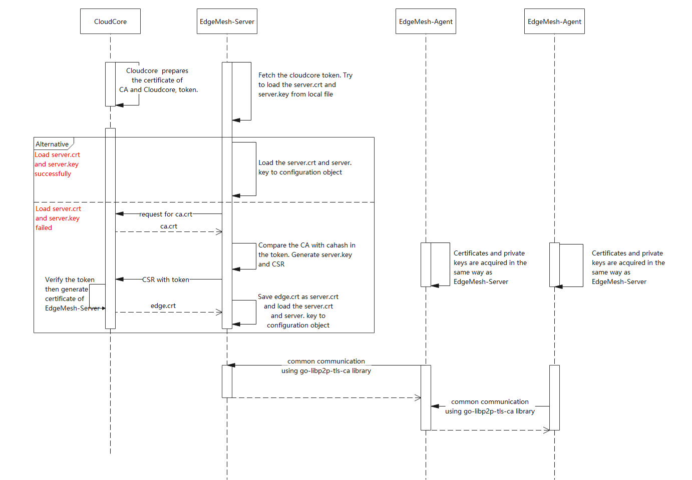

# Motivation
Currently, the connections between edgemesh-server and edgemesh-agent, edgemesh-agent and edgemesh-agent are not securely designed, i.e. there is no authentication, authentication, encryption between EdgeMesh's service. This can lead to major security issues for EdgeMesh.

# Goal
+ Based on KubeEdge's security framework, support bidirectional authentication between EdgeMesh services
+ Supports secure transfers between EdgeMesh services
+ Support for security options is configurable

# Design detail
## Architecture


## Workflow
**step0:**  
Make sure the cloudcore is health. EdgeMesh apply certificate from cloudcore.

**step1:**  
EdgeMesh( including edgemesh-server and edgemesh-agent) requests for CA certificate from the CloudCore(this time they don't verify the certificate of each other)

**step2:**  
Return CA certificate directly to EdgeMesh without verifying identity.

**step3:**  
Hash the CA certificate, and compare it with the cahash in the token to verify the validness of CA certificate.

**step4:**  
Generate a pair of key and store the private key locally. Submit the certificate signing request(CSR) to CloudCore with token in the http header(this time only EdgeCore verifies the certificate of CloudCore using cacert from step2).
Unlike EdgeCore, EdgeMesh requires the types of certificates to be {x509.ExtKeyUsageClientAuth, x509.ExtKeyUsageServerAuth} rather than {x509.ExtKeyUsageClientAuth}

**step5:**  
Parse and verify token, If successful, use the CA certificate to sign the CSR and return a certificate to EdgeMesh.

**step6:**  
Parse and verify token, If successful, use the CA certificate to sign the CSR and return a certificate to EdgeMesh.
Then the edgemesh-server and edgemesh-agent, edgemesh-agent and edgemesh-agent can establish mutual authentication TLS using [go-libp2p-tls-ca](https://github.com/khalid-jobs/go-libp2p-tls) library which forks from 
[go-libp2p-tls](https://github.com/libp2p/go-libp2p-tls) and add the ca authentication feature.

### Configuration of edgemesh-server with security
```yaml
    ......
    modules:
      tunnel:
        # insert the following
        enableSecurity: true
        ACL:
          # cloudcore's https api for crts sign apply
          httpServer: <cloudhub-https-addr>
```
### Configuration of edgemesh-agent with security
```yaml
    ......
    modules:
      tunnel:
        # insert the following
        enableSecurity: true
        ACL:
          # cloudcore's https api for crt sign apply
          httpServer: <cloudhub-https-addr>
```

# Future development tasks
1. certification rotation: The certification rotation will affect the connection between edgemesh-server and edgemesh-agent, edgemesh-agent and edgemesh-agent, we need think more about this.

# Related Link
1. kubeedge edge authentication: https://github.com/kubeedge/kubeedge/blob/master/docs/proposals/edge-authentication.md
