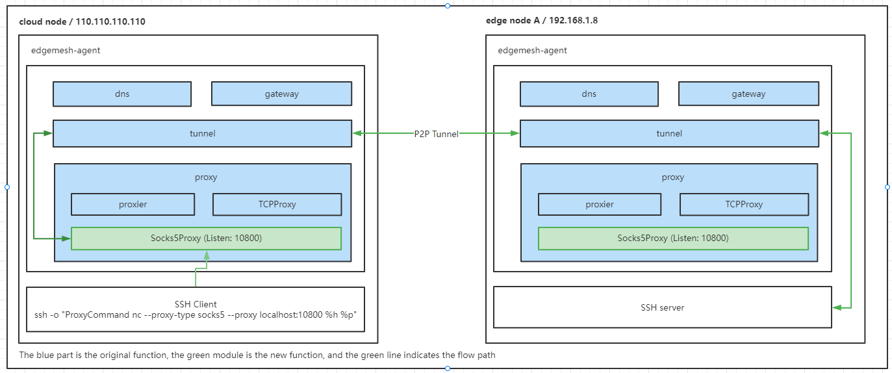

# Motivation
1. Since edge nodes are generally distributed in an environment without public IP, remote operation and maintenance cannot be performed well. In daily management work, it is often necessary to go to the location of the node, which is very troublesome.
2. The network bandwidth of the edge node is not particularly good, if a large-scale upgrade is required. The time for each node to pull the image is also very long, and it is not possible to know the status of the node in the cloud.
3. It is also impossible to view the edgecore logs conveniently in the cloud, and when you encounter problems, you cannot effectively manage the edgecore. If you need to change or upgrade the edgecore configuration, you must go to the node location.
# Goal
+ Support SSH login between nodes

# Design detail
## Architecture

## Workflow
**step0:**  
The ssh client initiates a request through the socks5 proxy and proxy the traffic to the socks5 proxy.

**step1:**  
In the socks5 proxy, get the target host and target port. Convert the target host to the target IP through k8s api. The edgemesh-agent on the node uses hostNetwork, so just take its pod id directly.

**step2:**  
Encapsulate the converted target ip and target port and transmit them to the tunnel module

**step3:**  
The subsequent tunnel module will use the original p2p channel to send the request to the target machine and request the corresponding service (SSH server), and then return the traffic to socks5 to complete the traffic proxy
