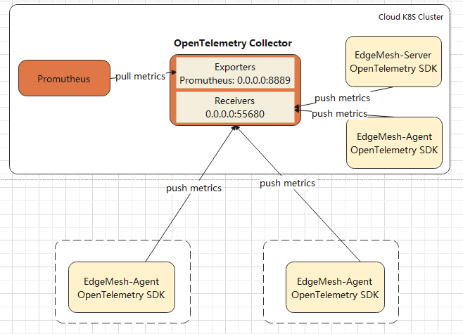

# Motivation
Service observability is an important ability of the software system. 
At present, EdgeMesh does not do any work for observability, 
and the operations staff of EdgeMesh cannot know the service status. 
At the current stage, we want to support metrics monitor and then gradually 
enhance the observability of EdgeMesh.

# Goals
+ Provide a general observability framework for EdgeMesh.
+ Add service metrics support in EdgeMesh.

# Design detail
## Metrics Design
We design the following metrics for edgemesh-agent

| Metrics | Definition |
| ---- | ----| 
| Latency | The time difference between the request reaches edgemesh-agent and the request ends |
| Network card traffic | Intra-container network card traffic data |
| Memory usage | Memory usage within the container |
| CPU usage | CPU usage within the container |
| Traffic  | The number of requests flowing across the edgemesh-agent |
| The success rate of the hole punch | The success rate of the hole punch |

And the following metrics for edgemesh-server

| Metrics | Definition |
| ---- | ----| 
| Latency | The time difference between the request reaches edgemesh-server and the request ends |
| Network card traffic | Intra-container network card traffic data |
| Memory usage | Memory usage within the container |
| CPU usage | CPU usage within the container |
| Traffic  | The number of requests flowing across the edgemesh-server |

## Framework Design
In the selection of the observability technology stack, we recommend [openTelemetry](https://opentelemetry.io/), 
which  is capable of receiving telemetry data (push and pull based). And the push based way is appropriate for 
edge node scenarios. And the OpenTelemetry framework also allows us to easily integrate other observability metrics, 
such as logs and traces. The EdgeMesh observability framework designed as 

1. Deploy Prometheus and OpenTelemetry collector on the cloud. And we require OpenTelemetry Collector can be access by EdgeMesh (edgemesh-agent and edgemesh-server)
2. edgemesh-server and edgemesh-agent use OpenTelemetry SDK to generate metrics data and push the metrics data to the OpenTelemetry Collector
3. Prometheus will try to pull metrics from OpenTelemetry Collector
4. Then we can see the metrics data in the Prometheus 

# Future Development Tasks
1. Currently, it's just a framework design, we will do the code implementations
2. Support trace observability support
3. Support log observability support