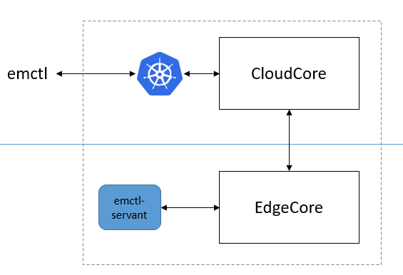

# emctl

EdgeMesh provides a command line tool for deployment, uninstallation, status detection and interaction with the cluster: `emctl`.

## Installation
TODO

## Commands

|Command|Syntax|Description|
|----|----|-------|
|[install](#install)|`cmctl install [flags]`|Deploy EdgeMesh system in the cluster, including components: edgemesh-server and edgemesh-agent.|
|[uninstall](#uninstall)|`cmctl uninstall [flags]`|Remove EdgeMesh system from the cluster.|

### install

The `install` command deploy EdgeMesh system in the cluster, including components: edgemesh-server and edgemesh-agent.

Tool `emctl` will do the following things:
- Check if KubeEdge version is >=1.6
- Enable the `dynamicController` module of CloudCore
- Deploy the `emctl-servant` pod to each node
- After the node is prepared, create the corresponding configmap, deploy edgemesh-server and edgemesh-agent

Pod `emctl-servant` will do the following things:
- Check if KubeEdge version is >=1.6
- Enable `metaServer` module and disable `edgeMesh` module of EdgeCore
- Feedback the task completion status to `emctl`

### uninstall
TODO
